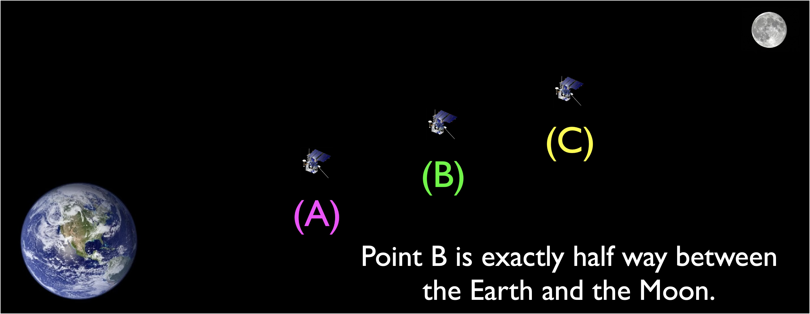

# Motion and Gravity Activities 

## Newton's Laws and Gravity Tutorial

### Check your understanding

Use this diagram to answer the questions

<quiz>
At which point is the gravitational force on the spacecraft from the Earth the greatest?

- [x] A
- [] B
- [] C
- [] All are equal

</quiz>

<quiz>
At which point is the gravitational force on the spacecraft from the Moon the greatest?

- [] A
- [] B
- [x] C
- [] All are equal

</quiz>

<quiz>

In what direction would the net gravitational force (from both Earth and Moon) point when the spacecraft is at point B?

- [x] towards the Earth
- [] towards the Moon
- [] the net force would be zero, so would not point in either direction

</quiz>

<quiz>
After completing some maneuvers, the spacecraft is moving 
at 12 miles per hour toward the Moon. It is at point B.
It is not firing any jets. What is happening to its speed?

- [] it is speeding up
- [x] it is slowing down
- [] it is traveling at constant speed
</quiz>

<quiz>
At which point would a spacecraft feel the greatest acceleration ?

- [x] When it is close to the Earth
- [] When it is close  to the Moon
- [] At point B
</quiz>