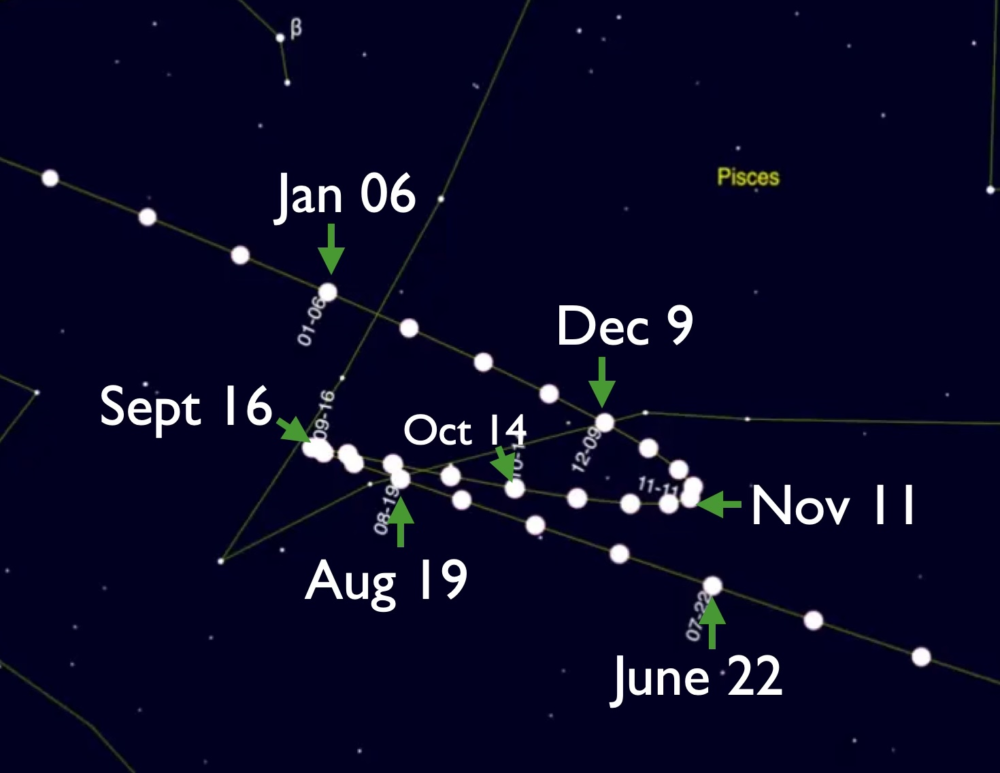

# Wandering Planets Activities

## Retrograde Motion Lecture Tutorial

Observing Retrograde Motion pages 99-100

Read carefully - the tutorials are designed to catch your errors!

Discuss the material in your pod and come to a consensus. 

### Check your understanding:
<quiz>
A planet is moving in retrograde motion.
Over the course of one night,
it will appear to...

- [x]  move from east to west across the sky
- [ ]  move from west to east across the sky
- [ ]  not move at all, as planets move with the stars
- [ ]  move randomly, as planets move differently to the stars

Over one night, the stars appear to move east to west, and the planets move with them.

</quiz>

<quiz>
A planet is moving in retrograde motion.
Over the course of several nights, compared to background stars, 
it will appear to...

- [x]  move from east to west
- [ ]  move from west to east
- [ ]  not move at all, as planets move with the stars
- [ ]  move randomly, as planets move differently to the stars

The unusual motion of retrograde is east to west compared to the stars. Prograde is west to east.

</quiz>

The composite photo below shows the path of Mars from June 2020 to January 2021, compared to background stars.

<quiz>

On October 14, Mars’ apparent motion compared to background stars was…
- [ ] Prograde
- [x] Retrograde
</quiz>

<quiz>

On December 14, Mars’ apparent motion compared to background stars was…
- [x] Prograde
- [ ] Retrograde
</quiz>

## Parsec Lecture Tutorial
