# Alien Worlds

- Transits
- Exoplanet Transits
- Planet detections
- Habitable worlds
- Are we Alone?

## Alien Planets

Exoplanets are planets around other stars.

## Transits

This vido shows our sun

<figure>
  <video controls width="100%">
    <source src="https://svs.gsfc.nasa.gov/vis/a030000/a030700/a030780/mercury_transit_720p.mp4">
    Your browser does not support the video tag.
  </video>
  <figcaption>The small planet mercury transits in front of the Sun.</figcaption>
</figure>

*Source: [Tom Bridgman, NASA's Goddard Space Flight Center](https://svs.gsfc.nasa.gov/30780)*

Venus also transits the sun when it passes exactly between the Sun and Earth. It did this in 2004 and 2012.

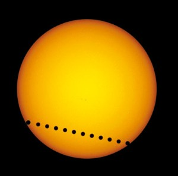
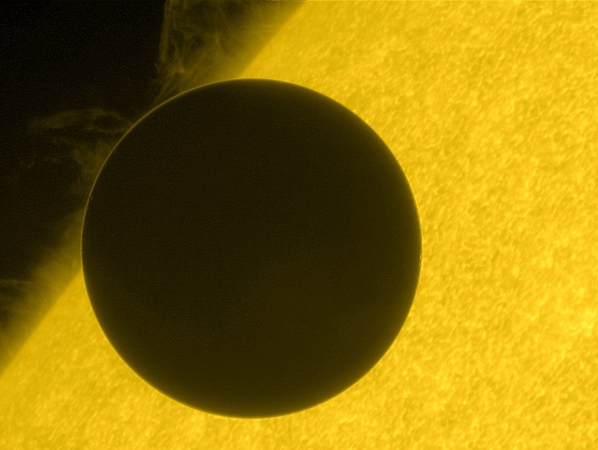
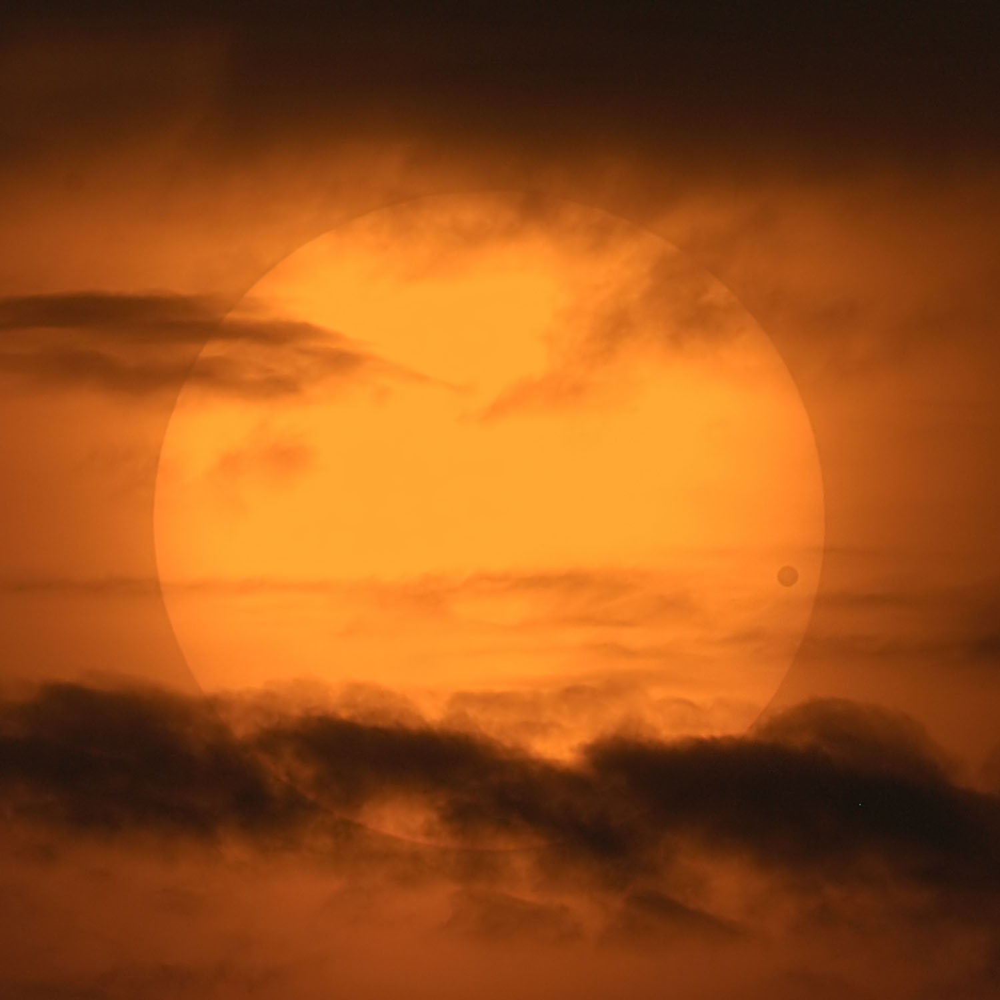
*Sources: E. SLAWIK/SPL, [NASA Hinode](https://www.nasa.gov/image-article/hinode-views-2012-venus-transit-2/), [David Cortner via APOD](https://science.nasa.gov/image-article/apod-2004-june-23-a-picturesque-venus-transit/) *

## Exoplanet transits
Transits of exoplanets across other stars
cause changes in stellar brightness
observed by a telescope

<figure>
  <video controls width="100%">
    <source src="https://assets.science.nasa.gov/content/dam/science/astro/exo-explore/2023/09/t/transit_method_single_planet_dlv.m4v">
    Your browser does not support the video tag.
  </video>
  <figcaption>A transit around a distant star causes the star's light to dim a little bit, if the planet passes between us and the star.</figcaption>
</figure>

## Observing exoplanet transits

Space telescopes: 

Kepler from 2009-2018, TESS starting 2018
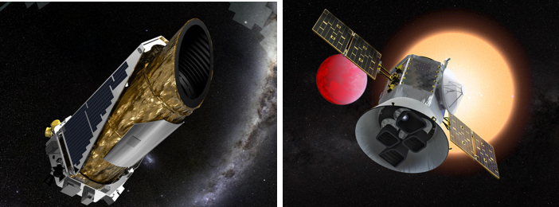
 and Roman launched 2026.
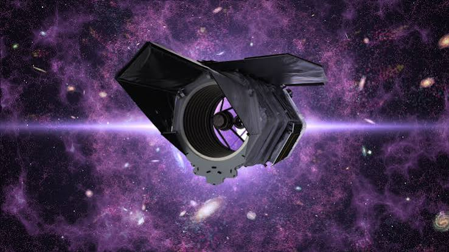

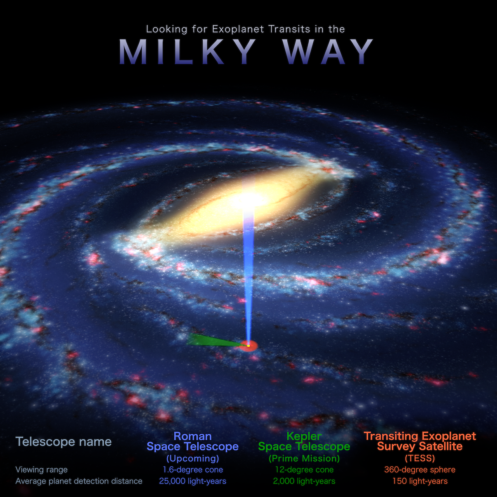

Kepler’s field of view would be covered by your hand if you held it up at arm’s length towards the sky

## Multiple transits

Needed to confirm a planet

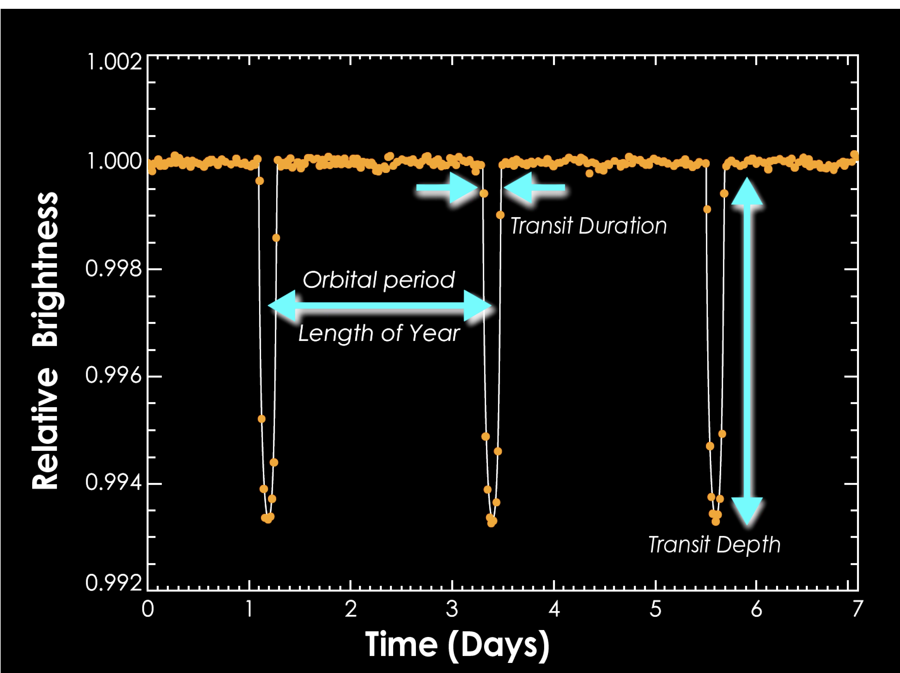

## Learning from transits
The size of the dip tells us the size of the planet.

<figure>
  <video controls width="100%">
    <source src="img/transit_method_double_planet-1.mp4">
    Your browser does not support the video tag.
  </video>
  <figcaption>Transit light curve comparisons for a larger and smaller planet</figcaption>
</figure>

Artist impression of the first 2740 planets found by the Kepler spacecraft:
 *Source: [NASA](https://www.nasa.gov/image-article/2740-kepler-planet-candidates-family-portrait-poster/)*

The amount of time between transits tells us the period of the planet’s orbit.
A version of Kepler’s Third Law then gives the distance from the star.

Animation of the first 726 exoplanet systems found by Kepler

<iframe width="560" height="315"
  src="https://www.youtube.com/embed/Td_YeAdygJE&mute=1"
  title="Kepler Orrery of 726 exoplanet systems compared to our own"
  frameborder="0"
  allow="accelerometer; autoplay; clipboard-write; encrypted-media; gyroscope; picture-in-picture; web-share"
  allowfullscreen>
</iframe>

## Are we alone?

- More than 100 billion star systems in our galaxy
- 100 billion galaxies in the Universe
- We do not yet know whether any world but Earth has life
- Astrobiology: The scientific search for life in the Universe
- Life as we know it needs liquid water

## Life in the Solar System

- Could there be/have been life on Mars? 
  - Signs of water, very little atmosphere
- Could there be life on Jupiter’s moon Europa?
  - internal tidal heating causes volcanic vents on its seafloor
- Saturn’s cold moons Titan (liquid methane oceans) or Enceladus (ice fountains)?
- No clear evidence for life yet!

## Life on Exoplanets

Habitable zone: distances where a planet surface could have liquid water

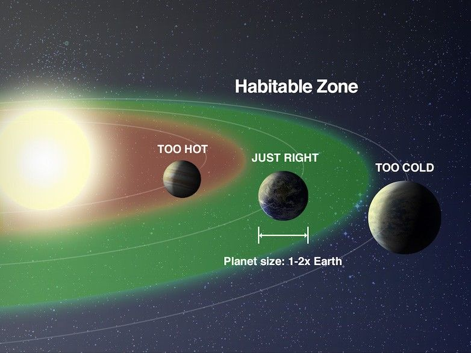
*Source: [NASA](https://science.nasa.gov/exoplanets/habitable-zone/)*

### Potentially habitable worlds

Artistic representation of the closest currently known potentially habitable exoplanets:
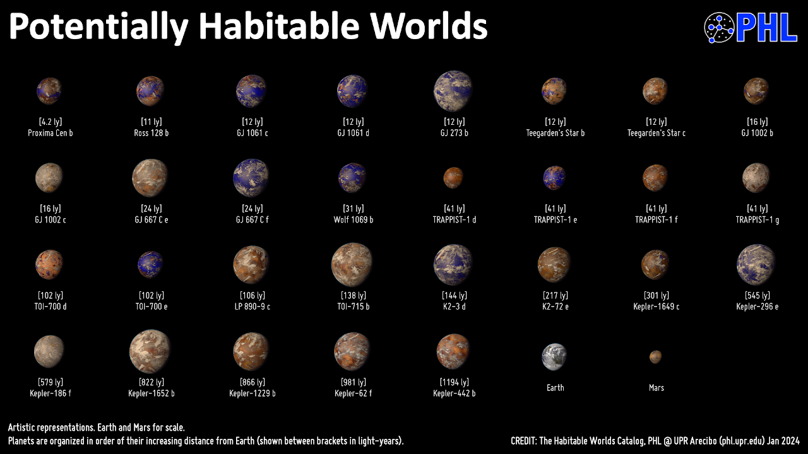
*Source:[The Habitable World Catalog](https://phl.upr.edu/hwc)*

Extrapolating from the number of planets we have been able to find…
About half of Sun-like stars have a rocky planet in the Habitable Zone

This illustration depicts Kepler-186f, the first validated Earth-size planet to orbit a distant star in the habitable zone.
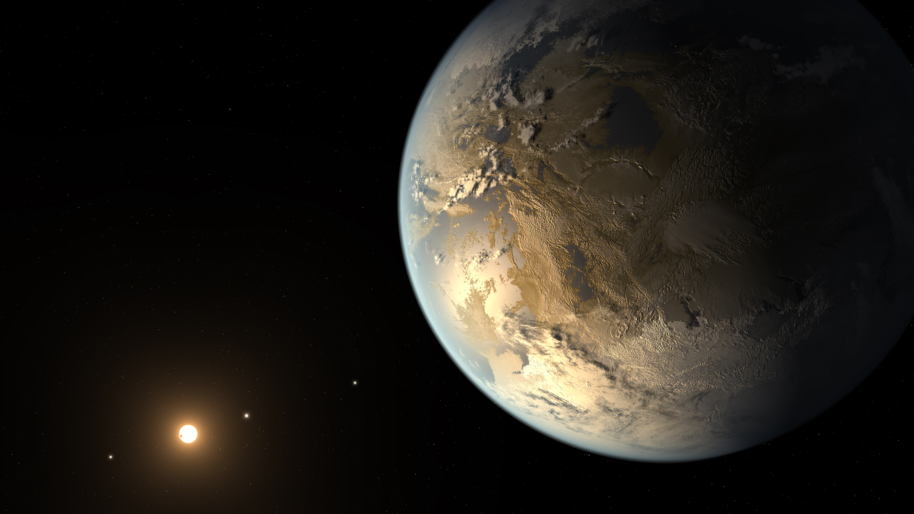
*Source: [NASA Ames/JPL-Caltech/T. Pyle](https://science.nasa.gov/universe/exoplanets/about-half-of-sun-like-stars-could-host-rocky-potentially-habitable-planets/)*

## Fermi’s Paradox

- There are billions of sun-like stars in our galaxy, many with Earth-like planets
- If Earth life is typical, many could have developed intelligent life
- Some may have developed interstellar travel
- “Where is everybody?” —Enrico Fermi, 1950
- Maybe intelligent life is extremely rare, maybe they haven’t contacted Earth, or maybe civilizations die quickly!
- We don’t yet know a scientific answer.

Challenge for finding alien civilizations: space is really big.
This image shows how far radio broadcasts from earth have travelled

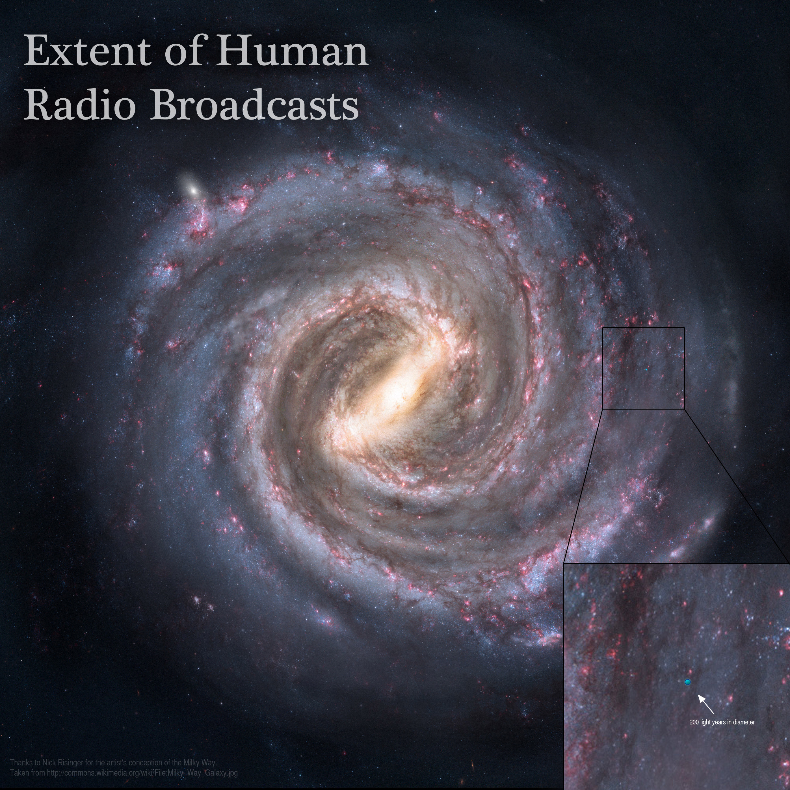
*Source [Adam Grossman / Nick Risinger](https://www.planetary.org/space-images/extent-of-human-radio-broadcasts)*

## Check your understanding

<quiz>
Which of the following possibilities is most likely to result in a Kepler detection in the mission lifetime of about ten years?? 

Assume the orbits are viewed edge-on

- [] an Earth-like planet in a 1 AU radius orbit
- []  An Earth-like planet in a 10 AU radius orbit
- [x] A Jupiter-like planet in a 1 AU radius orbit
- [] A Jupiter-like planet in a 10 AU radius orbit
- []  All are equally likely

It will be easier to notice a bigger dip in the light curve that occurs more frequently.

</quiz>

<quiz>
To find exoplanets, space telescopes must monitor a large number of stars for many years because:

- [] A. only a small percentage of stars have planets
- [] B. only a small percentage of planetary systems will aligned so that the telescope  can observe transits
- [] C. Any planets will only be transiting the star from a small percentage of the time
- [] both A. and B.
- [x] both B. and C.

</quiz>

<quiz>
How do scientists define the habitable zone around a star?

- []  the region around a star where humans can survive
- [x] the region around a star where liquid water could exist on planetary surfaces
- [] the region around a star where rocky planets can form
- [] the region around a star where ultraviolet radiation is too weak to destroy organisms

</quiz>
