# Alien Worlds

- Transits
- Exoplanet Transits
- Planet detections
- Habitable worlds
- Are we Alone?

## Transits

This vido shows our Sun. The little black circle moving across it is the planet Mercury in a *transit*.
<figure>
  <video controls width="100%">
    <source src="https://svs.gsfc.nasa.gov/vis/a030000/a030700/a030780/mercury_transit_720p.mp4">
    Your browser does not support the video tag.
  </video>
  <figcaption>The small planet mercury transits in front of the Sun.</figcaption>
</figure>

*Source: [Tom Bridgman, NASA's Goddard Space Flight Center](https://svs.gsfc.nasa.gov/30780)*

Venus also transits the sun when it passes exactly between the Sun and Earth. It did this in 2004 and 2012.

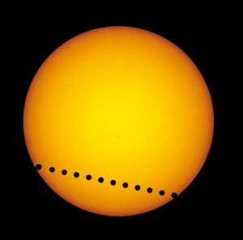
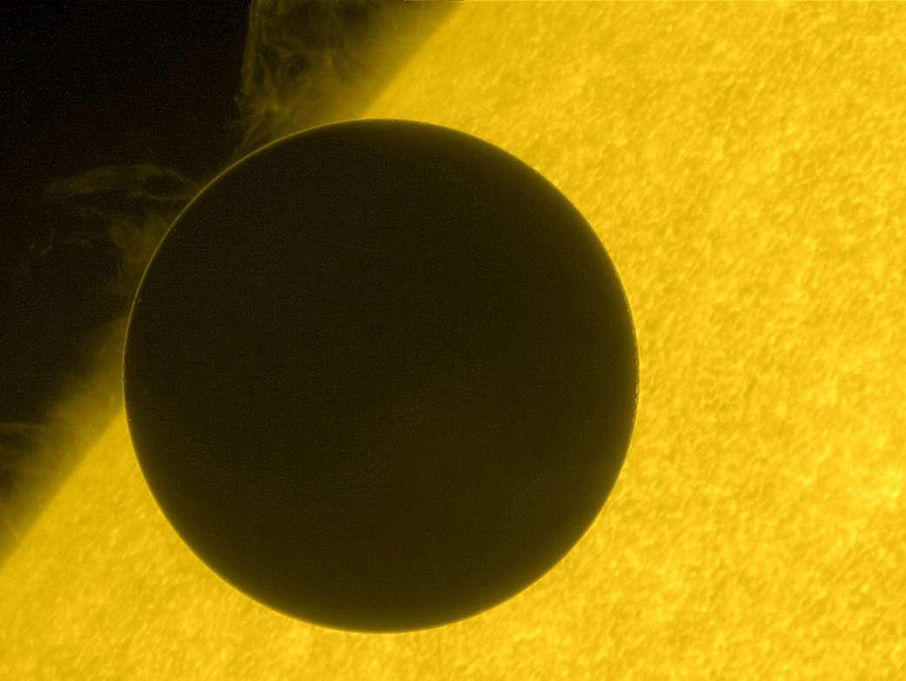
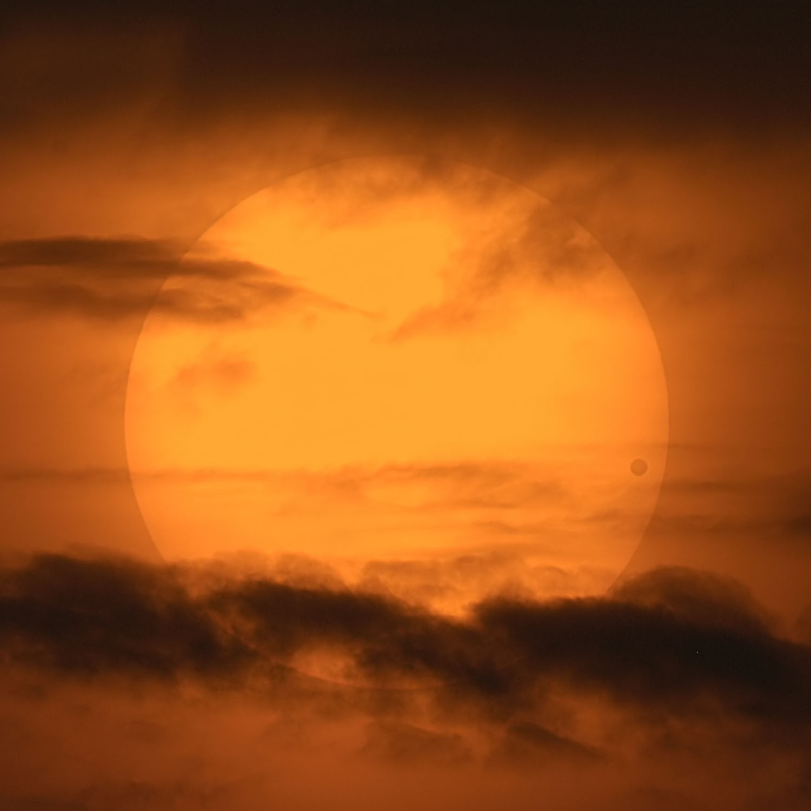
*Sources: E. SLAWIK/SPL, [NASA Hinode](https://www.nasa.gov/image-article/hinode-views-2012-venus-transit-2/), [David Cortner via APOD](https://science.nasa.gov/image-article/apod-2004-june-23-a-picturesque-venus-transit/)*

## Exoplanet transits
Transits of exoplanets across other stars
cause changes in stellar brightness
observed by a telescope.

We can't image the shadow across the star directly. We can only observe the change in brightness.

<figure>
  <video controls width="100%">
    <source src="https://assets.science.nasa.gov/content/dam/science/astro/exo-explore/2023/09/t/transit_method_single_planet_dlv.m4v">
    Your browser does not support the video tag.
  </video>
  <figcaption>A transit around a distant star causes the star's light to dim a little bit, if the planet passes between us and the star.</figcaption>
</figure>

## Observing exoplanet transits

Space telescopes: 

Kepler from 2009-2018, TESS starting 2018
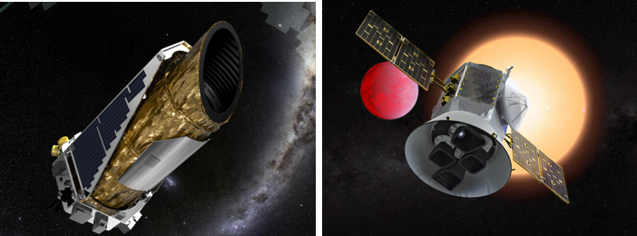
 and Roman launched 2026.
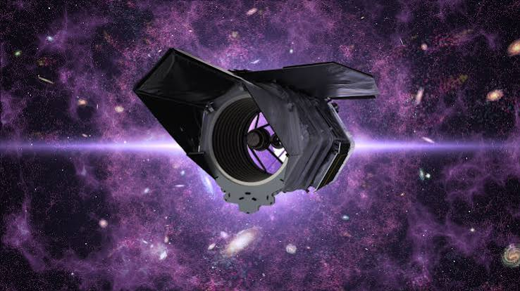

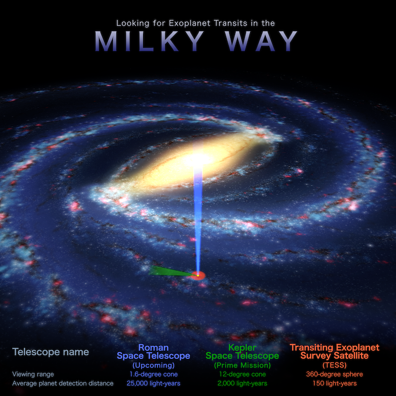

Roman will look for planets in a 1.6 degree cone out to 25,000 light years.
Kepler will look for planets in a 12-degree cone out to 2,000 light years.
TESS looks for planets in all directions out to 150 light years.

Kepler’s field of view would be covered by your hand if you held it up at arm’s length towards the sky

## Multiple transits

Needed to confirm a planet

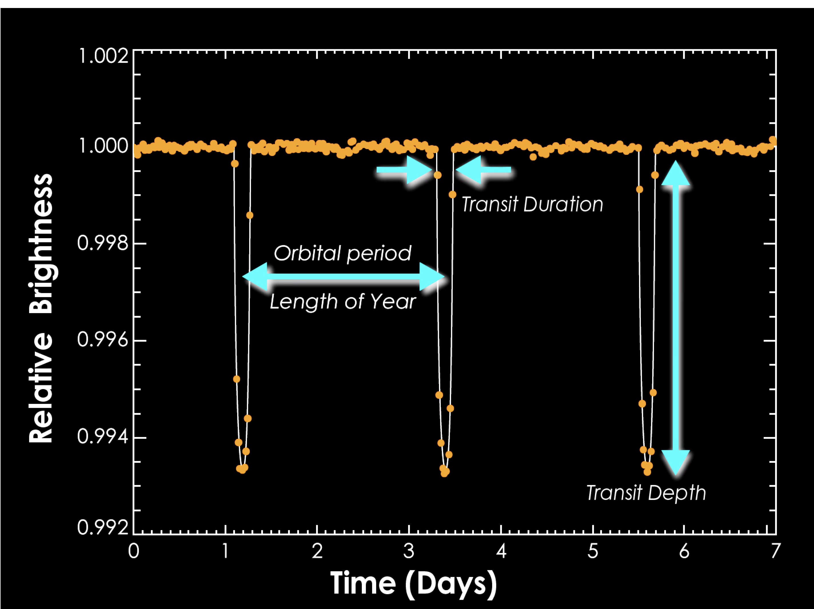

## Learning from transits
The size of the dip tells us the size of the planet.

<figure>
  <video controls width="100%">
    <source src="img/transit_method_double_planet-1.mp4">
    Your browser does not support the video tag.
  </video>
  <figcaption>Transit light curve comparisons for a larger and smaller planet</figcaption>
</figure>

Artist impression of the first 2740 planets found by the Kepler spacecraft, showing what the disk of the star might look like with the detected planets transiting.
 *Source: [NASA](https://www.nasa.gov/image-article/2740-kepler-planet-candidates-family-portrait-poster/)*

The amount of time between transits tells us the period of the planet’s orbit.
A version of Kepler’s Third Law then gives the distance from the star.

Animation of the first 726 exoplanet systems found by Kepler

<iframe width="560" height="315"
  src="https://www.youtube.com/embed/Td_YeAdygJE&mute=1"
  title="Kepler Orrery of 726 exoplanet systems compared to our own"
  frameborder="0"
  allow="accelerometer; autoplay; clipboard-write; encrypted-media; gyroscope; picture-in-picture; web-share"
  allowfullscreen>
</iframe>

## Are we alone?

- More than 100 billion star systems in our galaxy
- 100 billion galaxies in the Universe
- We do not yet know whether any world but Earth has life
- Astrobiology: The scientific search for life in the Universe
- Life as we know it needs liquid water

## Life in the Solar System

- Could there be/have been life on Mars? 
  - Signs of water, very little atmosphere
- Could there be life on Jupiter’s moon Europa?
  - internal tidal heating causes volcanic vents on its seafloor
- Saturn’s cold moons Titan (liquid methane oceans) or Enceladus (ice fountains)?
- No clear evidence for life yet!

## Life on Exoplanets

Habitable zone: distances where a planet surface could have liquid water

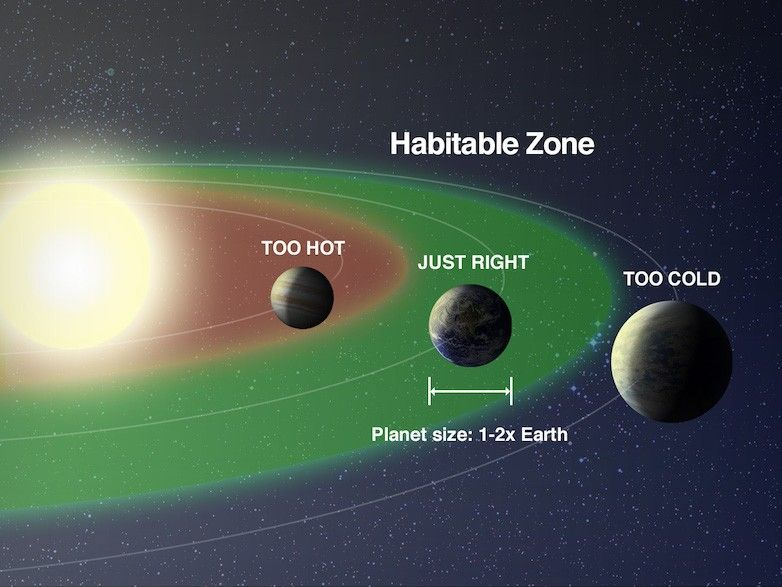
*Source: [NASA](https://science.nasa.gov/exoplanets/habitable-zone/)*

### Potentially habitable worlds

Artistic representation of the closest currently known potentially habitable exoplanets:
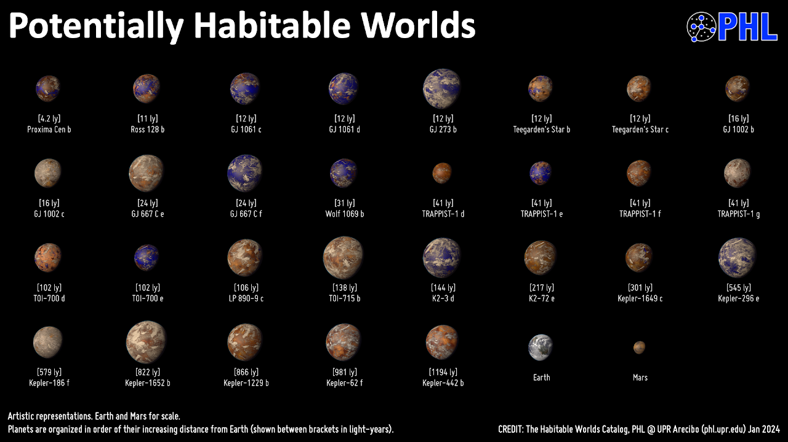
*Source:[The Habitable World Catalog](https://phl.upr.edu/hwc)*

Extrapolating from the number of planets we have been able to find…

About half of Sun-like stars have a rocky planet in the Habitable Zone! 

This illustration depicts Kepler-186f, the first validated Earth-size planet to orbit a distant star in the habitable zone.
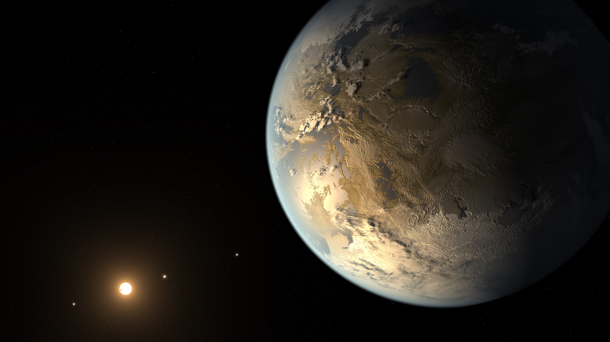
*Source: [NASA Ames/JPL-Caltech/T. Pyle](https://science.nasa.gov/universe/exoplanets/about-half-of-sun-like-stars-could-host-rocky-potentially-habitable-planets/)*

## Fermi’s Paradox

- There are billions of sun-like stars in our galaxy, many with Earth-like planets
- If Earth life is typical, many could have developed intelligent life
- Some may have developed interstellar travel
- “Where is everybody?” —Enrico Fermi, 1950
- Maybe intelligent life is extremely rare, maybe they haven’t contacted Earth, or maybe civilizations die quickly!
- We don’t yet know a scientific answer.

Challenge for finding alien civilizations: space is really big.

This image shows how far human radio broadcasts from earth have travelled (not very far on a galactic scale).

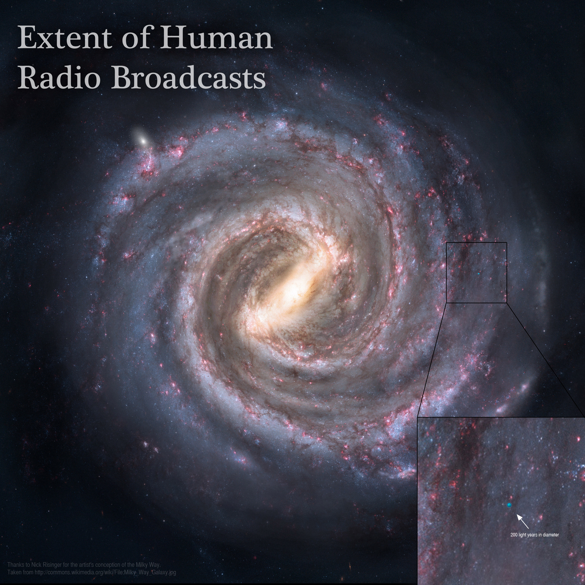
*Source [Adam Grossman / Nick Risinger](https://www.planetary.org/space-images/extent-of-human-radio-broadcasts)*

## Check your understanding

<quiz>
 For which system(s) would the telescope be able to measure transits?

- [] 
- [x] 
- [] 
- [] 

</quiz>

<quiz>

Complete this ranking task: [Each of the icons corresponds to a moment in time from a single extrasolar planet transit. Rank the icons from earliest to latest.](https://astro.unl.edu/newRTs/Transits/q1.html)

Did you succeed?
- [x] yes

</quiz>

<quiz>

Complete this ranking task: [Rank the percentage of light blocked in each planet-star system from least light blocked to most light blocked.](https://astro.unl.edu/newRTs/Transits/q3.html)

Did you succeed?
- [x] yes

</quiz>

<quiz>

Complete this ranking task: [Complete this ranking task: Rank the frequency of the transits for the systems shown from least frequent to most frequent.](https://astro.unl.edu/newRTs/Transits/q7.html)
Did you succeed?
- [x] yes

</quiz>

<quiz>
Complete this ranking task. Assume all the stars are the same mass as the Sun so that you can use Kepler's Third Law to compare planets. [Rank the distance between the planet and the star it orbits from shortest to greatest distance using the Kepler light curves.](https://astro.unl.edu/newRTs/Transits/q8.html)
Did you succeed?
- [x] yes

</quiz>

<quiz>
Which of the following possibilities is most likely to result in a Kepler detection in the mission lifetime of about ten years?? 

Assume the orbits are viewed edge-on

- [] an Earth-like planet in a 1 AU radius orbit
- []  An Earth-like planet in a 10 AU radius orbit
- [x] A Jupiter-like planet in a 1 AU radius orbit
- [] A Jupiter-like planet in a 10 AU radius orbit
- []  All are equally likely

It will be easier to notice a bigger dip in the light curve that occurs more frequently.

</quiz>

<quiz>
To find exoplanets, space telescopes must monitor a large number of stars for many years because:

- [] A. only a small percentage of stars have planets
- [] B. only a small percentage of planetary systems will aligned so that the telescope  can observe transits
- [] C. Any planets will only be transiting the star from a small percentage of the time
- [] both A. and B.
- [x] both B. and C.

</quiz>

<quiz>
How do scientists define the habitable zone around a star?

- []  the region around a star where humans can survive
- [x] the region around a star where liquid water could exist on planetary surfaces
- [] the region around a star where rocky planets can form
- [] the region around a star where ultraviolet radiation is too weak to destroy organisms

</quiz>
