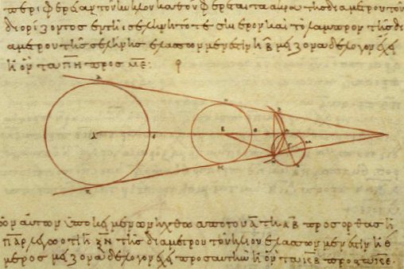
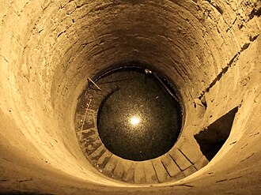
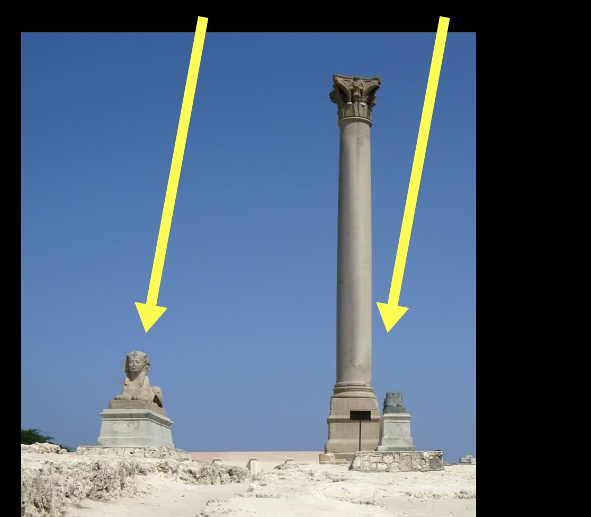
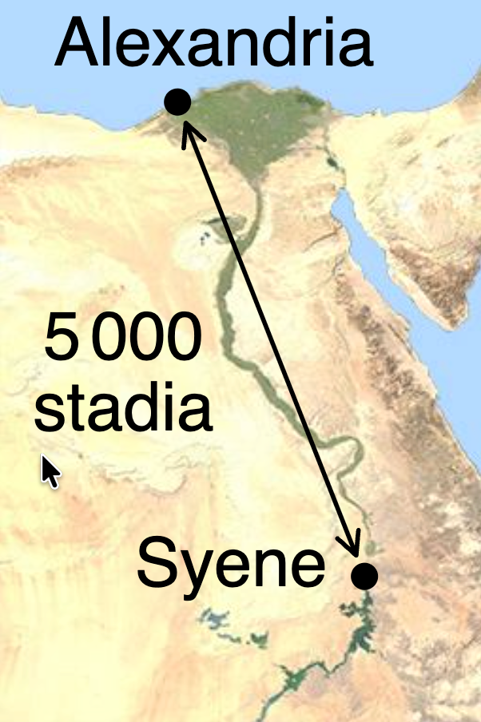
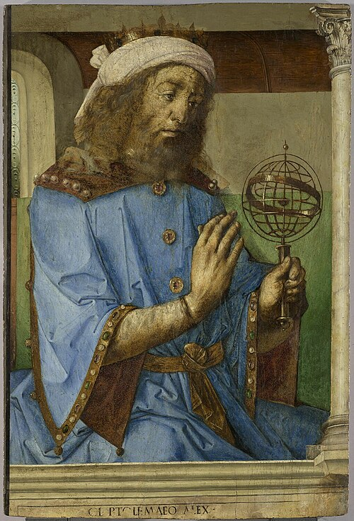
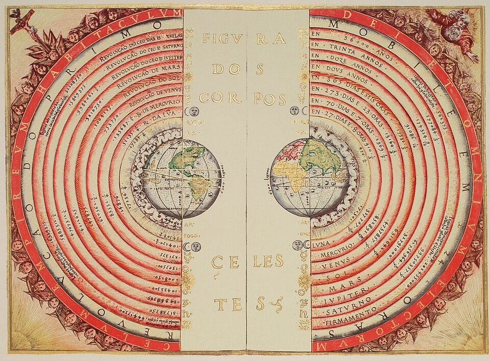
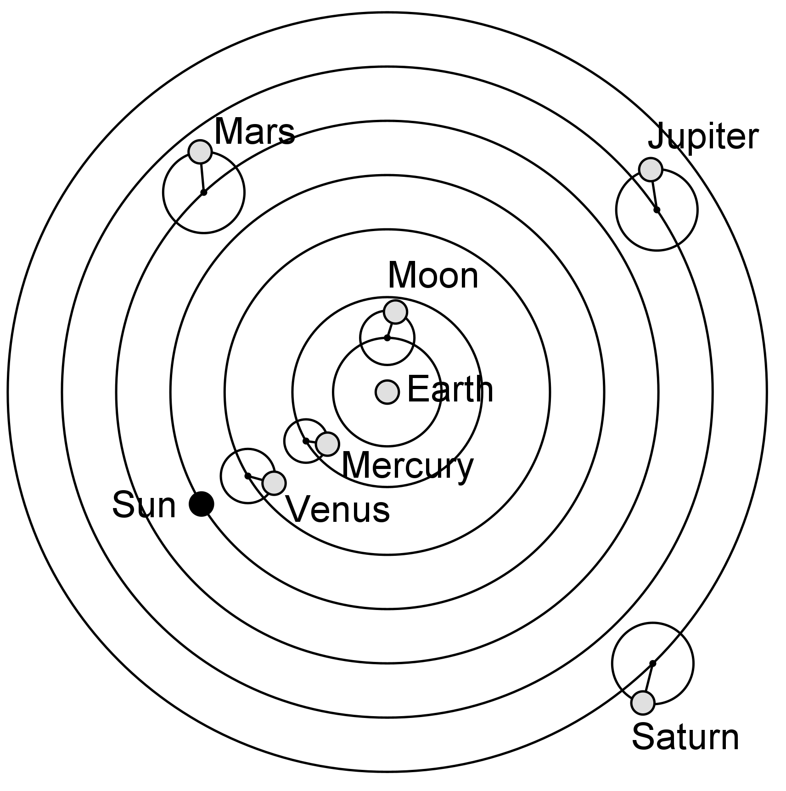

# Ancient Greek Astronomy

In this module, we'll discuss: 
* Early astronomical science in Ancient Greece
* How Eratosthenes measured the size of the Earth
* Geocentric models of Earth, Sun, and Planets
* Epicycles for retrograde motion
* Arguments against heliocentrism

## Early Astronomy

* The Ancient Greeks constructed conceptual models of the Universe.
* They used models to explain and predict nature without supernatural interventions.
* They used mathematics to give precision to their ideas.
* We have records of debates and discussions between astronomers in the Greek civilization.

This is the Antikythera Mechanism, a device to predict astronomical motion, made in 2 BC.
.webp.png)

This is copy of Aristarchus’s calculation  of the size of the Sun, Earth, and Moon in 3 BC.

## Ancient Astronomers

Some examples of Ancient Greek Astronomers:

* Eratosthenes 
    * from modern Libya, 220 BC 
    * Measured the size of the Earth and its axial tilt
* Hipparchus
    * from modern Turkey, 100 BC 
    * Made comprehensive star observations and catalogs
* Aglaonice
    * from modern Greece, 2 BC
    * Predicted Lunar eclipses

### How Eratosthenes measured the size of the Earth

An example of how the Ancient Greeks used scientific reasoning to learn about the Earth's size.

Erastosthenes noticed something interesting about the angle of sunlight at noon on the [June Solstice](seasons_on_earth.md#changing-sunlight-on-earth).

In Syene (close to the Tropic of Cancer) the sun was directly overhead.

In Alexandria, at the Solstice, tall objects still cast shadows in sun.

The difference came from their different locations on Earth.

[Base image: CMG Lee via Wikimedia ](https://commons.wikimedia.org/wiki/File:Eratosthenes_measure_of_Earth_circumference.svg 
)

### Eratosthenes’ calculation

Eratosthenes used geometry to to relate the distance between the cities and the full circle around the Earth. The ratio of the angles from Earth's center matches the ratio of distances. 

The distance between the cities (the green line from column to well) was approximately 500 miles.

From shadows: the Sun was 7 degrees off the Zenith at the Summer Solstice in Alexandria. So the angle between the cities, measured from Earth's center, was 7 degrees.

$$
\frac{36
0\deg}{7 \deg} = \frac{ \text{ Earth's circumference}}{500 \text{ miles}}
$$

So the circumference of the Earth must be approximately

$$
\frac{36
0\deg}{7 \deg} \times 500 \text{ miles} \simeq 25,000 \text{ miles}
$$

## Models of Astronomy

*Ptolemy with an armillary sphere model, by Joos van Ghent and Pedro Berruguete, 1476, Louvre, Paris. [Source: Wikipedia](https://en.wikipedia.org/wiki/Ptolemy)*

Most ancient astronomers imagined that the Celestial Sphere was real.

  * Celestial objects like the Sun and Moon were all perfect spheres.

  * They moved in perfect circles through the Celestial Sphere.

  * The Celestial Sphere rotated around the Earth once each day.

## Geocentric Models

An example Geocentric model, Bartolomeu Velho, Cosmographia, 1568.

Models where Earth is in the center of the planets are **geocentric models**.

They can explain the motion of the stars, the Sun and the Moon.

But it is harder to explain apparent retrograde motion.

### Ptolemy’s Geocentric Model

 [Source: Wikipedia](https://commons.wikimedia.org/wiki/File:Ptolemaic_Model.png)

- Earth is at the center and does not move or spin
- Celestial spheres carry objects (Moon, Mercury, Venus, Sun, Mars, Jupiter, and Saturn) around the Earth
- The Moon and Planets are also on epicycles. These extra circles are used to match observed retrograde motion.
- Venus and Mercury move along with the Sun

### Ptolemaic Epicycles

This is not what actually happens!

[Source: Berto via Wikimedia Commons](https://commons.wikimedia.org/wiki/File:Epicycles.gif)

- Each planet is on a large circle around Earth
- In addition each planet moves on a small circle called an epicycle
- This produces retrograde motion
- Ptolemy also added offsets to better match observed planetary motion

### Aristarchus of Samos (310-230 BCE)
- Aristarchus suggested a Sun-centered or heliocentric model of the universe
- Aristarchus’ model kept the idea of “perfection of the heavens” (spherical planets moving in perfect circles)
- It predicted retrograde motion, like our modern model does, without any extra circles

## Early Heliocentric Models  

- The Sun is at the center.  Venus and Mercury are close to the Sun.
- Daily motion is from Earth’s spin
- The moon circles the Earth
- Earth passing other planets leads to retrograde motion
- Celestial objects are still all perfectly spherical and moving in perfect circles

## Arguments against heliocentrism

Why was an Earth-centered model assumed to be true for centuries?

Scientific arguments:

- If the Earth is spinning, shouldn’t things in the air get left behind?
    - Air moves too, objects in motion tend to stay in motion (Newton).
    - We only notice the effect of the spin on large scales (Coriolis effect).
- If the Earth is moving, shouldn’t it change our view of the stars?
    - Stars are extremely far away.

This second effect is [Parallax](./parallax.md).

# Check your understanding

<quiz>
For his estimate of the size of the Earth, Eratosthenes used these assumptions (check ALL that were used):

- [x] The Earth is a sphere, so distances along the surface correspond to angles measured from the center.
- [ ] The Earth seems flat, so shadows show the Sun's height above the Earth.
- [x] Light from the Sun comes toward the Earth in parallel rays.
- [ ] The Sun orbits the Earth, so shadows change as the Sun moves.
- [ ] The Earth orbits the Sun, so the Sun's light comes from a fixed direction.
</quiz>

## Go Further

[The Coriolis Effect: Earth's Rotation and Its Effect on Weather](https://education.nationalgeographic.org/resource/coriolis-effect/)

