# The Celestial Sphere

The Celestial Sphere describes a model of our view of the Universe. You'll learn about constellations, directions in the sky, and how the rotation of the Celestial Sphere looks from here on Earth.

*Note: This article is written for observers in Fullerton, California.*

What you should know: How to measure angles in degrees. [Angles Review from Math is Fun](https://www.mathsisfun.com/geometry/degrees.html).

## Patterns in the Sky

For human observers, the stars appear in **fixed patterns in the sky**.

You might recognize the pattern of the stars in Vincent van Gogh's *Starry Night Over the Rhône*, which was painted in 1888:  
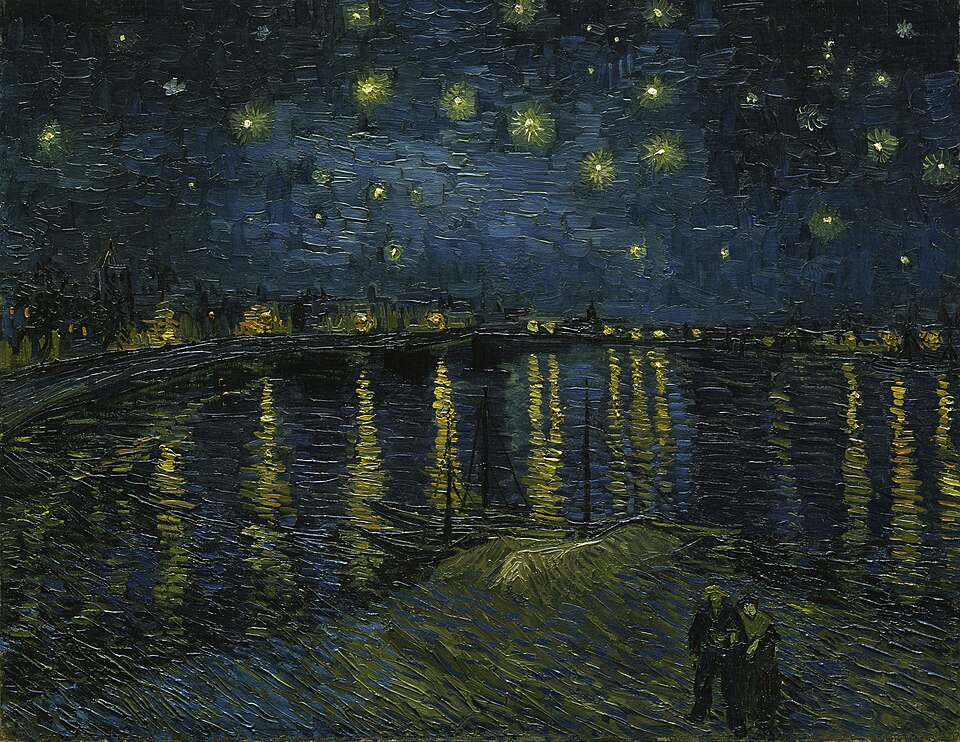  
*[Source](https://en.wikipedia.org/wiki/File:Vincent_van_Gogh_-_Starry_Night_-_Google_Art_Project.jpg)*

You might know it today as the Big Dipper, a part of the constellation Ursa Major.  
  
*[Source: Acadia Photo Safari](https://www.acadiaphotosafari.com/blog/2013/10/3/big-dipper-over-bubbles)*  
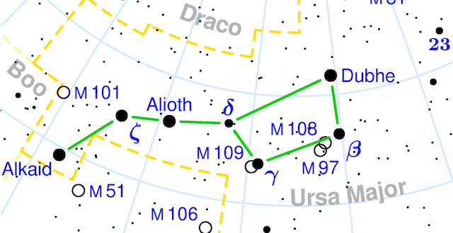  
*[Source: Torsten Bronger](https://commons.wikimedia.org/wiki/File:Ursa_Major_constellation_map.png)*

This same pattern appears in texts written by human observers over a thousand years ago.

- The Dunhuang star map, from around 700 AD:    
  
*[Source](https://commons.wikimedia.org/wiki/File:Dunhuang_star_map.jpg)*

- The *Book of Fixed Stars* from around 964 AD:  
_-_Bodleian_Library_-_Marsh_144_crop.jpg)
*[Source](https://commons.wikimedia.org/wiki/File:Al_Sufi_-_Book_of_Fixed_Stars_-_Ursa_Major_(The_Great_Bear)_-_Bodleian_Library_-_Marsh_144.jpg)*

All around the world, observers notice the same patterns,
but tell their own stories:  
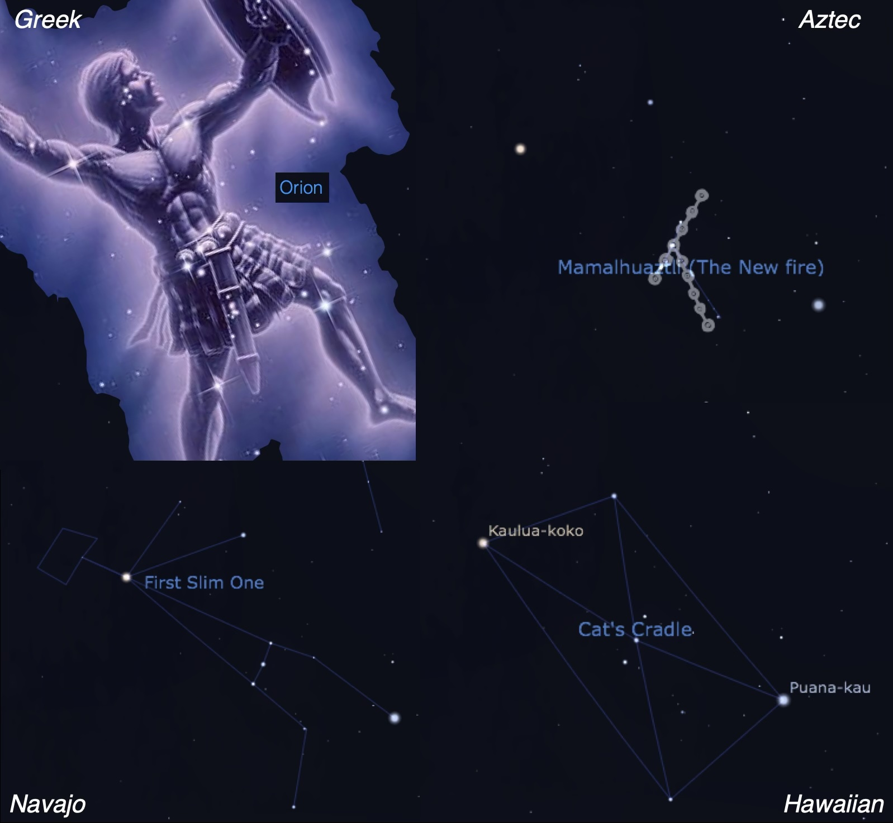  
*Sources: [Stellarium](https://stellarium.org/), [NASA/STScI](https://science.nasa.gov/universe/discovering-the-universe-through-the-constellation-orion/)*

### Constellations

In modern Astronomy, constellations are how we identify and name **regions of the sky** - NOT the patterns of the stars themselves. 

The constellation Orion is everything in the highlighted region in this sky map:  
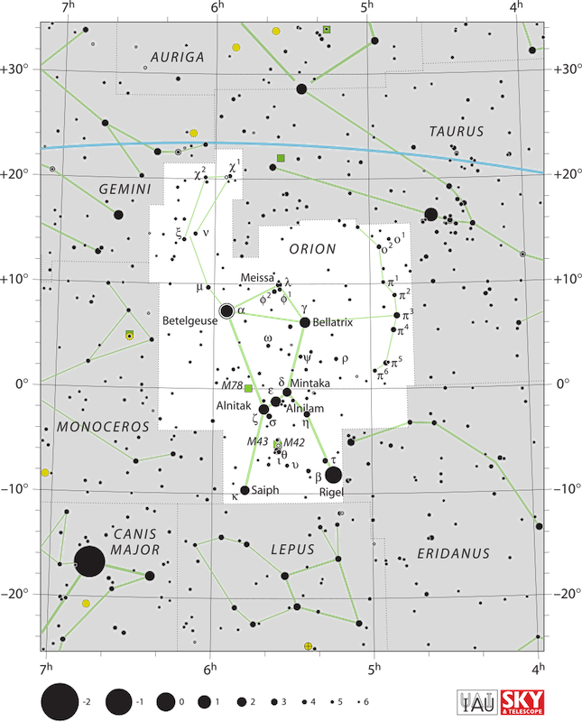  
*[Source: IAU, Sky and Telescope](https://commons.wikimedia.org/wiki/File:Orion_IAU.svg)*

## The Dome of the Sky

Stars in constellations **appear** to be side-by-side, but they can be at very **different distances** from the Earth.  

The red star Betelgeuse on Orion's "shoulder" is 650 light years away, but the purplish glowing Nebula M42 in the "sword" is 1,344 light years away. So Betelgeuse is closer to us than it is the nebula.  
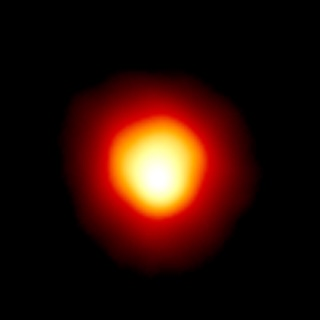
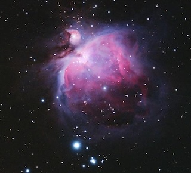  
Sources: [Dupree and Gililand, CfA/STScI/NASA/ESA](https://esahubble.org/images/opo9604b/) and [Filip Loic](https://www.asc-csa.gc.ca/eng/multimedia/search/image/3834)

How can you figure out how far away things are if you can’t reach them?

1. Binocular vision (compare view from each eye.)
2. Known size scaling (cows are really the same size.)

*[Source: RF Vila](https://commons.wikimedia.org/wiki/File:Cows_in_a_Yorkshire_field_IMG_0349.jpg)*
3. Atmospheric perspective (the effect of the air.)

*[Source: Joaquim Alves Gaspar](https://commons.wikimedia.org/wiki/File:SerraEstrela-MAR2007-5.jpg)*

* Modern astronomers use versions of each of these methods to work out the distances to astronomical objects 
* None of them work for unassisted human vision
* Stars are not small, but are very far away
* They have different sizes and distances, BUT appear as points in the sky 
    * except for the star closest to us... the Sun!

  
*[Source](https://en.wikipedia.org/wiki/File:Deathvalleysky_nps_big.jpg)*

When we look at the night sky they seem to be sprinkled on a dome over our heads.

This is an optical illusion because we lack depth perception for such distant objects.

## Directions in the Sky

If you look to any side, you see the **Horizon**. This is where the sky appears to meet the most distant part of the ground you can see.

### Horizon examples:

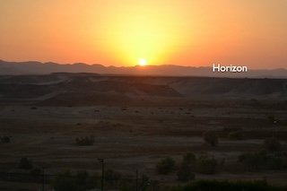

### Ground to sky:

**North, East, South,** and **West** mark the directions you would travel out toward the horizon. They are the same directions you use to orient a map.

If you look directly overhead, you see the **Zenith**. This is the "top" of the dome.

### Altitude, Azimuth, Meridian

We locate regions in the sky by **azimuth** (angle around the horizon) and  **altitude** (angle above the horizon).

First you find the azimuth on the horizon. Which direction do you face? For example: North, East, South, or West. 

Then, you look up from the horizon to find altitude:

* On the Horizon (0°)
* Low in the sky (less than 45° up from the horizon)
* High in the sky (more than 45° up from the horizon)
* Zenith (directly overhead, 90° up from the horizon)

For example: the GPS satellite passes overhead:
from far away in the Northwest, 
to the Zenith, to far away in the Southeast.  
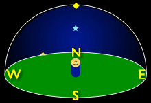

### Polaris, the North Star

Polaris is seen directly above the North point of the horizon in the Northern Hemisphere.

In Fullerton, we see Polaris at an altitude of 34° above the horizon.

You can find Polaris from nearby star patterns - it's between the stars of the Big Dipper and the W-shaped Casseopeia.

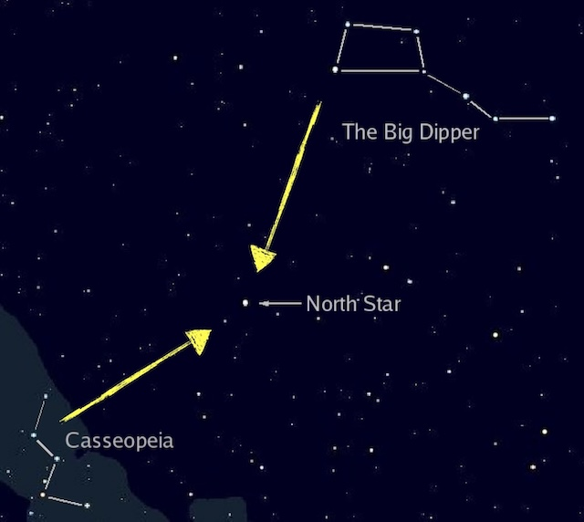

### The Sun and the Meridian

The sun rises in the East, 
moves high in the Southern sky,
and sets in the West. Its path makes an arc across the sky.  
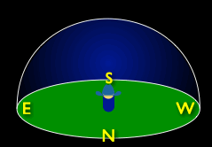

We also divide the sky by the **meridian**, a line going from the North point of the hoizon to the South point.

This is where we get a.m. (ante meridian, before meridian) and p.m. (post meridian, after meridian).

## The Celestial Sphere

Each night, the stars appear to move.

Looking North toward Polaris, the stars rotate around it.

Polaris Time Lapse video:  

<iframe src="https://player.vimeo.com/video/4330429?badge=0&amp;autopause=0&amp;player_id=0&amp;app_id=58479" frameborder="0" allow="autoplay; fullscreen; picture-in-picture; clipboard-write; encrypted-media; web-share" referrerpolicy="strict-origin-when-cross-origin" style="position:absolute;top:0;left:0;width:100%;height:100%;" title="Polaris time lapse"></iframe>

This makes it seem like the stars are all on the surface of a spinning ball around us.

Animation of the Celestial Sphere: *[Source: Science Sims @ CCNY](https://sciencesims.com/simdocs/celestial-sphere)*
<iframe src="https://ccny-physics-sims.github.io/sims/celestial-sphere/" width ="400" height="400" ></iframe >

Many early astronomers imagined that stars were really fixed on the surface of a Celestial Sphere that surrounded and revolved around the Earth.

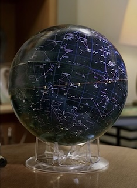

* The celestial sphere is a scientific model.

* We now know it is not how things really are. 

* It’s still a useful way to map the position and motion of the stars in our sky.

### Features of the Celestial Sphere Model

The Celestial Sphere surrounds the Earth. 

* The stars are in fixed positions on the sphere.

* The North Celestial Pole is directly above Earth's North Pole.  

* The Celestial Equator is directly above Earth's equator. It's 90° down from Polaris. 

## The Celestial Sphere and your Local Sky

Your Local Sky is half of the celestial sphere; the half that is above your local horizon

* Your zenith is directly above your location on Earth. Your horizon is 90° down from your zenith in a full circle. The North Celestial Pole and Celestial Equator are tilted in your sky.

* The North point of your horizon is directly beneath the North Celestial Pole. Your meridian runs from North on your horizon, through the Zenith, to South on the opposite side of the horizon. East and West are to the left and the right if facing South.

## The Rotating Sphere
In the Celestial Sphere model, the Earth is fixed and the Celestial Sphere rotates.

* It rotates around the Polar axis from East to West
    - An axis through the North Celestial Pole (Polaris, the North Star)

* The Celestial Sphere makes a complete rotation once every day.

* The stars on the sphere appear to make circular paths. 

* Each star completes a full circle path every 24 hours.

## Example Star Paths in the Local Sky
Below is a diagram of a the local sky facing East, with two example star paths. One path circles Polaris in the sky, and the other arcs from East to West. The stars are only visible when they are above the horizon.

Things to notice:

- The N/E/S/W directions are on the horizon.
- Polaris is high in the Northern sky.
- The Celestial Equator runs from East to West, but is tilted compared to the Zenith. Seen the center of the dome, the Equator is 90° away Polaris.
- Star Path A follows the Celestial Equator. A star on this path rises across the horizon due East, travels high above the Southern horizon, and sets across the horizon due West.
- Star Path B circles Polaris. A star on this path never crosses the horizon. It moves from low in the Northern sky to the Zenith and back. 

## Types of Stars

Visible stars at a given location may be circumpolar or rise-and-set stars.

Stars making a full circle in the sky are Circumpolar stars. Circumpolar stars never set below the horizon.

Stars coming up from the horizon are Rise-and-set stars.

In this long-exposure sky photograph, the motion of stars turs them into streaks across the sky.  
  

Polaris is not *exactly* on the north celestial pole, so it makes a little arc in this photo.

## Check Your Understanding

<quiz>

You walk outside and turn so you are facing due North. 
Your zenith is:

- [ ] Directly in front of you
- [ ] Straight out to your right
- [ ] Directly behind you
- [ ] Straight out to your left
- [x] Directly overhead

</quiz>

<quiz>

You walk outside and turn so you are facing due North. 
South is:

- [ ] Directly in front of you
- [ ] Straight out to your right
- [x] Directly behind you
- [ ] Straight out to your left
- [ ] Directly overhead

</quiz>

<quiz>

Where in the diagram would you label North?  

- [ ] Position A
- [ ] Position B
- [ ] Position C
- [x] Position D
- [ ] Position E

The North direction is on the horizon, directly underneath Polaris.

</quiz>

<quiz>
What direction is the observer looking in the diagram below?

- [ ] toward the South
- [ ] toward the North
- [x] toward the East
- [ ] toward the West

</quiz>

<quiz>

You look to see the sun in the early evening. It's a few sun-heights above the horizon. You describe it as: (choose two)  

- [ ] High
- [x] Low 
- [ ] In the Northern Sky
- [ ] In the Eastern Sky
- [ ] In the Southern Sky
- [x] In the Western Sky

Since this is closer to the horizon than to the zenith, it is low in the sky. Since it's evening, the sun about to set in the West, so it's in the Western sky.

</quiz>

<quiz>

You observe a star rising due East. When the star reaches its highest position above the horizon, where will it be?

- [ ] High in the Northern sky
- [ ] High in the Eastern sky
- [x] High in the Southern sky
- [ ] High in the Western sky
- [ ]  At the Zenith

This star is like Star A in [Example Star Paths](#example-star-paths). The Lecture Tutorial on Position will help you understand!

</quiz>

## Go Further

What stars can you see? [Where Are the Stars? See How Light Pollution Affects Night Skies | Short Film Showcase by National Geographic (YouTube)
](https://www.youtube.com/watch?v=0FXJUP6_O1w) explains how light pollution affects our view of the stars.

Ideas from this lecture are used in the [The Rotating Sky
Lab](https://astro.unl.edu/naap/motion2/motion2.html).