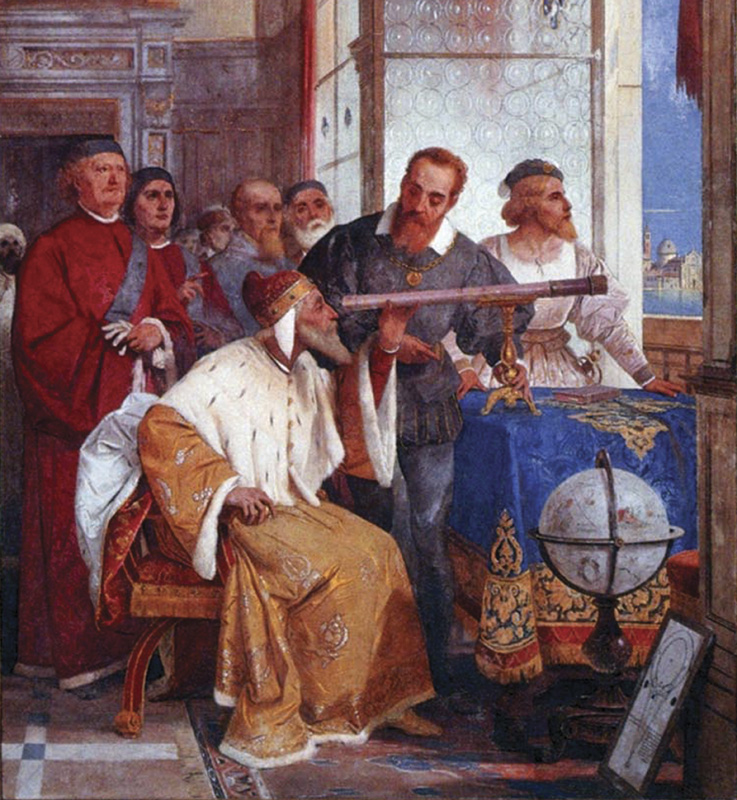
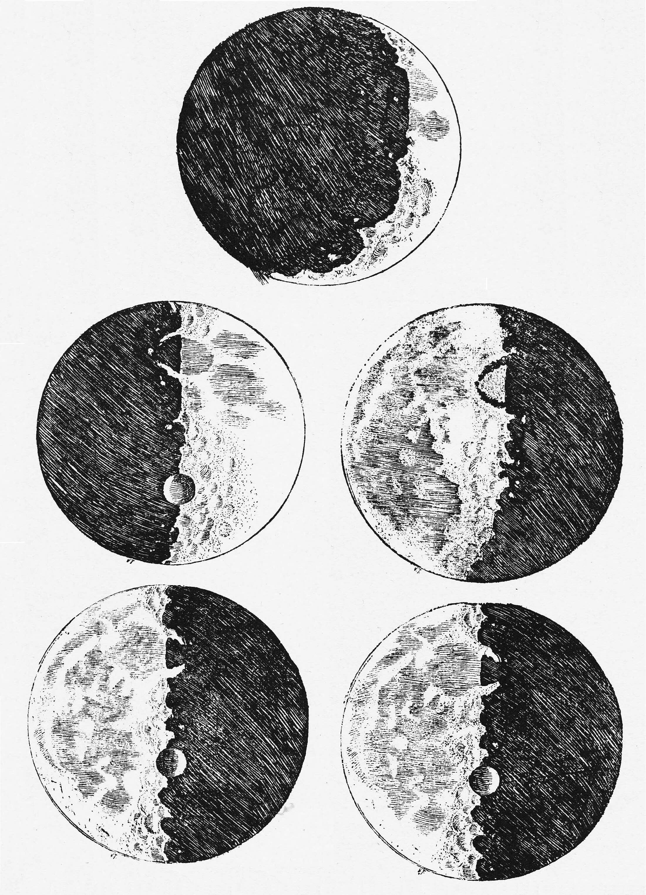
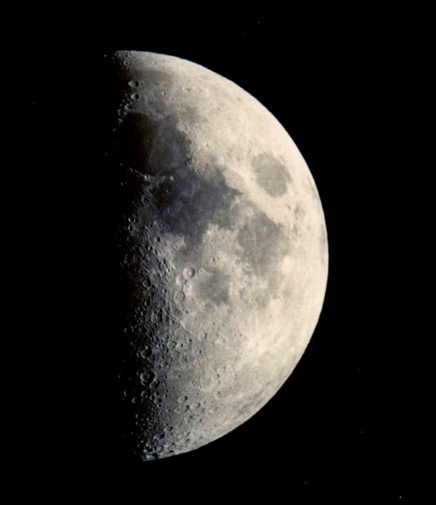
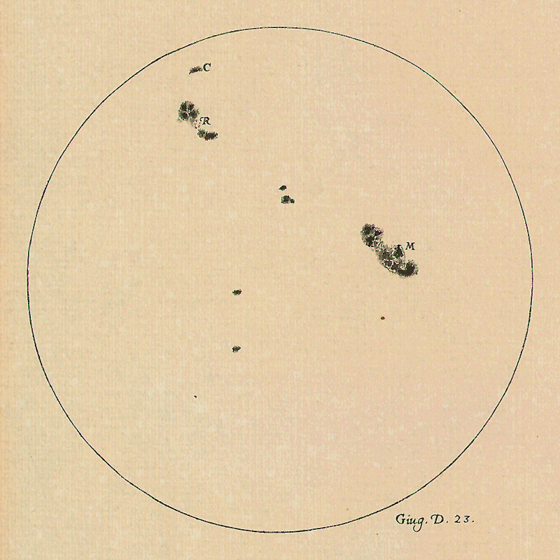
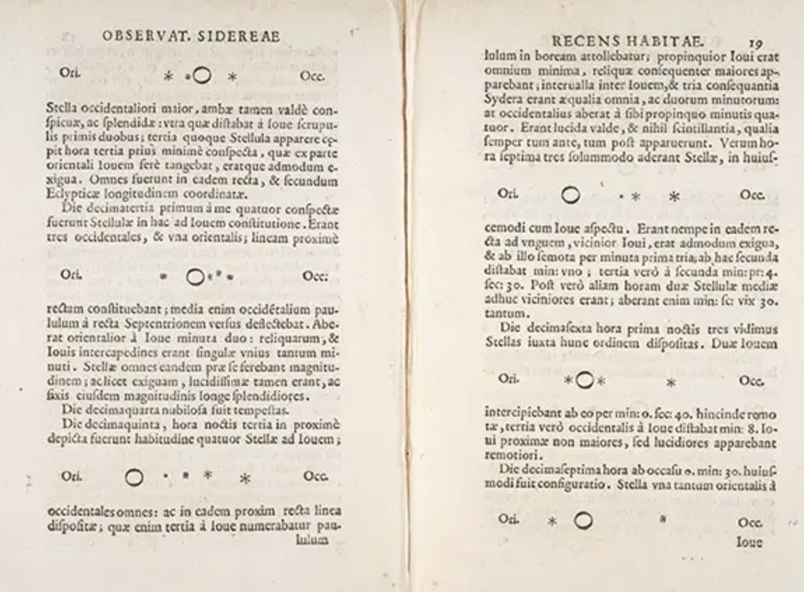
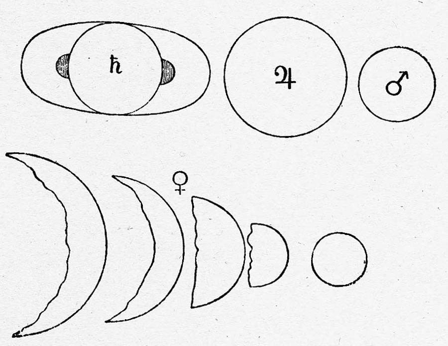
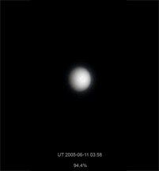
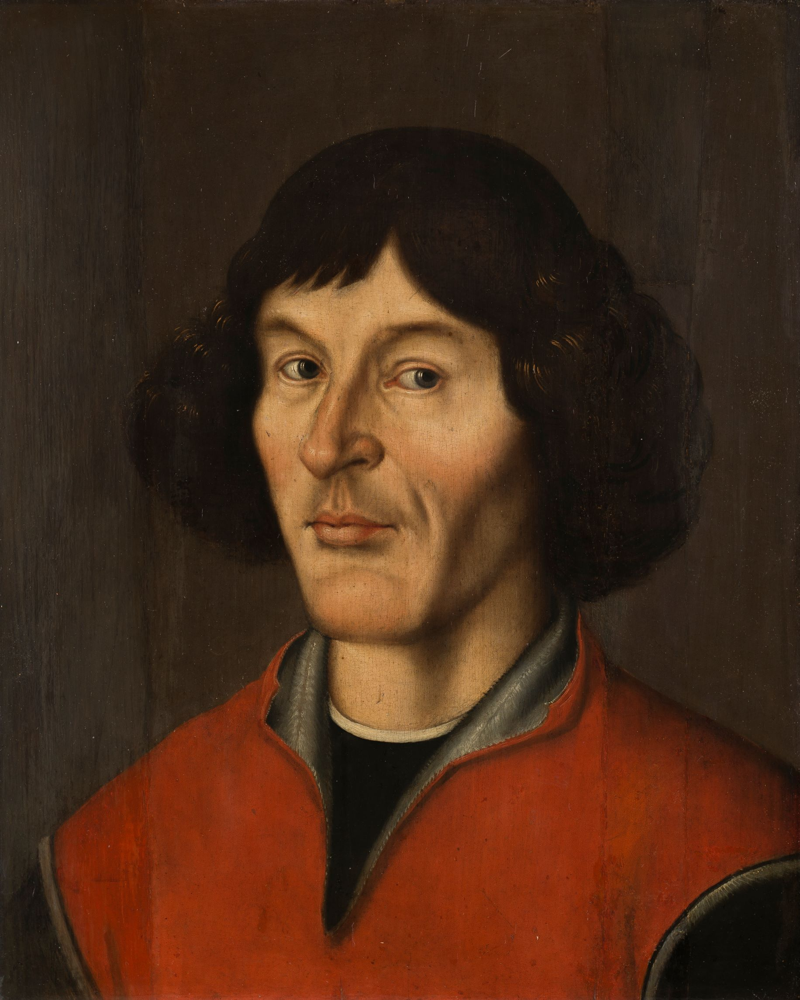
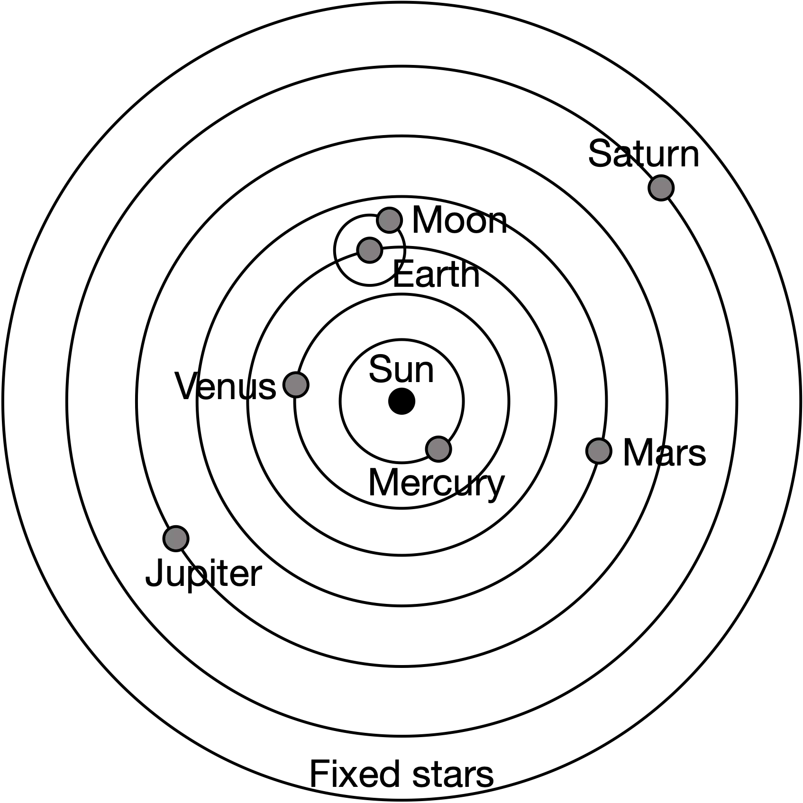
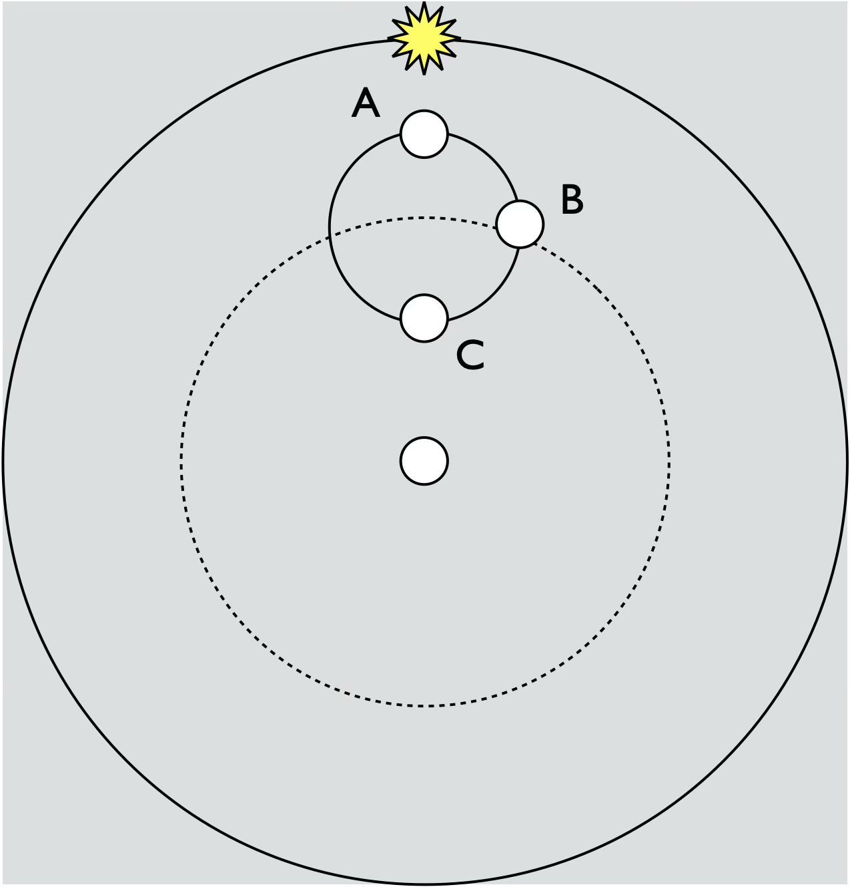

# Galileo and Copernicus

In this module, we'll discuss:

* Galileo’s Telescope
* The Phases of Venus
* The Copernican Model

## Galileo’s telescope

- Galileo Galilei (1564-1642) did not invent the telescope.

- He was one of the first to use it to observe Celestial objects.

- Earliest models had only 3x magnification  
- Later >10x

*Artist: Giuseppe Bertini [Image Source: Gabriele Vanin](http://www.gabrielevanin.it/S.%20Marco%201609.htm)*

- Here showing it to Venice’s leadership  

### Galileo's Observations

Galileo’s Sidereus Nuncius (“The Starry Messenger”) was  published in Latin in 1610. He published about sunspots in 1613.

* Galileo saw craters on the moon...

  * Like a photo today:

* ...and he saw changing sunspots on the sun

  * Like we do today:
<figure>
  <video controls width="100%">
    <source src="../img/buak2-vid-spotmove-smaller.mp4" type="video/mp4">
    Your browser does not support the video tag.
  </video>
  <figcaption>Moving sunspot video in ultraviolet light on August 22, 2011, recorded by the SDO (Solar Dynamics Observatory) spacecraft, which orbits between the Sun and Earth.</figcaption>
</figure>

*Source: [NASA/Goddard Space Flight Center Scientific Visualization Studio
via PBS Learning Media](https://www.pbslearningmedia.org/resource/buack2-sci-sunspotgall/sunspots-on-the-move/)*

* Galileo observed moons moving around Jupiter

    * Compare this sequence of photographs taken by JunoCam aboard the Juno spacecraft, in June 2016, of Jupiter and the motion of the four Galilean moons, as the spacecraft approached the planet.

*Source [National Aeronautics and Space Administration / Jet Propulsion Laboratory / Malin Space Science Systems, via Wikipedia](https://commons.wikimedia.org/wiki/File:Jupiter_and_the_Galilean_moons_animation.gif), original [Source on YouTube](https://www.youtube.com/watch?v=XpsQimYhNkA)* 

* Galileo observed different planetary shapes for Saturn, Jupiter, Mars, and Venus.
* Venus has phases

  * They can be seen with telescopes or binoculars today

*[Source: Wah!](https://apod.nasa.gov/apod/ap060110.html)*

Implications:
  * These observations shattered the idea of heavenly perfection
  * Moons can orbit a moving planet!
  * Venus orbits the Sun (How does this show that?)

## The Phases of Venus

Observations of Venus provided critical support for heliocentric models in the 1600s.

* Both geocentric model and a heliocentric model produced [retrograde motion](./retrograde_motion.md)
* The heliocentric model predicts stellar parallax, but that wasn’t observed until 1837
* The geocentric model and the heliocentric model have **different** predictions for planetary phases

## The Copernican Model

Nicholas Copernicus, (1473-1543) Renaissance astronomer  

Formulated a comprehensive heliocentric model in the 1540s.

- The Sun is at the center.  Venus and Mercury are close to the Sun.
- Daily motion is from Earth’s spin
- The moon circles the Earth
- Earth passing other planets leads to retrograde motion
- Celestial objects are still all perfectly spherical and moving in perfect circles

### Features of the Copernican model

* The Earth and planets revolve around the Sun
* The Earth rotates so the stars, Sun and planets appear to move around the Earth
* The moon orbits the Earth, not the sun
* Mercury and Venus are closer to the Sun and so always appear near the Sun
* As the Earth passes the planets they appear to undergo retrograde motion
* The planets were still assumed to move in perfect circles (more on this later)

## Planetary phases

Compare planetary phases in the Copernican and [Ptolemaic](ancient_astronomy.md#geocentric-models) models:

### Ptolmeic model
What phases can be seen?

[Ptolemaic Model animation, Astronomy Education at the University of Nebraska-Lincoln](https://astro.unl.edu/classaction/animations/renaissance/ptolemaic.html).

<iframe
  src="https://astro.unl.edu/classaction/animations/renaissance/ptolemaic.html"
  title="Ptolemaic Model of Venus Phases"
  width="900"
  height="650"
  style="max-width: 100%; border: 1px solid #ccc;"
  loading="lazy"
  allowfullscreen>
</iframe>

 The model produces... 

 crescents and new Venus 

### Copernican Model

[Ptolemaic Model animation, Astronomy Education at the University of Nebraska-Lincoln](https://astro.unl.edu/classaction/animations/renaissance/venusphases.html).

<iframe
  src="https://astro.unl.edu/classaction/animations/renaissance/venusphases.html"
  title="Venus Phases Model"
  width="900"
  height="650"
  style="max-width: 100%; border: 1px solid #ccc;"
  loading="lazy"
  allowfullscreen>
</iframe>

 The model produces... 

 All phases: crescents, gibbous, full, and new 

### Galileo's observations
Galileo saw all phases of Venus, a compelling case for heliocentrism!

So, are we done?  

Can we predict all the celestial motion with the Copernican Model?

### Check your understanding
Use this diagram of Venus positions for the heliocentric questions.

<quiz>
In the heliocentric model ,
which letter corresponds to this
phase of Venus?

{ width="50"}

- [ ] A
- [ ] B
- [ ] C
- [ ] D
- [x] E

</quiz>

<quiz>
In the heliocentric model ,
which letter corresponds to this
phase of Venus?

{ width="50"}

- [ ] A
- [x] B
- [ ] C
- [ ] D
- [ ] E

</quiz>
Use this diagram for the geocentric questions:

<quiz>
In the geocentric model,
where would you see a “new”
phase of Venus?

- [ ] A only
- [ ]  B only
- [ ]  C only
- [x] Both A and C
- [ ]  Nowhere

</quiz>

<quiz>
Can a gibbous Venus ever be seen from
Earth in the geocentric model?

- [ ] Yes
- [x] No

</quiz>

<quiz>
How are observations of
Venus at odds with the
geocentric epicycle picture?

- [ ]  Venus would not be expected to significantly change in size
- [ ] Venus would not appear “new” as the Moon does
- [x]  Venus would not appear “full” as the Moon does

</quiz>

