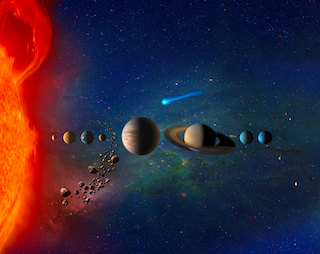
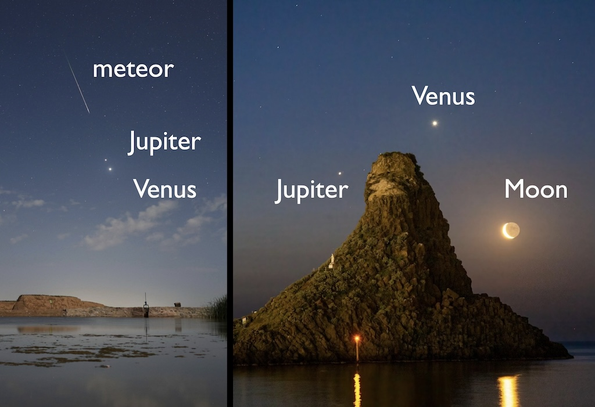
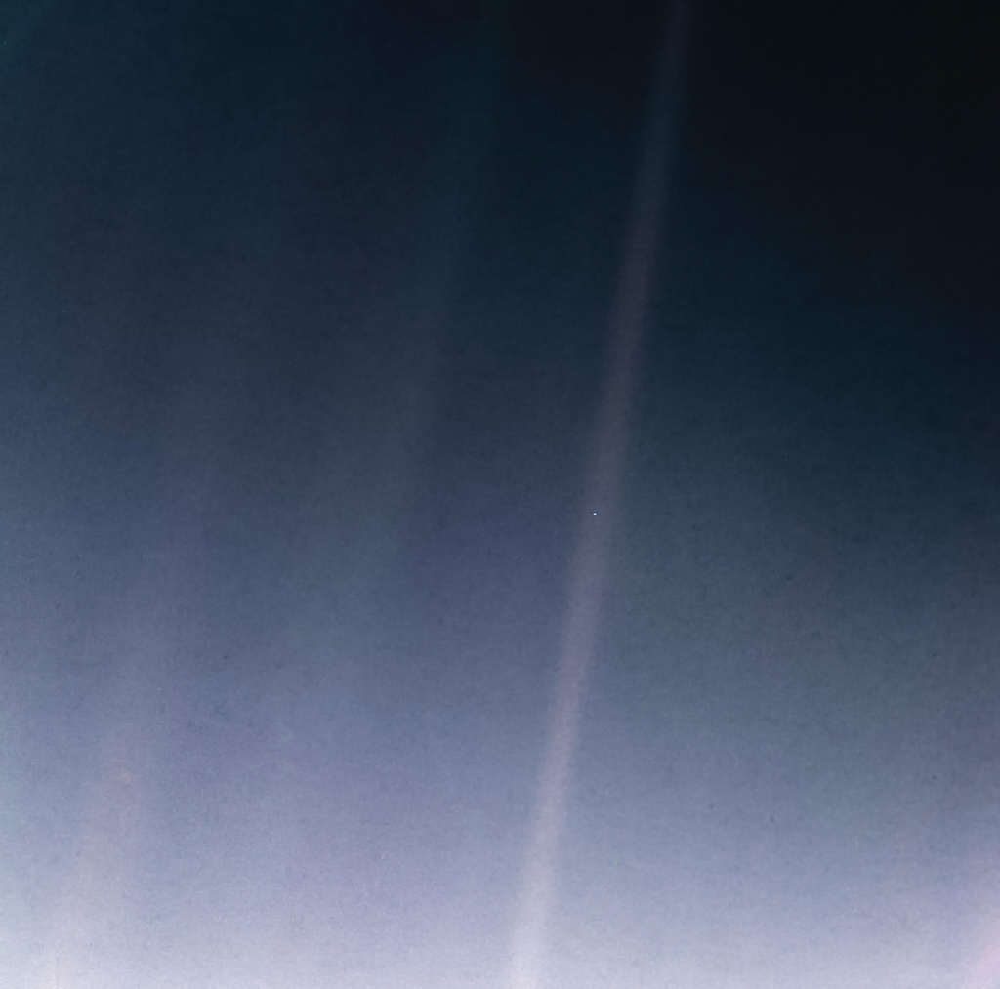
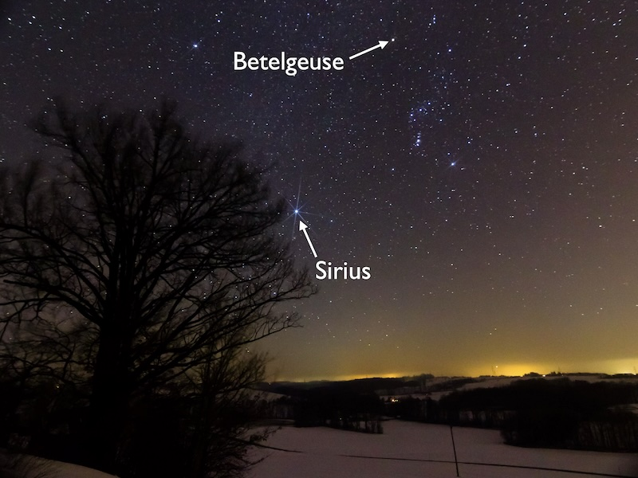
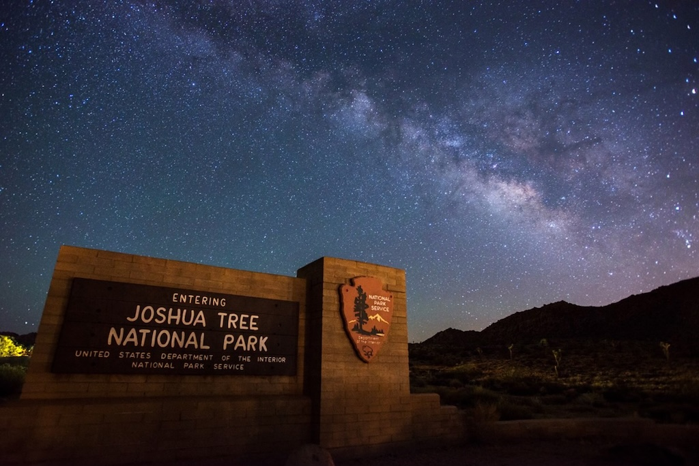

# Our Cosmic Address 

Our Cosmic Address describes the location of Earth in the context of the Universe, and how we see the Universe from Earth.

You will also learn about *Astronomical Units*, *Light Years*, and the *Observable Universe*.

What you need to know: 

* Powers of 10 or Scientific notation, like 1000 = 103
 [Scientific Notation Review (Khan Academy)](https://www.khanacademy.org/math/pre-algebra/pre-algebra-exponents-radicals/pre-algebra-scientific-notation/a/scientific-notation-review)
* 1 million = 1,000,000 = 106 
* 1 billion = 1,000,000,000 = 109
* The speed that something travels determines how long it takes to cover a given distance. For example, it takes 2 hours to travel 100 miles at a speed of 50 miles per hour. 

## Steps to the Universe

1. [Earth](#earth)
2. [The Solar System](#the-solar-system)
3. [Our Stellar Neighborhood](#our-stellar-neighborhood)
4. [The Milky Way Galaxy](#our-galaxy-the-milky-way)
5. [The Local Group](#the-local-group-of-galaxies)
5. [The Virgo Supercluster](#the-virgo-supercluster)
4. [The Universe](#the-universe)

## Earth

We are on the planet Earth.

May 18, 1969: An Apollo 10 photograph of Earth, taken from 100,000 miles away on a journey to the Moon. 

*[Source: NASA](https://www.nasa.gov/image-article/may-18-1969-apollo-10-view-of-earth/)*

Our Moon orbits the Earth.

July 5, 2016: The moon passes between NOAA's DSCOVR satellite and Earth over a period of about four hours.  
  
*[Source: NASA](https://www.nasa.gov/solar-system/from-a-million-miles-away-nasa-camera-shows-moon-crossing-face-of-earth/)*

### Scale of the Earth, Moon, and Sun:

Earth is about 1/100 the size of our star, the Sun.

The size of the Earth and the Moon, and the distance between them, are shown to scale with the Sun in this image.  
  
*[Source: Tom Roelandts. Sun image: Thomas Bresson.](https://tomroelandts.com/articles/earth-moon-system-to-scale)*

## The Solar System

Earth and the Moon are in the Solar System. 

The Solar system: Our Sun and all the stuff (planets, dwarf planets, asteroids, comets, …) that orbits it.
This is an artist's representation of the Solar System:  

From Earth, we see the planets as points of light. In the photo to the left, we see a meteor streak near Venus and Jupiter in August 2025. Bits of dust or rock in the Solar System hitting our atmosphere make meteors. In the photo to the right, we see Venus and Jupiter in November 2023, this time near a crescent Moon in the sky.

*[Source 1: Jeff Dai](https://apod.nasa.gov/apod/ap250815.html)*, *[Source 2: Giovanni Passalacqua](https://apod.nasa.gov/apod/ap231114.html)*

Almost always, including in this class, we will show models and diagrams of the Solar System that are "not to scale." This is because the distances involved are so big.

### Light Years and Astronomical Units:

Two astronomical units of distance we'll use:

- One *Astronomical Unit* or A.U. is the average distance from the Earth to the Sun (1 A.U. = 1.4 x 1011 meters)
-  Light travels at 3 x 108 meters per second (the fastest possible speed).
- Light from the sun takes about 8 minutes to reach Earth. 
  - Calculation: $1.4\times 10^{11} \text{ meters} \times \frac{1 \text{ second}}{3 \times 10^{8} \text{ meters}} \times \frac{1 \text{ minute}}{60 \text{ seconds}} = 8 \text{ minutes}$
- One *light year* is the distance light travels in a year (1 ly = 9 x 1015 meters)

- We use the terms:

    - One *light minute* for the distance light travels in a minute
    - One *light second* for the distance light travels in a second    

- The Earth is 8 light minutes from the Sun.
- The Earth is 1.2 light seconds from the Moon.

### The Scale of the Solar System

This image shows both the sizes and distances of the Solar System to scale. It shows that if the Sun-Neptune distance of the Solar System were scaled down to the 100-yard playing field length of a football field (yellow lines mark the goal line to goal line span). 

*[Source: Tdadamemd](https://commons.wikimedia.org/wiki/File:Solar_System_to_Scale_to_a_Football_Field.jpg)*

At this scale:

- The Sun and eight planets would be small enough to hold in the palm of a person's hand. 
- The Sun is about two-thirds the size of a golf ball.
- All four terrestrial planets (Mercury, Venus, Earth, Mars) are smaller than the ball contained at the tip of a ball-point pen.
- All four gas/ice giant planets (Jupiter, Saturn, Uranus, Neptune) are smaller than a peppercorn.
- For distances, the Sun is at one goal line, with Neptune at the opposite goal line (100 yards away).
- Earth is at the 3 yard line, and Jupiter at the 17 yard line.

### The Pale Blue Dot
The famous "Pale Blue Dot" image is a photograph of Earth taken Feb. 14, 1990, by NASA’s Voyager 1 spacecraft. It was taken from beyond Neptune, 6 billion kilometers or 5 light hours away. Earth is the dot in the middle of the faint sunbeam just to the right of center.

*[Source: NASA](https://science.nasa.gov/resource/voyager-pale-blue-dot-download/)*

"Look again at that dot. That's here. That's home. That's us." - Carl Sagan, *[Pale Blue Dot](https://www.youtube.com/watch?v=wupToqz1e2g)*

## Our Stellar Neighborhood

The Sun is a star, sometimes called Sol.

It sits in a neighborhood of many stars.

The closest star, Proxima Centauri, is 4.25 light years away.

*[Source: Andrew Z. Colvin](https://commons.wikimedia.org/wiki/File:04-Closest_Stars_(LofE04240).png)*

In this image of the night sky, you can see the constellation Orion. Two bright stars, Betelgeuse and Sirius, are labeled. Sirius is nearby.

*Photo: H Raab*

 - Sirius is a neighbor star, 8 light years away.
 - Betelgeuse is 642 light years away.

The Summer Triangle is made of three bright stars: Vega, Deneb, and Altair. Vega and Altair are nearby.

*Photo: Bob King*

- Vega is 25 light years away.
- Deneb is 2600 light years away.
- Altair is 17 light years away.

## Our Galaxy: The Milky Way

The Sun is in the Milky Way galaxy.

Galaxies are collections of stars bound together by gravity. They contain millions of stars.

The Milky Way contains all the individual stars we see in the sky.

*[Source: Andrew Z. Colvin](https://commons.wikimedia.org/wiki/File:05-Milky_Way_Galaxy_(LofE05240).png)*

From Earth's perspective, we can see the core of the Milky Way in a dark sky. It is 25,000 light years away.

*Source: NPS/ Lian Law*

## The Local Group of galaxies

The Milky Way is in a group of nearby galaxies.

*[Source: Andrew Z. Colvin](https://commons.wikimedia.org/wiki/File:5_Local_Galactic_Group_(ELitU).png)*

The nearest large galaxy is the Andromeda Galaxy, M31, which is 2.5 million light years away. Its faint glow is larger than the full Moon in our sky.

*[Photo source: Ted Van, earthsky.org](https://earthsky.org/tonight/andromeda-galaxy-visible-again-each-evening/)*

We can also see smaller galaxies near the Milky Way from Earth's Southern hemisphere: the Magellanic Clouds. The photo below was taken above the radio telescopes of ALMA in the Atacama Desert of northern Chile. 

*[Photo source: ESO/Christoph Malin](https://www.astronomy.com/science/almas-science-so-far/)*

## The Virgo Supercluster
Our group of galaxies is part of the Virgo Supercluster.

Galaxies are arranged in clusters and superclusters containing many galaxies. Each dot in the image below marks a galaxy containing billions of stars. 

*[Source: Andrew Z. Colvin](https://commons.wikimedia.org/wiki/File:07-Laniakea_(LofE07240).png)*

The Fornax cluster is also in the Virgo Supercluster. It is about 62 million light years away. The photograph below shows many galaxies of the Fornax cluster from a 25 minute exposure, so the faint galaxies can be seen.

*Source: ESO/J. Emergson/VISTA/Cambridge Astronomical Survey Unit*

## The Universe

All these clusters and superclusters of galaxies are in the same Universe. 

The Universe also contains galaxies we will never be able to see.

The part of the Universe we can potentially see is *the observable universe*. It contains hundreds of millions to trillions of galaxies.

The Observable Universe stretched out from our location in all directions. 

*[Source: R. Powell, Atlas of the Universe](http://www.atlasoftheuniverse.com/universe.html)*

Hubble’s Extreme Deep Field Image shows
more than five thousand of the most distant galaxies. It was made with a total exposure time of 22 days, by the Hubble Space Telescope over the years 2002 to 2012. The light recorded to make this image had been traveling for up to 13.2 billion years.

*[Source: NASA](https://science.nasa.gov/asset/hubble/hubble-extreme-deep-field-xdf/)*

### The Boundary of the Observable Universe 

- Light takes time to travel from distant galaxies.
    - As we look further away, we look back in time.
- The universe is about 14 billion years old
    - The oldest light we can see has travelled for 14 billion years.
    - This edge is a boundary in time.
- Light from the Extreme Deep Field has travelled for 13. 2 billion years
    - It left when the Universe was only 800 million years old. 

## The Size of the Observable Universe:

- The universe is expanding in size.  Galaxies were closer when they emitted the light we see.
- If the most distant light sources still exist, they are now 45 billion light years away 

## Activities

Go to the [Activities Page for this lecture](../activities/cosmic_address.md).

## Go Further

* [How Big is the Universe by minutephysics](https://www.youtube.com/watch?v=5NU2t5zlxQQ) Expanded discussion of the Observable Universe and the full Universe.
* [Build your own Solar System](https://www.exploratorium.edu/explore/solar-system/activity/build-model) Calculate the sizes to build your own scale model of the Solar System

* [Why does the Southern Hemisphere get the best view of the Milky Way? by Dr. Becky](https://www.youtube.com/watch?v=Ieq_z81JpL8)