# Daily Motion of the Sky

We'll discuss how Earth's spin causes the motion we see,  how the sun and stars appear to move, 

## The Celestial Sphere

Each night, the stars appear to move.

Polaris Time Lapse video:  Looking North toward Polaris, the stars rotate around it.

<iframe src="https://player.vimeo.com/video/4330429?badge=0&amp;autopause=0&amp;player_id=0&amp;app_id=58479" frameborder="0" allow="autoplay; fullscreen; picture-in-picture; clipboard-write; encrypted-media; web-share" referrerpolicy="strict-origin-when-cross-origin" style="position:absolute;top:0;left:0;width:100%;height:100%;" title="Polaris time lapse"></iframe>

This makes it seem like the stars are all on the surface of a spinning ball around us.

Many early astronomers imagined that stars were really fixed on the surface of a Celestial Sphere that surrounded and revolved around the Earth.

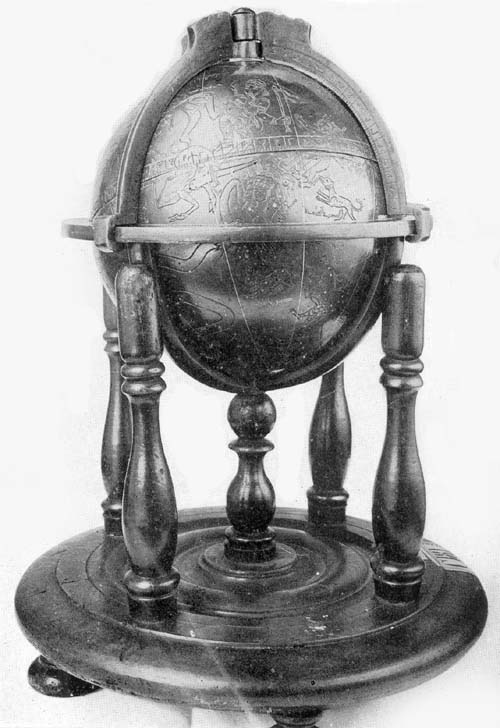  
Globe of Mohammed ben Muwajed el Ordhi, 1279.
*[Source: Edward Luther Stevenson](https://www.gutenberg.org/files/39866/39866-h/39866-h.htm)*

Animation of the Celestial Sphere: *[Source: Science Sims @ CCNY](https://sciencesims.com/simdocs/celestial-sphere)*
<iframe src="https://ccny-physics-sims.github.io/sims/celestial-sphere/" width ="400" height="400" ></iframe >

* The celestial sphere is a scientific model.

* We now know it is not how things really are. 

* It’s still a useful way to map the position and motion of the stars in our sky.

*NASA research mathematician Katherine Johnson is photographed at her desk at NASA Langley Research Center with a globe, or "Celestial Training Device," in 1962. [Source: NASA](https://www.nasa.gov/image-article/katherine-johnson-work-1962/)*

### Features of the Celestial Sphere Model

The Celestial Sphere surrounds the Earth. 

* The stars are in fixed positions on the sphere.

* The North Celestial Pole is directly above Earth's North Pole.  
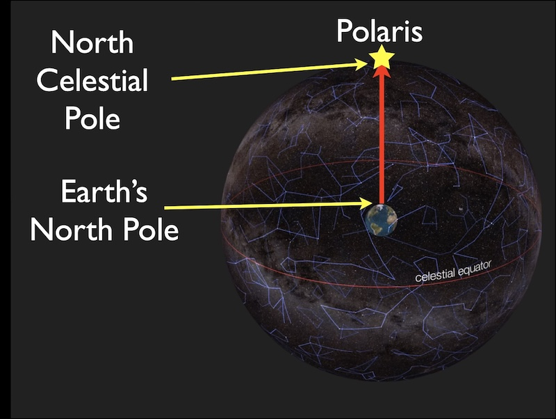

* The Celestial Equator is directly above Earth's equator. It's 90° down from Polaris. 
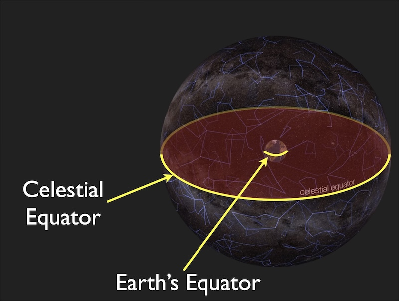

## The Celestial Sphere and your Local Sky

Your Local Sky is half of the celestial sphere; the half that is above your local horizon

* Your zenith is directly above your location on Earth. Your horizon is 90° down from your zenith in a full circle. The North Celestial Pole and Celestial Equator are tilted in your sky.
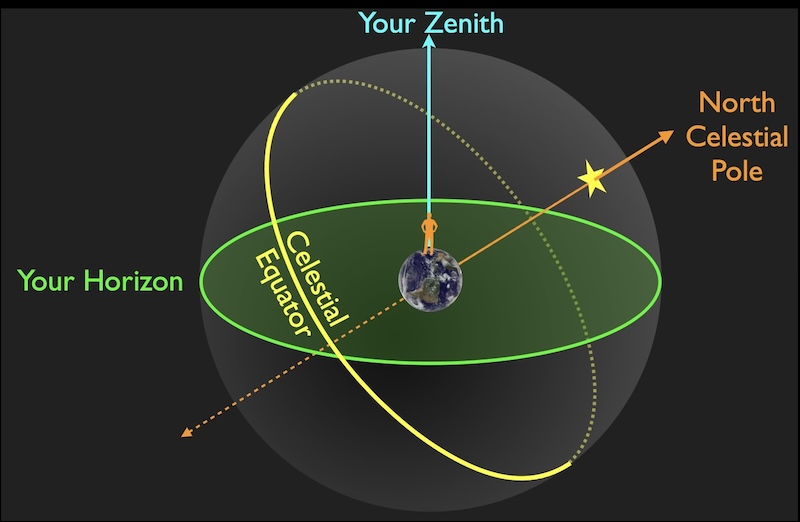

* The North point of your horizon is directly beneath the North Celestial Pole. Your meridian runs from North on your horizon, through the Zenith, to South on the opposite side of the horizon. East and West are to the left and the right if facing South.
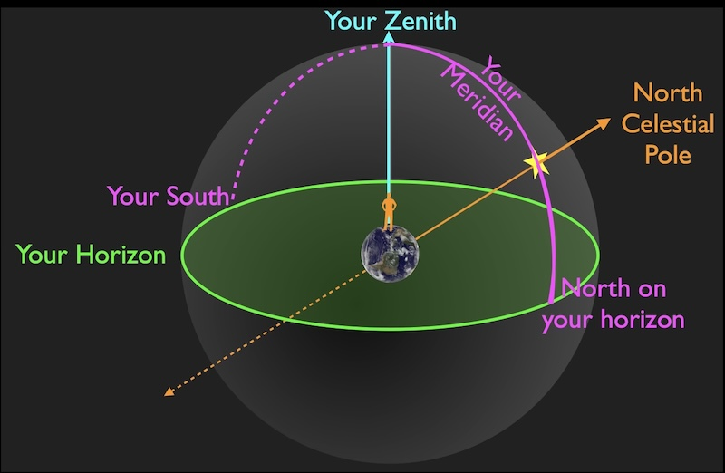

## The Rotating Sphere
In the Celestial Sphere model, the Earth is fixed and the Celestial Sphere rotates.

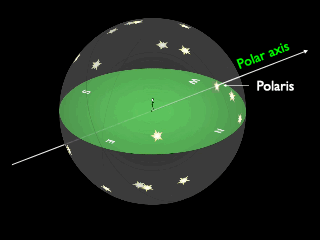

* It rotates around the Polar axis from East to West
    - An axis through the North Celestial Pole (Polaris, the North Star)

* The Celestial Sphere makes a complete rotation once every day.

* The stars on the sphere appear to make circular paths. 

* Each star completes a full circle path every 24 hours.

The [Celestial Sphere Model](celestial_sphere.md) describes what we see but isn't how things really are.

## Types of Stars

Visible stars at a given location may be circumpolar or rise-and-set stars.

Stars making a full circle in the sky are Circumpolar stars. Circumpolar stars never set below the horizon.

Stars coming up from the horizon are Rise-and-set stars.

In this long-exposure sky photograph, the motion of stars turs them into streaks across the sky.  
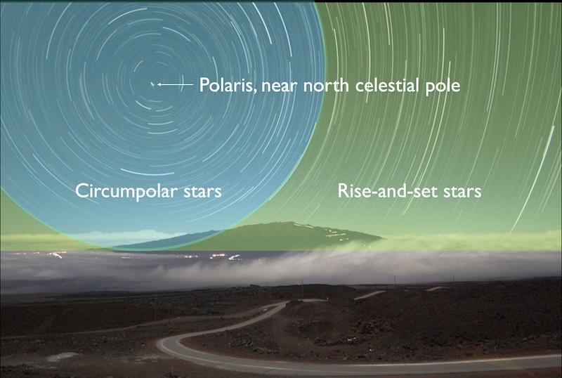  

Polaris is not *exactly* on the north celestial pole, so it makes a little arc in this photo.

## What Causes Daily Motion?

Earth is spinning.

This is a Galileo satellite time-lapse movie of Earth 
starting 6AM PST, December 11 1990, from
2,000,000 km away. The movie covers 25 hours.  
<iframe src="https://commons.wikimedia.org/wiki/File:Earth_rotation_during_Galileo_flyby_(PIA00114).webm?embedplayer=yes" title"A view of the spinning Earth" width="256" height="192" frameborder="0" loading="lazy" allow="autoplay; picture-in-picture" allowfullscreen></iframe>

*[Movie Source: NASA](https://science.nasa.gov/photojournal/earth-south-america-first-frame-of-earth-spin-movie/)*

- Earth’s motion changes our view of space.

- When looking at celestial objects, two of our own motions change what we see:
    - The daily rotation of the Earth about its axis
    - The annual revolution (orbit) of the Earth around the Sun

- Earth’s orbit is slow compared to its daily rotation. We don’t notice it hour-to-hour.

### Earth's rotation

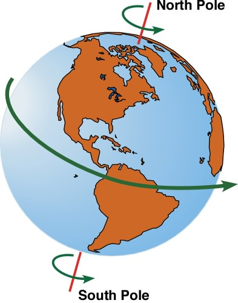

- The Earth rotates from west to east
- This makes the celestial sphere appear to rotate around us from east to west
- It makes a full rotation every 24 hours (*23 hours 56 minutes compared to background stars*)

### Observing from a rotating Earth

- Most objects in our Solar System move slowly compared to this daily rotation.
- More distant objects are too far away to see any motion.
- For most celestial objects, the motion you see in the sky is daily motion from the Earth’s rotation
    - stars, galaxies, the Sun, the Moon, the planets, passing comets…
- Exceptions: rapidly-moving nearby objects like meteors (shooting stars) and satellites

## Check Your Understanding: The Rotating Sky

*Choose the best answer!*

<quiz>

You observe a star rising due East. When the star reaches its highest position above the horizon, where will it be?

- [ ] High in the Northern sky
- [ ] High in the Eastern sky
- [x] High in the Southern sky
- [ ] High in the Western sky
- [ ]  At the Zenith

This star is like Star A in [Example Star Paths](#example-star-paths). The Lecture Tutorial on Position will help you understand!

</quiz>

<quiz>

How much time has passed in this animation?

- [x] One day
- [ ] One week 
- [ ] One month 
- [ ] One year 

The stars make a full circle in the sky, appearing to rotate around the Celestial Pole. This means that 24 hours, or one day, has passed.

</quiz>

<quiz>

About how much time has passed in this animation?

- [ ] 3 hours
- [x] 6 hours 
- [ ] 12 hours 
- [ ] 24 hours 

The stars make about a quarter of their circle. This means that one quarter of 24 hours has passed. 24 hours divided by 4 is 6 hours.

</quiz>

<quiz>

Which star is above the horizon for the greatest amount of time?

- [ ] Star A
- [X] Star B

Star B is circumpolar, it is above the horizon for 24 hours every day.

</quiz>

<quiz>

Which star is above the horizon for the greatest amount of time?

- [ ] Star A
- [x] Star B

Each circle path takes 24 hours. A bigger fraction of B's circle is above the horizon, so it spends a greater part of its time above the horizon.

</quiz>

<quiz>
How much time is there between when a star rises and when the star sets?

- [ ]  less than 12 hours
- [ ]   about 12 hours
- [ ]  more than 12 hours
- [x] it depends on the star 

Depending on the star's path, the time above the horizon changes. Some stars spend 24 hours above the horizon and never set.

</quiz>

## The Path of the Sun

This composite image follows the Sun's path through the sky the December solstice day of 2005 in Italy. The view covers about 115 degrees side to side in 43 seperate exposures from sunrise to sunset.

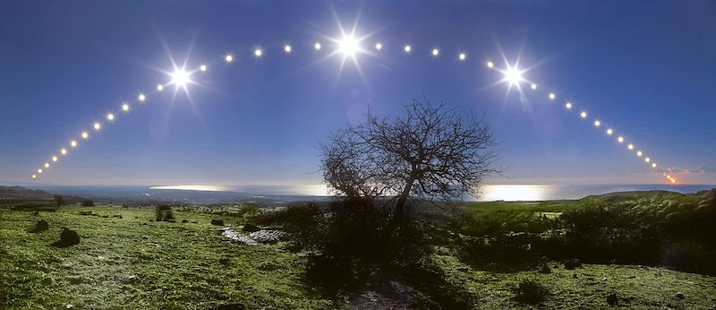  
*[Source: Danilo Pivato](http://apod.nasa.gov/apod/ap101221.html)*

* The Sun, Moon, and planets also appear to lie on the Celestial Sphere

* Over the course of one day, they appear almost fixed with respect to the stars in the Celestial Sphere

* The Celestial Sphere appears to carry the Sun, Moon, and planets around the Earth once per day (24 hours) 

* The real motion is Earth’s rotation

This timelapse shows the motion of the Sun from sunrise to sunset:

<iframe
  width="560"
  height="315"
  src="https://www.youtube.com/embed/FjZT2pfw-do?start=12&end=43&mute=1&rel=0&modestbranding=1"
  title="A timelapse recording of a view over a neighborhood, starting before dawn. It follows the sun through sunrise, turning to follow the motion of the sun through the sky, and stopping after sunset."
  frameborder="0"
  allow="autoplay; fullscreen; picture-in-picture"
  referrerpolicy="strict-origin-when-cross-origin"
  allowfullscreen>
</iframe>

The Sun's path is similar to Star B in our previous Local Sky example:

* The daily motion of the Sun is just like a rise-and-set star

* The Sun’s daily motion is from Earth’s rotation

* The sun is highest around noon. In Fullerton, it is never at the zenith.

## The Sun and Stars

When the Sun is above the horizon, our sky changes.

The stars are always there, but we can’t see them during the daytime because of scattered sunlight.

A local sky at Noon, facing South, with atmosphere:
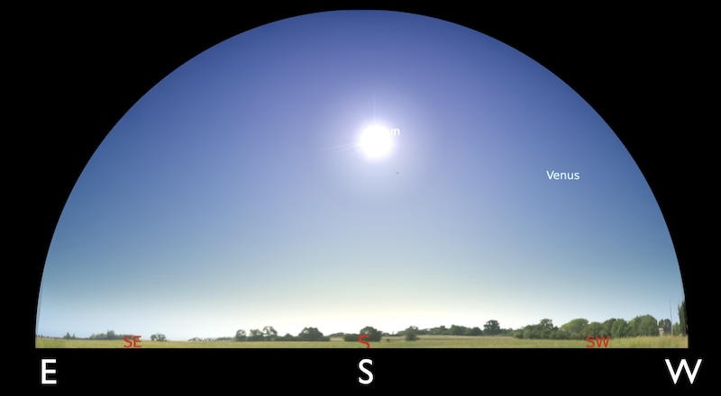

The same local sky at Noon, facing South, without atmosphere:
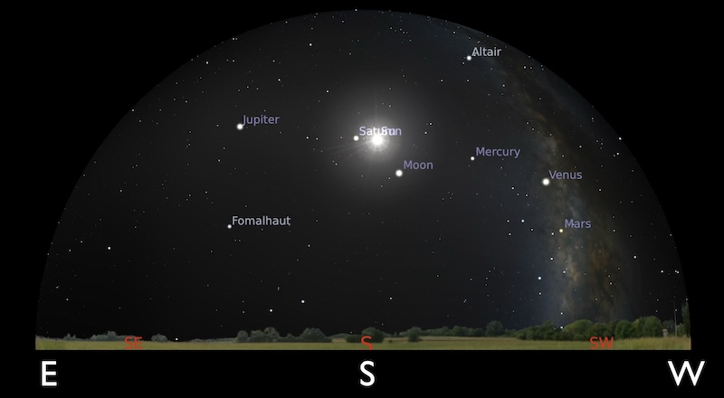

Over one day, the sun and stars move together from East to West on the celestial sphere.

Observing the stars before sunrise, and after sunset, we can determine what constellation (region of the Celestial Sphere) the Sun appears in.

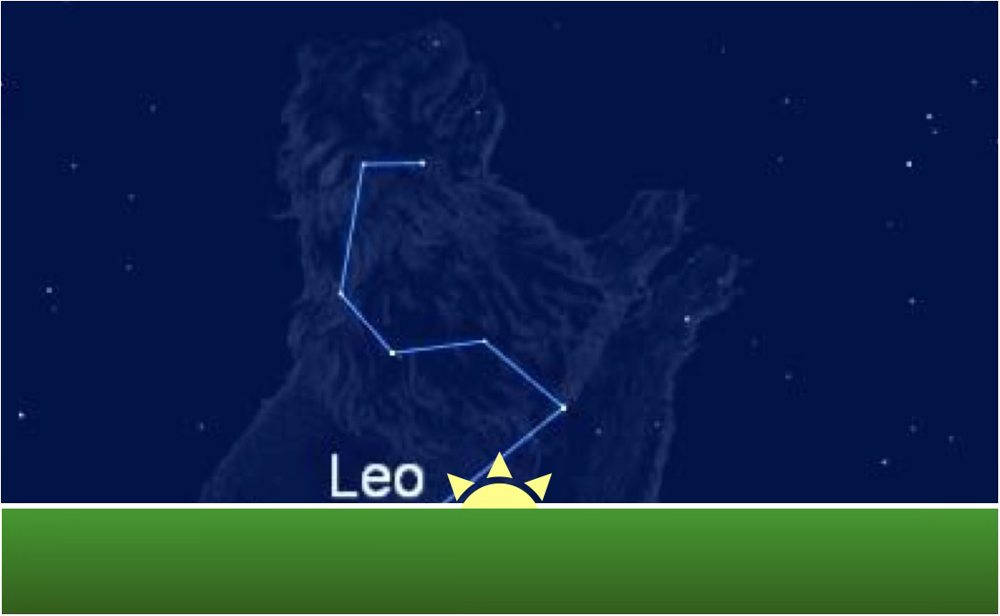

## Check your understanding: The Sun

<quiz>
You observe <s>a star</s> the Sun rising due East. When the <s>star</s>  Sun reaches its highest position above the horizon, where will it be?

- [ ] High in the Northern sky
- [ ] High in the Eastern sky
- [x] High in the Southern sky
- [ ] High in the Western sky
- [ ]  At the Zenith

This sun is like Star A in [Example Star Paths](#example-star-paths). 

</quiz>

