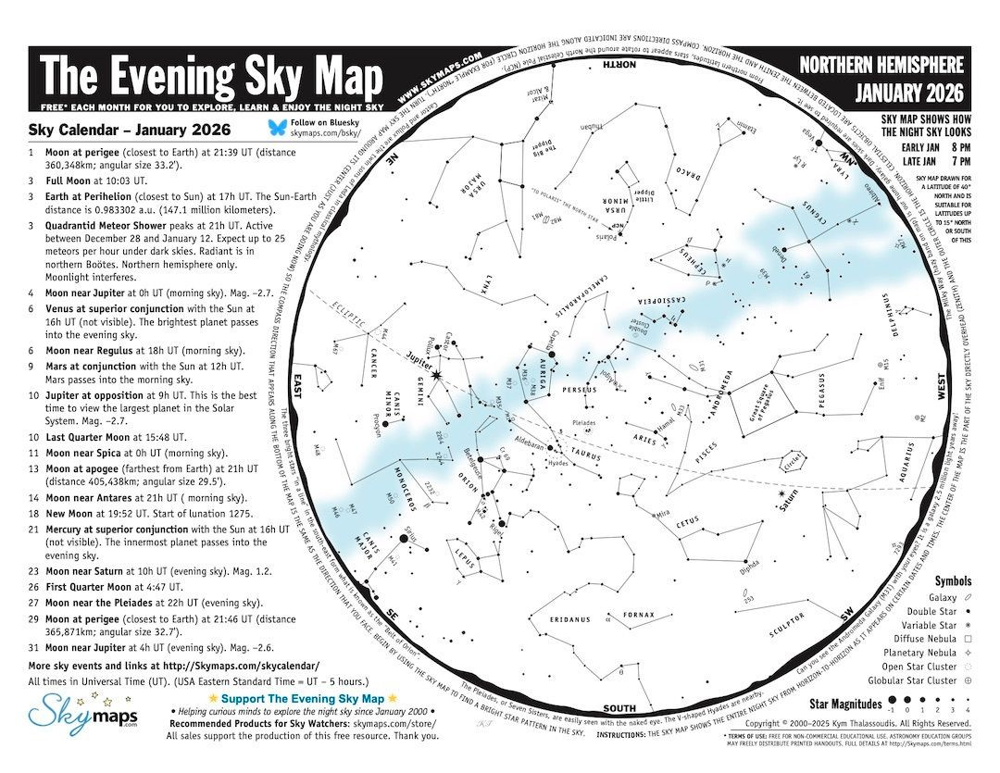

This [Sloan Digital Sky Survey Video on YouTube](https://www.youtube.com/watch?v=08LBltePDZw) shows a flythrough of 400,000 real galaxy images mapped by their actual locations (or the locations of similar galaxies) derived from the Sloan Digital Sky Survey (SDSS), out to about 1.3 billion light years from Earth.
<iframe width="560" height="315" src="https://www.youtube.com/embed/08LBltePDZw?si=BGOHODb1ViIjb31h" title="YouTube video player" frameborder="0" allow="accelerometer; autoplay; clipboard-write; encrypted-media; gyroscope; picture-in-picture; web-share" referrerpolicy="strict-origin-when-cross-origin" allowfullscreen></iframe>

We'll discuss how a map of the sky, like the one shown below, relates to what you can see in the sky.

*Monthly skymaps in pdf from [skymaps.com](https://www.skymaps.com/downloads.html) or images shared by [Kym @ The Evening Sky Map](https://skymaps.com/bsky/).*