# Eclipses

* The cause of eclipses
* Umbra and Penumbra
* Why we don’t see eclipses every month
* Lunar and Solar Eclipse types

## Causes of Eclipses

The Moon and the Earth cast shadows in sunlight

When the Sun, Moon and Earth align, these shadows can cause eclipses.

Lunar eclipse:
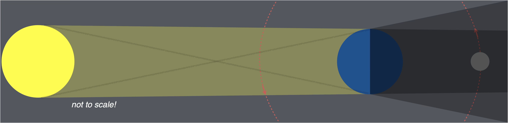

Solar eclipse:
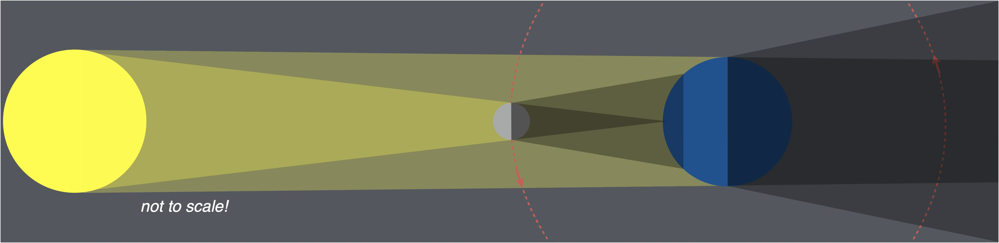

## Angular size

The angular size of an object is the angle it appears to span on your field of view

Observing the sky, we can measure the angular size of objects or the angular distance between objects.

You can estimate the size of angles with an outstreched arm.
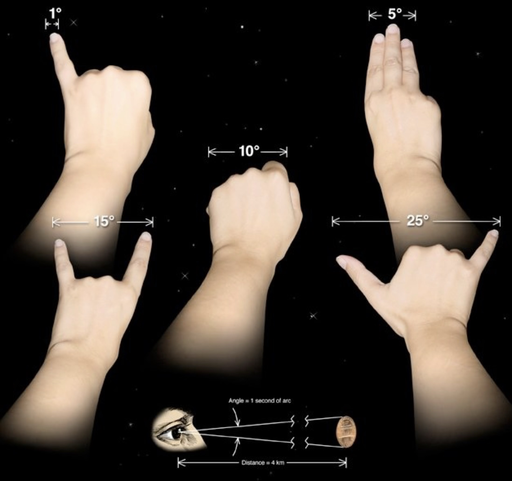

Angular measurements do not tell us real physical sizes

To determine the true size we need to know the distance to the objects (which we cannot figure out with our eyes).

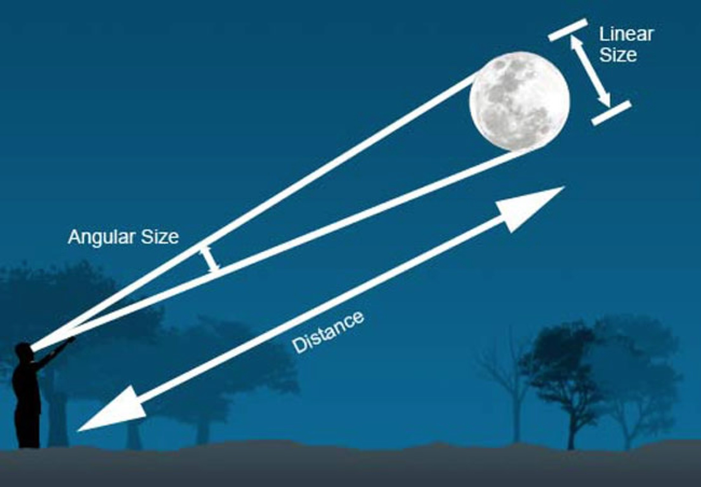

The Sun is about 400 times larger than the Moon, but since it is about 400 times further away, both have the same [angular size](celestial_sphere.md#angular-size).

This coincidence allows solar eclipses!

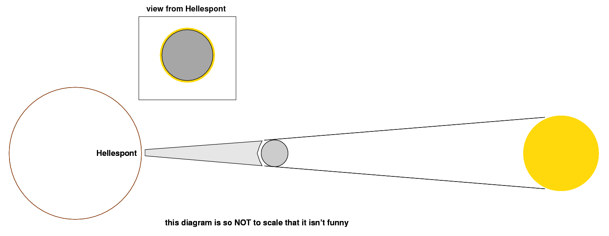
*[Source: Michael Richmond](http://spiff.rit.edu/richmond/asras/measure_ss/measure_ss.html)*

## Why don’t we see eclipses every month?

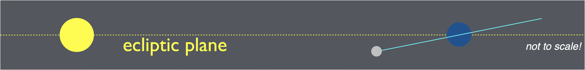

* The Moon’s orbit is inclined at about 5° to the Ecliptic plane
* The Sun, Moon, and Earth are actually very small compared to their orbital distances (not shown in most diagrams)
* To have an eclipse the Moon must be aligned with the Earth and Sun and lie exactly in the ecliptic plane
* So eclipses are rare!

### Eclipse seasons
The Moon's orbital tilt stays the same as the Earth and Moon orbit the Sun. Eclipses happen whenever the orbit crosses the Ecliptic plane, during two seasons each year. During other times, the Moon is too high or too low to create an eclipse. 

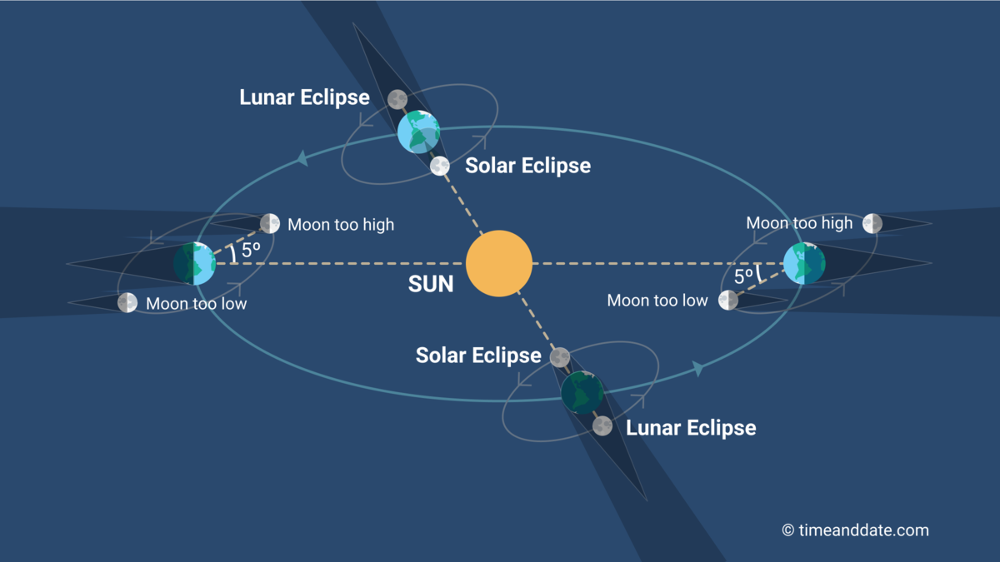
*[Source: timeanddate.com](https://www.timeanddate.com/eclipse/eclipse-season.html)*

## Shadow Terms

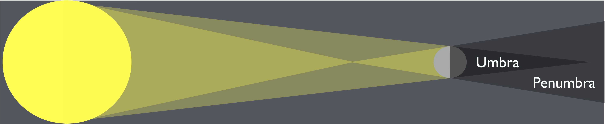

Umbra: the light source is totally blocked
Penumbra: part of the light source is blocked

## Lunar Eclipses

* Lunar eclipses occur when the Moon passes through Earth’s shadow

* They take a few hours

* Observers on Earth can see the lunar eclipse wherever the moon is above the horizon

*[Source: Tomruen, CC BY-SA 4.0 &lt;https://creativecommons.org/licenses/by-sa/4.0&gt;, via Wikimedia Commons](https://commons.wikimedia.org/wiki/File:Animation_July_27_2018_lunar_eclipse_appearance.gif)*

### Partial Lunar Eclipse

Part of the Moon passes through the Earth’s Umbra.

 This composite image uses successive pictures recorded during the eclipse from Athens, Greece to trace out a large part of the umbra's curved edge.
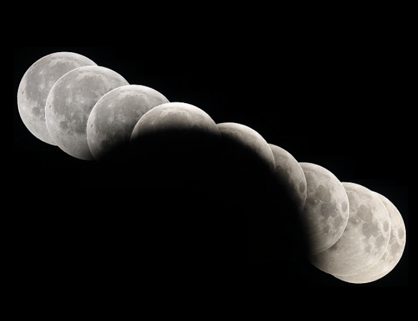
*[Source: APOD](https://apod.nasa.gov/apod/ap080820.html)*

### Total Lunar Eclipse

All of the Moon passes through the Earth’s Umbra.

The red color of the fully eclipsed Moon from red light scattered around the Earth by our atmosphere (Like sunsets!). The red light is otherwise obscured by the bright reflection of the sun.

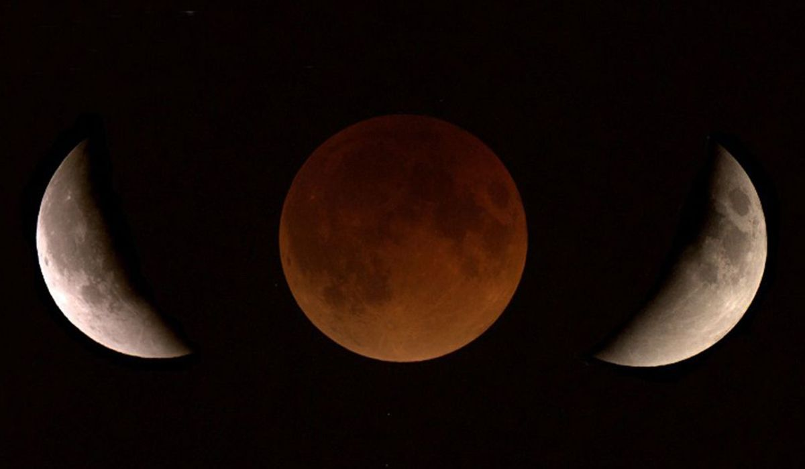

## Solar Eclipses

Solar eclipses occur when the Moon’s shadow falls on Earth.

Only some locations on Earth can see a solar eclipse.

The shadow moves across the Earth over the course of a few hours.

This video of a solar eclipse over the Pacific Ocean was captured by Himawari-8, a Japanese weather satellite. 

<video controls>
  <source src="https://svs.gsfc.nasa.gov/vis/a030000/a030700/a030758/himawari8_eclipse_720p.mp4" type="video/mp4">
</video>

*[Source: NASA Scientific Visualization Studio](https://svs.gsfc.nasa.gov/30758/)*

### Partial Solar Eclipse

Only part of the Sun is blocked in the Moon’s shadow (the Moon’s Penumbra hits Earth).

Very dangerous to look at with the naked eye!

A pinhole shows the shape of the sun.
e.g. dappled shadow of tree leaves, or a hole poked into an index card.

2017 Partial Eclipse from CSUF Campus Viewing Party:
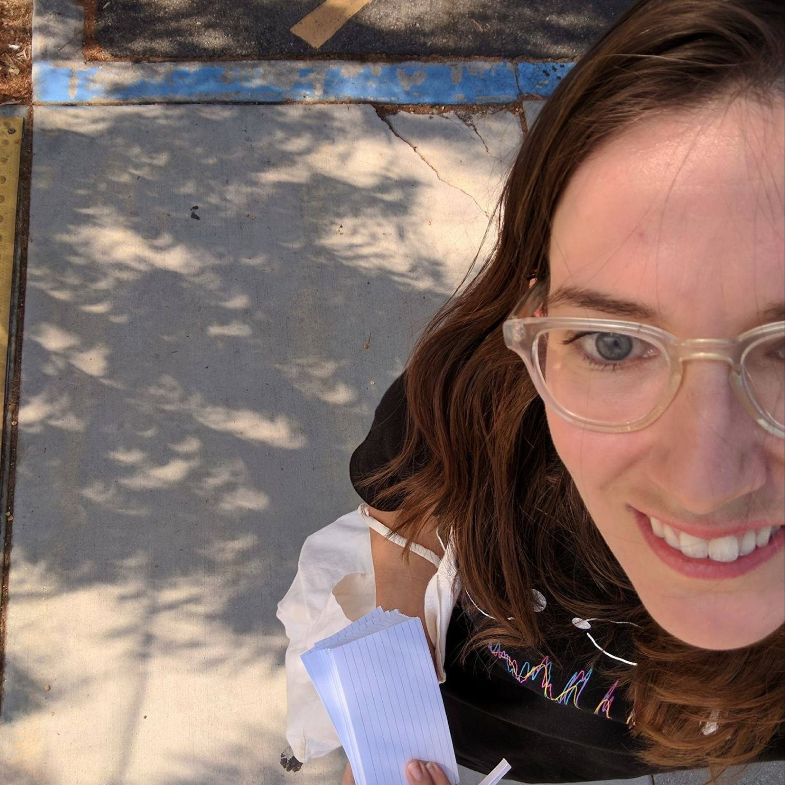

### Annular Solar Eclipse

The Moon’s orbit is not a perfect circle

When it is farther away, it can’t block the full Sun

Only the Penumbra hits the Earth

*[Source: 
Vxfour11, CC BY-SA 4.0, via Wikimedia Commons](https://commons.wikimedia.org/wiki/File:Annular_Solar_Eclipse_2019-12-26_Annularity_Viewed_From_Tanjungpinang.jpg)*

### Total Solar Eclipse

* Occurs where the darkest part of the Moon’s shadow (the Umbra) hits the Earth

* The sky goes completely dark where the Umbra hits

* Stars, planets, and the fainter outer layers of the Sun can be seen.

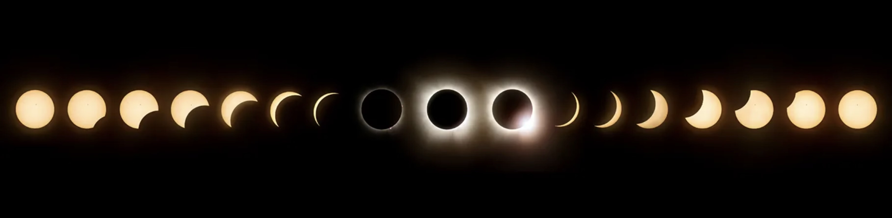
[Source: NASA’s Glenn Research Center (GRC)](https://science.nasa.gov/science-research/earth-science/looking-back-on-looking-up-the-2024-total-solar-eclipse/)

[Source: NASA’s Glenn Research Center (GRC)](https://science.nasa.gov/science-research/earth-science/looking-back-on-looking-up-the-2024-total-solar-eclipse/)

NASA’s Earth Polychromatic Imaging Camera (EPIC) imager on the Deep Space Climate Observatory (DSCOVR) satellite captured these views of Earth during the total solar eclipse on April 8, 2024.

<video controls> 
<source src="https://science.nasa.gov/wp-content/uploads/2024/04/totalsolareclipse-epc-20240408-1080p.mp4">
</video>

*[Source: NASA](https://science.nasa.gov/solar-system/skywatching/april-8-total-solar-eclipse-through-the-eyes-of-nasa)*

## Future Eclipses

See [future eclipses in Fullerton](https://www.timeanddate.com/eclipse/in/usa/fullerton).

Solar eclipses are rare. Here are upcoming eclipses around the world.

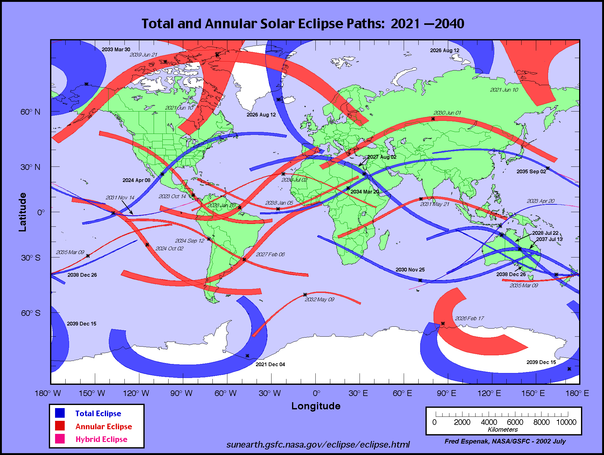
*[Source: Fred Espenak, NASA](https://eclipse.gsfc.nasa.gov/SEatlas/SEatlas.html)*

## Check your Understanding

<quiz>

What is the phase of the Moon immediately before a Solar eclipse?
- [x] New
- [ ] First Quarter
- [ ] Waxing Gibbous
- [ ] Waning Crescent  
- [ ] Full

</quiz>

<quiz>

What type of eclipse would be seen by observers on the night side of Earth in the diagram below?

- [ ]  Total Solar Eclipse 
- [ ]  Partial Solar Eclipse 
- [ ]  Annular Eclipse
- [ ]  Total Lunar Eclipse 
- [x]  Partial Lunar Eclipse 
- [ ]  Penumbral Eclipse
- [ ] No Eclipse

</quiz>

<quiz>

What kind of eclipse do you see if you stand in the Moon's Umbra?

- [x]  Total Solar Eclipse 
- [ ]  Partial Solar Eclipse 
- [ ]  Annular Eclipse
- [ ]  Total Lunar Eclipse 
- [ ]  Partial Lunar Eclipse 
- [ ]  Penumbral Eclipse
- [ ] No Eclipse

</quiz>