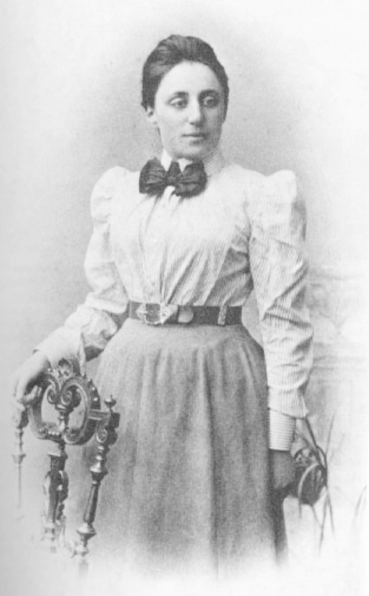
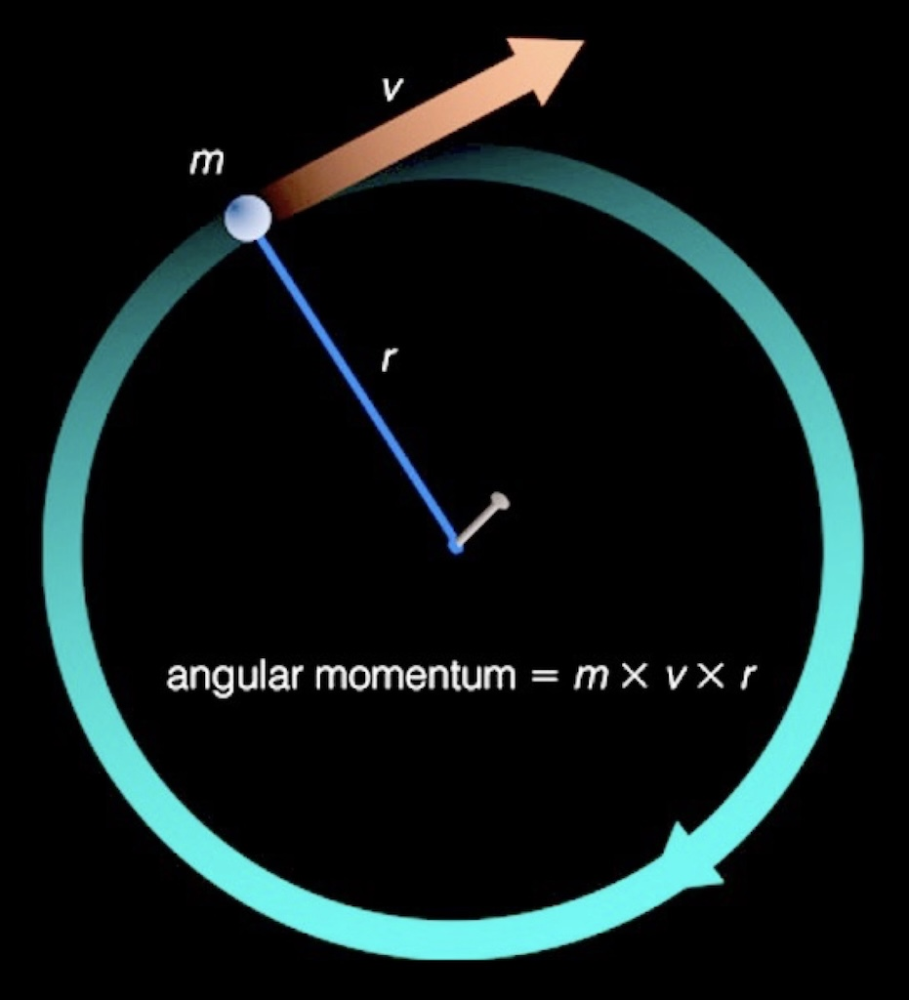
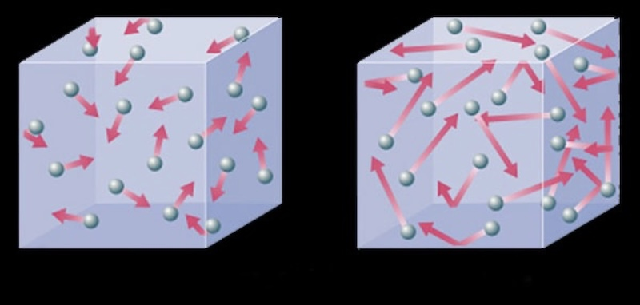
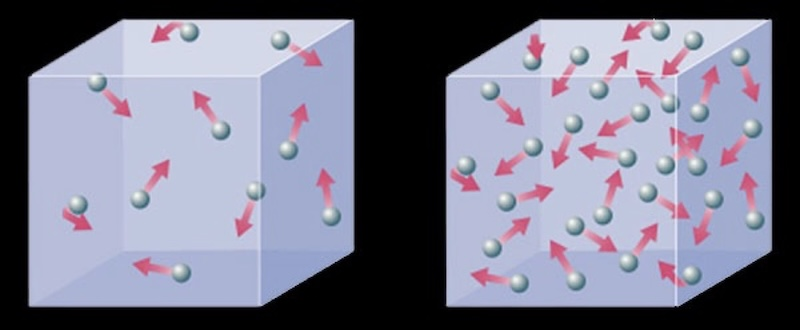
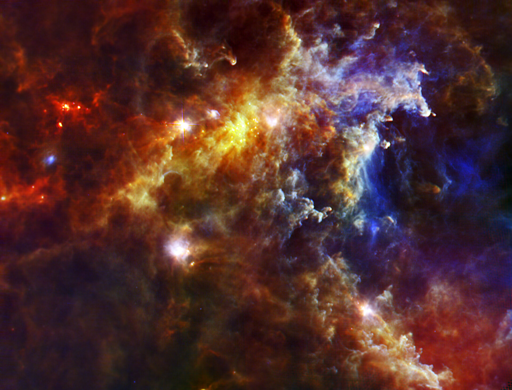
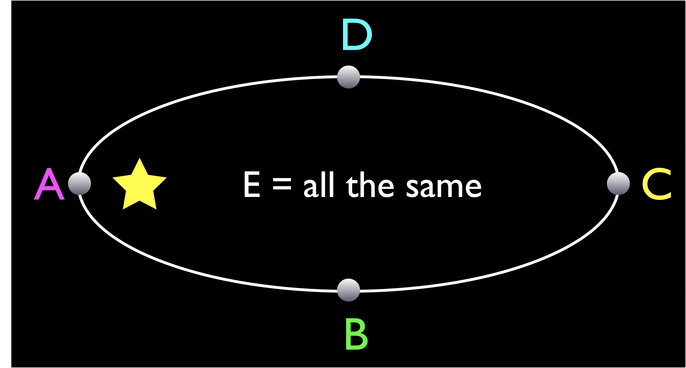

# Energy and Momentum

- Conserved quantities
- Angular momentum
- Energy
- Collapsing clouds

## Conserved quantities

In eccentric orbits, the force and acceleration constantly change.

Systems with many objects have even MORE interactions and motions to track

To understand complicated systems, it’s useful to think about things that stay the same:

- Energy
- Angular Momentum

## Noether's Laws

Emmy Noether, Mathematician (1882-1935)

Noether’s Law (1915): 

Energy is conserved because physical laws are the same at different times

Momentum is conserved because physical laws are the same at different locations and in different directions.

## Angular Momentum

Rotating and orbiting objects have a special type of momentum called 
angular momentum.

The total angular momentum of a system will not change (unless there is an external influence that adds/removes it) 

- Angular momentum is *conserved*

Angular momentum $= m \times  v \times r$

If the angular momentum is constant then when radius gets smaller velocity must get bigger

## Angular momentum in orbits

Conservation of angular momentum around the Sun also gives Kepler’s second law (equal areas in equal times)

Close to Sun: small $r$, large $v$

Far from Sun: large $r$, small $v$

$m \times r \times v$ is constant

## Angular Momentum on Earth

Imagine a figure skater going into a spin.

*Source:[Vbrunophotog via Wikipedia](https://commons.wikimedia.org/wiki/File:Mone_Chiba_at_the_2025_World_Figure_Skating_Championships_01.jpg)*

What changes:

 the mass m of her arms and leg, as she pulls them in?

 the same 

 the distance from center r of her arms and leg as she pulls them in?

 smaller 

 the rate of spin of her arms and leg, as she pulls them in?

 larger 

<figure>
  <video controls width="100%">
    <source src="../img/World%20Record%20Figure%20Skating%20Spin-AQLtcEAG9v0.mp4" type="video/mp4">
    Your browser does not support the video tag.
  </video>
  <figcaption>A video showing a figure skater set a world record for spin RPM</figcaption>
</figure>

Atheletes use conservation of angular momentum to control their body's motion.

## Energy

- We define “energy” in a specific way to quantify the ability of things to affect other things (to do work).
- The total amount of energy is conserved. 
- That means, energy never created or destroyed, but it changes forms

### Energy: 3 forms you need to know

- Potential energy: stored energy which can be converted later

- Kinetic energy: the energy of motion (includes sound and heat!)

- Radiative energy: the energy carried by light (electromagnetic waves)

## Gravitional Potential energy

- Gravitationally interacting masses have potential energy when they are far apart

- Objects lose gravitational potential energy as they fall together

- This gravitational potential energy is converted into kinetic energy

## Energy in orbit

Energy is conserved

When a comet is close to the sun, it has more kinetic energy and less gravitational potential energy

When a comet is far from the sun, it has more gravitational potential energy and less kinetic energy

The total energy stays the same 

## Adding Heat and Light to Newton's Laws

Stars are more than points of mass. To understand them we need to include heat and light as well as gravity.

This simulation starts with gas and dust in a cloud in space to show how it collapses to form stars.

  <iframe
    src="https://www.youtube.com/embed/LeX5e51UkzI"
    title="STARFORGE simulation of star cluster formation"
    style="width: 100%; height: 100%; border: 0;"
    allow="accelerometer; autoplay; clipboard-write; encrypted-media; gyroscope; picture-in-picture; web-share"
    referrerpolicy="strict-origin-when-cross-origin"
    allowfullscreen>
  </iframe>

## Heat, Energy, and Temperature

- Heat is the total kinetic energy of many particles

- Temperature measures the average kinetic energy of the individual particles (energy per particle)

### Different temperature

Left: lower temperature
Right: higher temperature

The particles are moving faster so the
temperature is higher

### Different energy

Left: lower energy
Right: higher energy

**Same temperature** since the speed per particle is the same

But: more particles, so more energy

## Heat and Temperature in Space

A collapsing gas cloud contains many interacting particles.

They can exert gravitational forces on each other, converting potential to kinetic energy.

They can collide and transfer kinetic energy between different particles.

Together, they have a temperature.

Overall, energy and angular momentum are conserved.

### Simulation example

<figure>
  <video controls width="100%">
    <source src="../img/ClusterXT1810Z_H264B.mp4" type="video/mp4">
    Your browser does not support the video tag.
  </video>
  <figcaption>The collapse and fragmentation of a molecular cloud with a mass 50 times that of our Sun. The cloud is initially 1.2 light-years in diameter with a low temperature.
The cloud collapses under its own weight and stars start to form.</figcaption>
</figure>

*Source: [Simulation Matthew Bate, University of Exeter.
Visualisation Richard West, UKAFF.](https://www.ukaff.ac.uk/starcluster/)*

This is how stars are born: ignited at the center of a collapsing cloud of gas and dust

Baby stars in the Rosette cloud (a real telescope image):

*Source: [ESA](https://www.esa.int/Science_Exploration/Space_Science/Herschel/Baby_stars_in_the_Rosette_cloud)*

The bright smudges are dusty cocoons containing massive protostars. The small spots near the centre of the image are lower mass protostars.

## Radiative energy

Radiative energy: the energy carried by light 

- If you heat something up enough, it glows... heat energy is converted to radiative energy
- Total energy is always conserved
- Sun and stars shine brightly for millions to billions of years… where is that energy coming from?

## Check your understanding

<quiz> What will happen as a spinning figure skater
pulls their arms and legs closer in to their body?

- [ ] they spin more slowly
- [x] they spin more quickly
- [ ] nothing will happen

</quiz>

<quiz>
An asteroid that is moving farther away from the sun is gaining:

- [] mass energy.
- [x]  gravitational potential energy.
- [] radiative energy.
- [] kinetic energy.

</quiz>

Use this orbit diagram for the next questions.

The following orbit of a comet around the Sun is shown from directly over the orbital plane:

<quiz>
 At which position does the comet have the highest speed? 

- [x] A
- [] B
- [] C
- [] D
- [] E (all the same)

</quiz>

<quiz>
At which position does the comet have the highest angular momentum? 

- [] A
- [] B
- [] C
- [] D
- [x] E (all the same)

 </quiz>

<quiz>
At which position does the comet have the highest kinetic energy? 

- [x] A
- [] B
- [] C
- [] D
- [] E (all the same)

 </quiz>

 <quiz>
At which position does the comet have the highest potential energy? 

- [] A
- [] B
- [x] C
- [] D
- [] E (all the same)

 </quiz>

 <quiz>
At which position does the comet have the highest total energy? 

- [] A
- [] B
- [] C
- [] D
- [x] E (all the same)

 </quiz>

Can you fill in the blanks?

Options: speed of rotation, angular momentum, temperature, kinetic energy, potential energy, total energy

As a cloud of gas collapses due to gravity, ________ will increase, but _______ is constant.

As a cloud of gas collapses due to gravity, speed of rotation will increase, but angular momentum is constant.

As a cloud of gas collapses due to gravity, the particles will lose ________ and gain ________, so ________ will increase, but _______ is constant.

As a cloud of gas collapses due to gravity, the particles will lose potential energy and gain kinetic energy, so temperature will increase, but total energy is constant.

