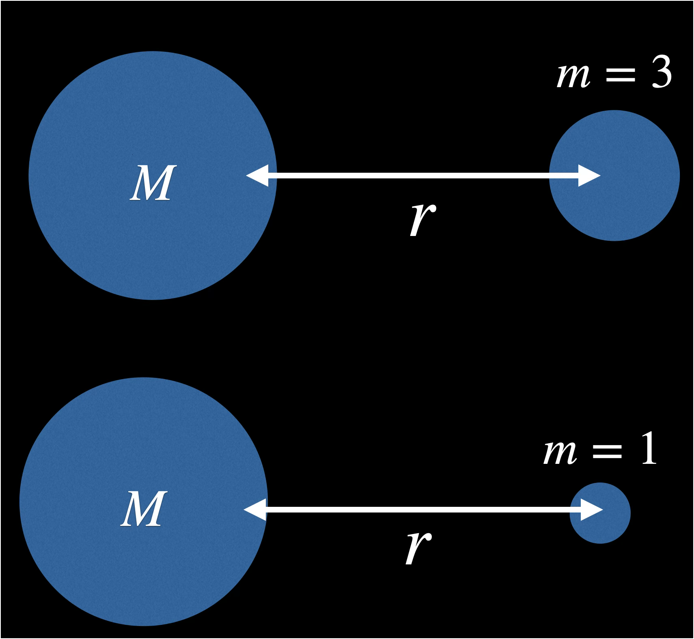
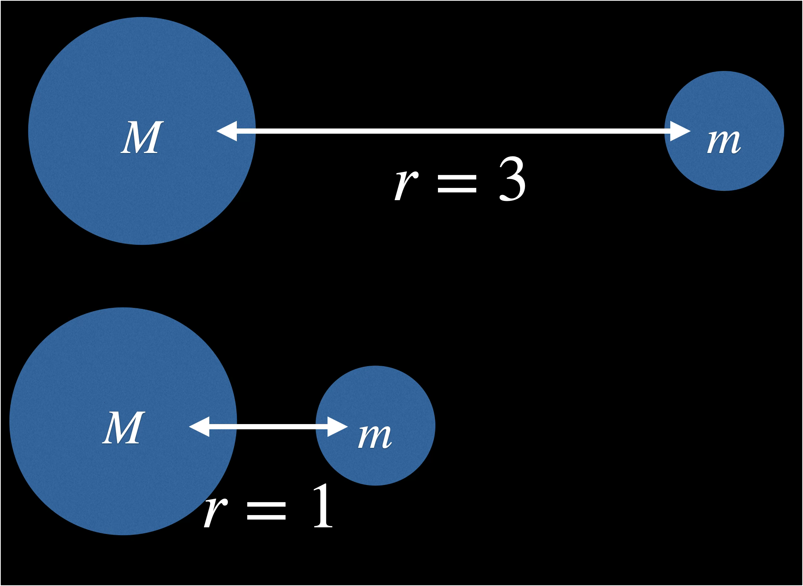
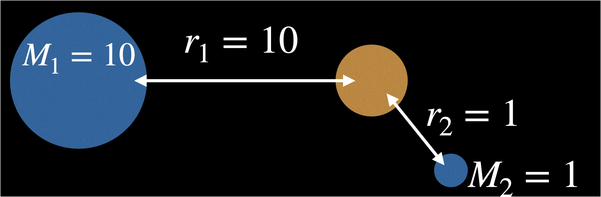
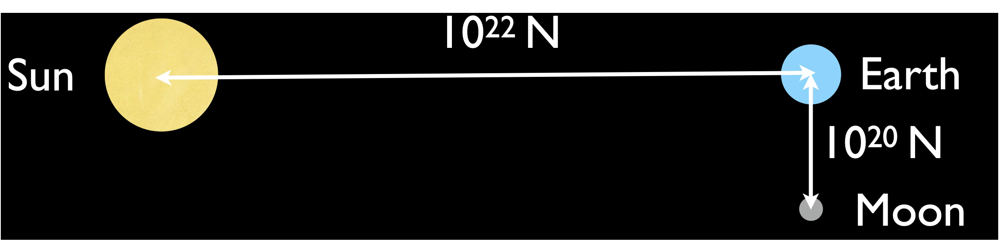
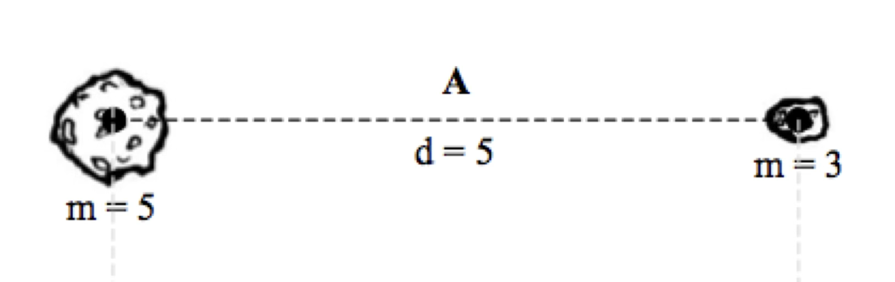
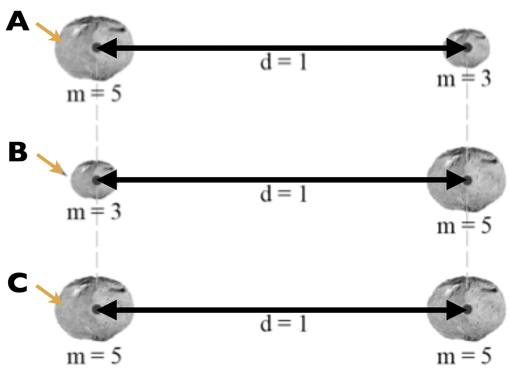

# Newton's Gravity

- Newton’s Law of Gravitation
- Comparing Forces
- Newton’s version of Kepler’s Law
- Pluto and Charon

## Newton’s Law of Gravitation

- What determines how things fall on Earth?
- What are the properties of the force that keeps the planets in orbit?

Every mass attracts every other mass with a gravitational force

The strength of the force is: 
- proportional to the product of the two masses
- inversely proportional to the square of the distance between them

$$F = G \frac{m M}{r^2}$$

- $F$ is the force of Gravity
- $G$ is Newton's Constant
- $M$ is the mass of the first object
- $m$ is the mass of the second object
- $r$ is the distance between objects

### Changing mass 

Gravitational force changes like $m$

The top force is 3 times bigger.

### Changing distance

Gravitational force changes like $\frac{1}{r^2}$

The top force $\frac{1}{3^2} = \frac{1}{9}$ of the bottom force.

Much smaller

### Explaining orbits

Gravity and $F=ma$ explain this motion of a satellite around Earth

 $\frac{1}{r^2}$ means it’s a lot bigger when the satellite is close

## Calculate for our class

There are gravitational forces between every pair of massive objects.

To compare them:

- multiply the masses of the two objects
- divide by the square of the distance between them
- and remember the two masses exert equal and opposite forces on each other (Newton’s third law!)

### Sun and Earth

$$F = ma$$

The Earth exerts the same force on the Sun as the Sun exerts on Earth.

The Sun has the mass of 333,000 Earths.

Earth has a large acceleration from this force.

The Sun’s acceleration from this force is tiny

## Comparing Forces

- Each pair of masses exert equal and opposite forces on each other (Newton’s 3rd Law)

- The force one object feels from different other objects will vary.  It will depend on each of their masses and distances.

### Comparison example

Which force is larger?

$\frac{10}{10^2}$ compared to $\frac{1}{1^2}$

The force from the second object is larger. 

### Earth's forces
Earth feels a gravitational force from the sun and a gravitational force from the moon.

The Moon is MUCH less massive than the Sun, but it is closer to Earth: its force on Earth (and Earth’s force on the Moon) is only about 100 times smaller than the forces between the Earth and the Sun.

## Newton and Kepler

Newton can explain:

Why do all objects orbiting at the same distance from the sun follow the same path, no matter what their mass is?

How can we use Kepler’s laws for exoplanets around different stars?

### Cancelling the mass for Kepler's Laws

[Kepler's Third Law](keplers_laws.md#keplers-third-law) told us about the orbit period and speed of different planets at different distances. It didn't depend on mass.

Newton's Laws explain why.

Newton’s Laws for Gravitational Force and acceleration (motion from forces):

$F  =  G \frac{M m}{r^2} \quad$          and             $\quad F  =  m a$

Match the $F$:

$G \frac{M m}{r^2}   =  m a$

Cancel the $m$:

$G \frac{M }{r^2}   =  a$

The motion of a planet (acceleration $a$) at a particular distance ($r$) from the Sun ($M$) is the same for any mass of planet.

So their orbits will be the same.

### Kepler's Third Law for exoplanets around different stars

Kepler's Third Law worked for planets, asteriods and comets that orbit our Sun.

Kepler's Third Law: Period of the orbit (time taken) $P$ in years is related to the semimajor axis (size of the orbit) $a$ in A.U.

$$P^2=a^3$$

Newton’s Laws give us a universal version of Kepler’s Third Law for ANY two orbiting bodies.

Newton's version:

$$ P^2 = \frac{4\pi^2}{G(M + m)}a^3$$

It includes Newton's constant and both of the masses $M$ and $m$.

Stars are much more massive than planets, so the planet mass doesn’t make much difference. Drop one mass $m$. 

$$ P^2 = \frac{4\pi^2}{GM}a^3$$

We can estimate the mass of the star $M$ from the light it emits (we’ll talk about how later in this class.) 

So, for exoplanets: Once we know mass $M$ and period $P$,  we can calculate orbit size (semi-major axis) $a$.

### Pluto and Charon

If the masses are similar (we can't drop $m$), both objects move:

This series of New Horizons images of Pluto and its largest moon, Charon, was taken at 13 different times spanning 6.5 days, starting on April 12 and ending on April 18, 2015.

*Source: [NASA/Johns Hopkins University Applied Physics Laboratory/Southwest Research Institute](https://www.nasa.gov/image-article/new-horizons-sees-pluto-charon/)*

They orbit each other.

## Check your understanding

Newton’s law of gravity describes the attractive force $F$ between masses $M$ and $m$
separated by a distance $r$

$$F = G \frac{m M}{r^2}$$

<quiz>

How big would the force be, in terms of the original $F$, if the mass $M$ was doubled?

- [] $F/4$ (one quarter as big)
- [] $F/2$ (one half as big)
- [x]  $2F$ (twice as big)
- [] $4F$ (four times as big)

</quiz>

<quiz>

How big would the force be, in terms of the original $F$, if the distance $r$ was doubled?

- [x] $F/4$ (one quarter as big)
- [] $F/2$ (one half as big)
- []  $2F$ (twice as big)
- [] $4F$ (four times as big)

</quiz>

<quiz>
Which asteroid exerts a greater gravitational force on the other? 

- []  the left asteroid
- []  the right asteroid
- [x] both exert forces of the same strength

it doesn't matter which order you multiply 5x3 or 3x5. Also, Newton's Third Law
</quiz>

<quiz>
Which asteroid experiences a larger acceleration? 

- []  the left asteroid
- [x]  the right asteroid
- [] both exert forces of the same strength

Use F=ma for the same F.
</quiz>

Use this image for the next two questions:

<quiz>

Which asteroid experiences the largest force from its “partner” asteroid?

- [] A
- [] B
- [x] C
- [] A and B, which are the same

</quiz>

<quiz>

Which asteroid experiences the smallest force from its “partner” asteroid?

- [] A
- [] B
- [] C
- [x] A and B, which are the same

</quiz>

## Go Farther

### PHYS 225 example
Calculating the Force between Sun and Earth

Sun $M=2.0\times 10^{30} \text{ kg}$

Earth $m=6.0\times 10^{24} \text{ kg}$

Distance $r=1\text{ A.U.}=1.5\times10^{11} \text{ m}$

Newton's constant $G=6.7\times 10^{-11} \frac{\text{m}^3}{\text{kg } \text{s}^2}$

So

$$F = G\frac{mM}{r^2}$$

$$ =\left(6.7\times 10^{-11} \frac{\text{m}^3}{\text{kg } \text{s}^2} \right)\frac{\left(6.0\times 10^{24} \text{ kg}\right)\left(2.0\times 10^{30} \text{ kg}\right)}{\left(1.5\times10^{11} \text{ m}\right)^2} $$

$$=3.6 \times 10^{22} \text{ Newtons}$$

Compare to force between you and Earth, which is about 1,000 Newtons.