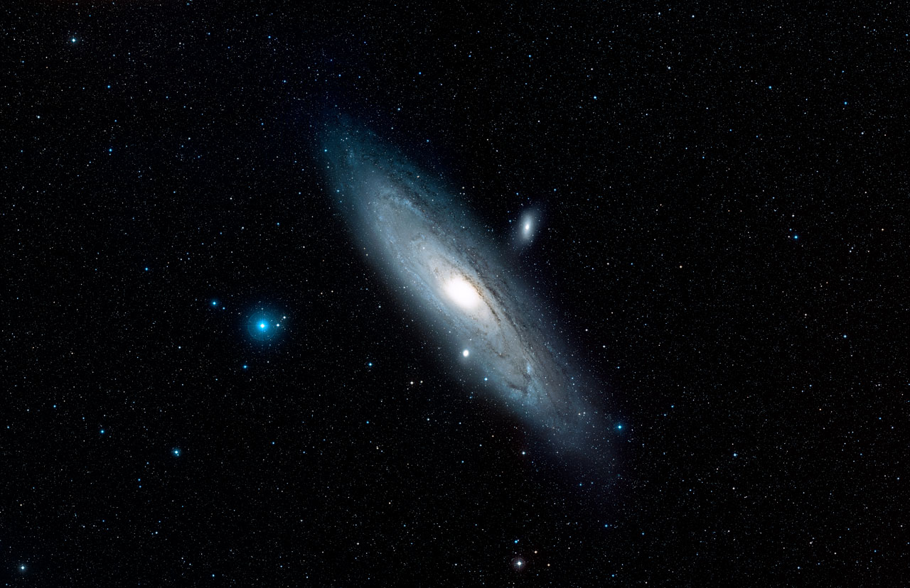
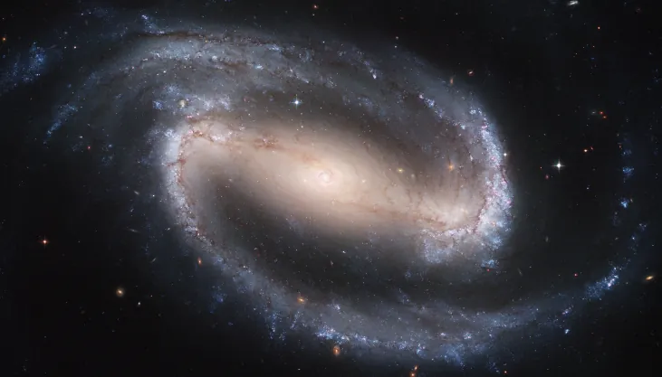
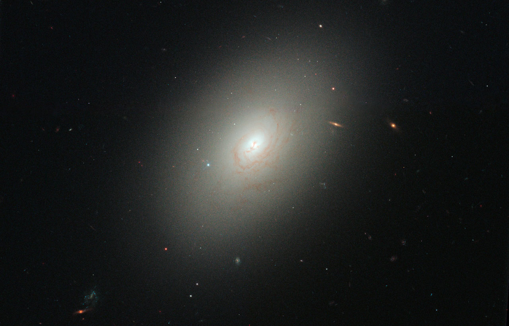
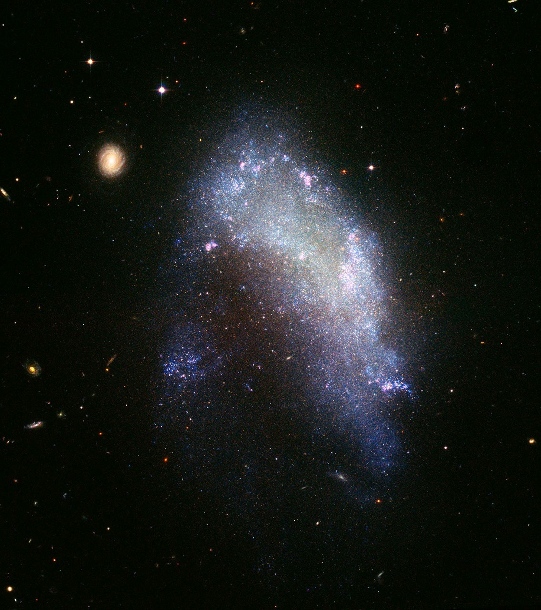
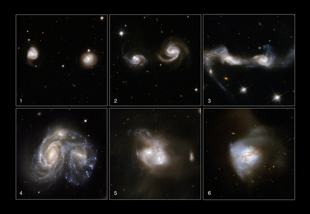
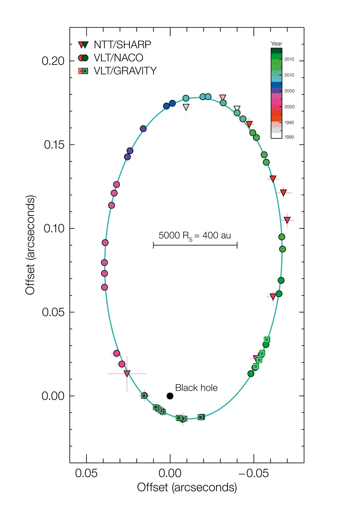

# Galaxies and Black Holes

- Shapes of Galaxies
- Galaxy Simulations
- Merging Galaxies
- Black holes
- Our galaxy's black hole

## Galaxy Shapes

Seen in the sky

- Spiral Galaxy (this one is Andromeda)  *Source: [Digitized Sky Survey](https://esahubble.org/images/heic1502b/)*
- Barred Spiral Galaxy  *Source: [NASA, ESA, and the Hubble Heritage Team(STScI/AURA) via OpenStax](https://openstax.org/books/astronomy-2e/pages/26-2-types-of-galaxies)*
- Elliptical Galaxy  *[Source](https://esahubble.org/images/opo1038b/)*
- Irregular Galaxy  *Source: [Hubble](https://science.nasa.gov/asset/hubble/galaxy-ngc-1427a-plunges-toward-the-fornax-galaxy-cluster/)*

## Newton's Laws apply to Galaxies of stars
Each star of mass $m$ accelerates following $F=ma$
with the combined gravitational forces of all the other stars
$$F_{\text{net}}=G \left(\frac{m M_1}{r_1^2}+\frac{m M_2}{r_2^2}+\frac{m M_3}{r_3^2}+\ldots\right)$$

## Computer simulation

  <iframe
    src="https://www.youtube.com/embed/-ii0nksV2lY?start=80"
    title="Spiral galaxy simulation"
    style="width: 100%; height: 100%; border: 0;"
    allow="accelerometer; autoplay; clipboard-write; encrypted-media; gyroscope; picture-in-picture; web-share"
    referrerpolicy="strict-origin-when-cross-origin"
    allowfullscreen>
  </iframe>

Why do some galaxies have spiral arms?

We see this in numerical simulations of many stars: comes out of Newton’s laws with enough objects.

Density waves, like giant traffic jams of stars moving around.

We don’t exactly understand how long they last or why!

## Galaxies Interacting

Seen in the sky

*Source: [Hubble](https://sci.esa.int/web/hubble/-/42637-merger-stages-of-interacting-galaxies)*

Explanation of irregular galaxies

The Milky way will eventually collide with Andromeda

  <iframe
    src="https://www.youtube.com/embed/fMNlt2FnHDg"
    title="Milky Way's Head On Collision"
    style="width: 100%; height: 100%; border: 0;"
    allow="accelerometer; autoplay; clipboard-write; encrypted-media; gyroscope; picture-in-picture; web-share"
    referrerpolicy="strict-origin-when-cross-origin"
    allowfullscreen>
  </iframe>

## Black holes (Part 1)

If you make an object smaller in size, but keep the mass the same, its gravity at the surface $r$ gets larger 

$F= G\frac{Mm}{r^2}$

At a certain size, the gravity gets so strong that it overcomes all other forces. Nothing can stop things from falling inward to the center. 

The result is a black hole.

A black hole is an object with gravitational effects so strong that not even light can escape the horizon (“surface” of the black hole)

Radius of a black hole with mass $M$: 

$R_S= 2\frac{GM}{c^2} $ where $c$ is the speed of light and $G$ is Newton's constant.

## The earth as a black hole?
If the mass of Earth was compressed to smaller than a ping-pong ball, it would become a black hole.

Earth radius: 6400 000 m

Ping pong ball: 0.020 m

## Orbits and black holes

Far away from a black hole, its gravitational effects are the same as any other object of the same mass 

At large distances, orbits obey Newton's version of Kepler’s laws.

Stars can orbit black holes.

Black holes don’t “suck” you inward, *unless* you’re inside the horizon.

If we see small objects orbiting something, AND we can measure BOTH period and semi-major axis, we can calculate that something’s mass. 

## Journey to the Center of the Galaxy

  <iframe
    src="https://www.youtube.com/embed/FNHexFdacK0"
    title="Journey to the Center of the Galaxy"
    style="width: 100%; height: 100%; border: 0;"
    allow="accelerometer; autoplay; clipboard-write; encrypted-media; gyroscope; picture-in-picture; web-share"
    referrerpolicy="strict-origin-when-cross-origin"
    allowfullscreen>
  </iframe>

*[Source](https://science.nasa.gov/image-article/apod-2024-november-24-journey-to-the-center-of-the-galaxy/)*

## Orbiting Stars at the Center of the Galaxy

<figure>
  <video controls width="100%">
    <source src="../img/GC_animation_2020.mp4" type="video/mp4">
    Your browser does not support the video tag.
  </video>
  <figcaption>
    Orbiting stars at the center of the Galaxy, from 1995 to 2020
  </figcaption>
</figure>

$\star$: Supermassive black hole at the focus of the orbit

## The mass of the supermassive black hole

We can use the orbits of stars to measure the mass of the black hole.

This projection shows the orbit of the star S2 around the black hole, as seen on the sky. (Our view is tilted, the black hole is really at one focus)

*Source [ESO](https://www.eso.org/public/images/eso1825c/)*

From Newton's version of Kepler's Third Law for a small $m$ compared to the $M$:

$$ P^2 = \frac{4\pi^2 a^3}{GM}$$

We can use this orbit to find the black hole has a mass equivalent to four million of our Sun.

$$ M = 4,000,000 \, M_\text{sun}$$

We can then use the black hole radius relation to find the size of this black hole.

$$ R = 17 R_\text{sun} = 0.17 A.U.$$

This black hole would fit inside the orbit of Mercury.

## Check your understanding

