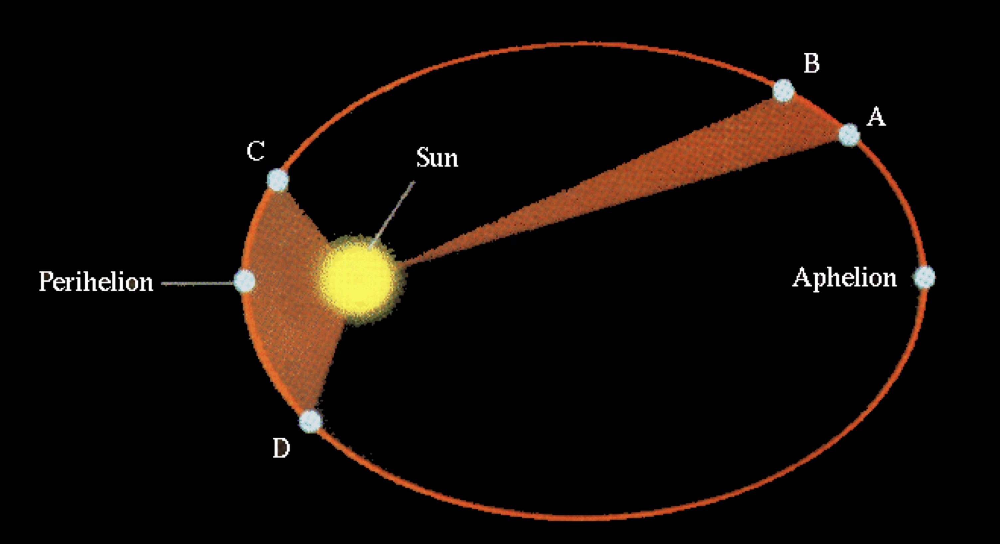
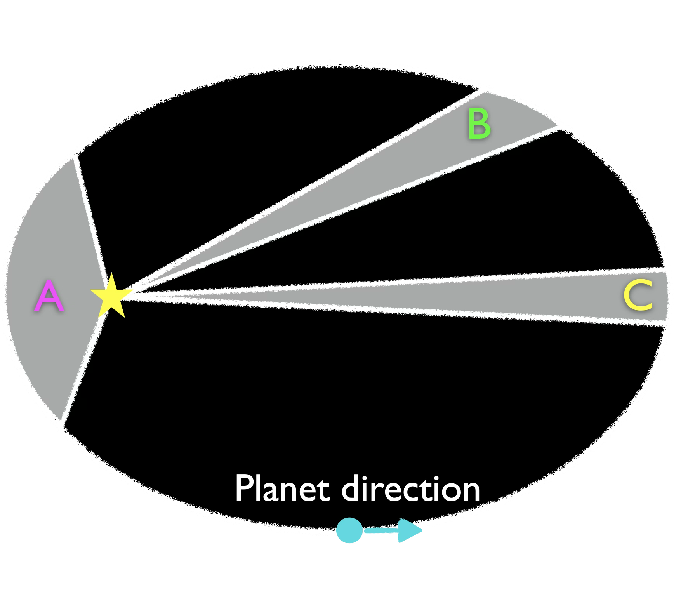
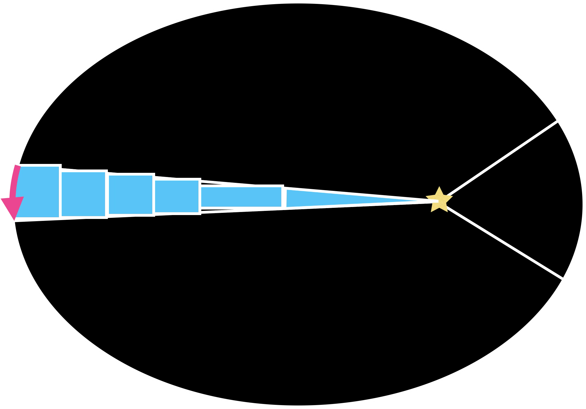
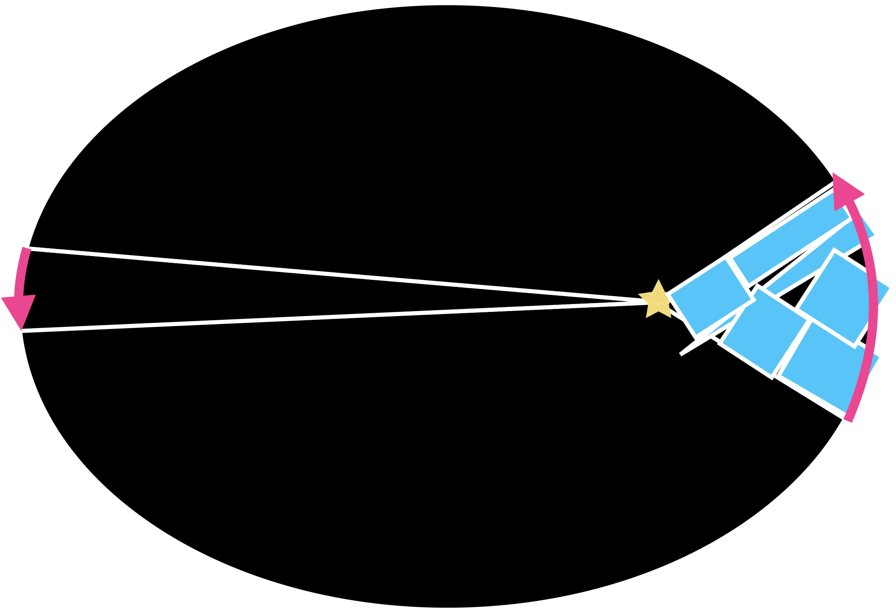
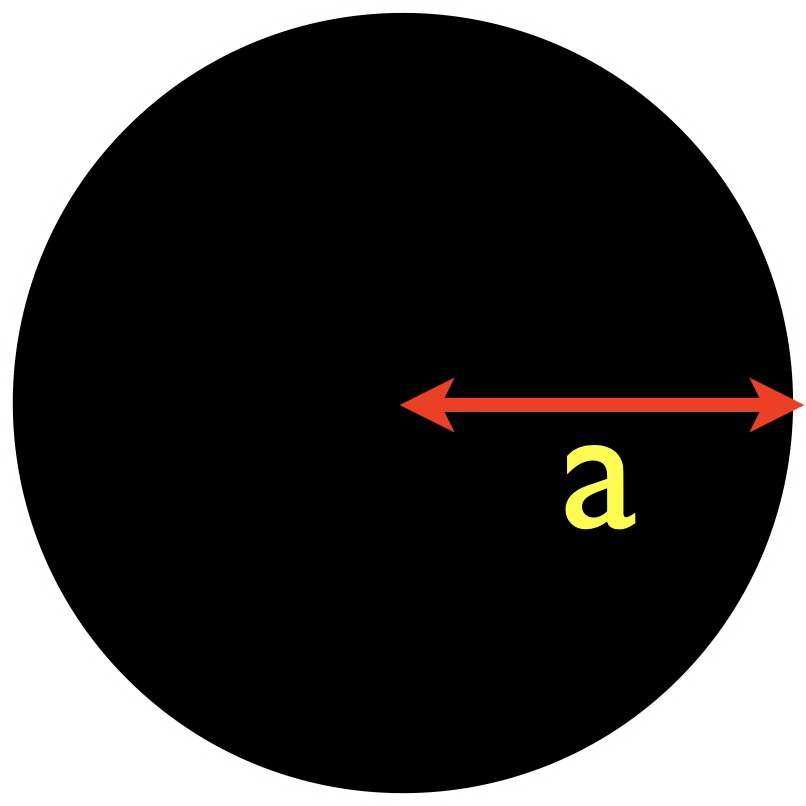
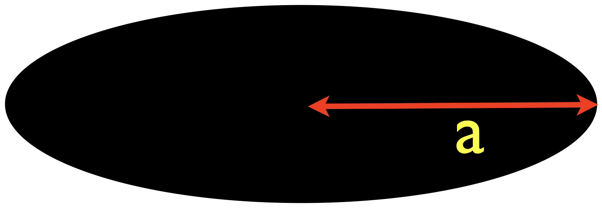
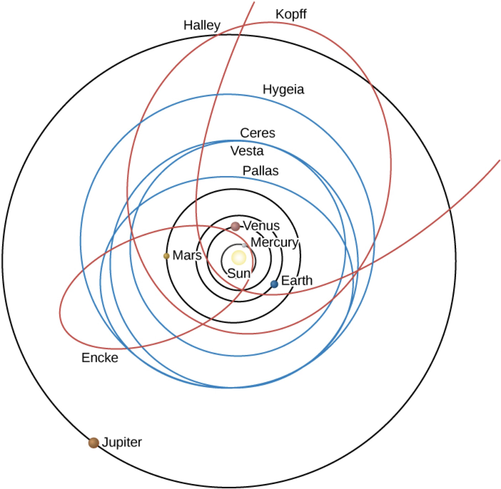
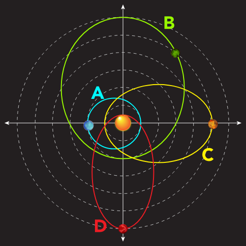

# Kepler's Laws

- Kepler’s Second Law
- Area and Speed
- Semi-major axis
- Kepler’s Third Law

## Orbits in our Solar System
Kepler developed his laws to explain visible planets. The same laws apply to planets, asteroids, comets, and dwarf planets.

*Source: [Chabot College ASTR](https://phys.libretexts.org/Courses/Chabot_College/Astronomy_10%3A_The_Solar_System_%28Totah-McCarty%29/05%3A_Planetary_Systems/5.01%3A_Overview_of_Our_Planetary_System)*

## Kepler's Second Law
As a planet moves in it’s orbit, a line to the star sweeps out equal areas in equal times.
Here: A to B and C to D.

These three regions have close to equal area:

### Comparing areas

It takes practice to compare areas of different shapes. Equal area:

 The areas are ... 

 The same. 

 The time taken for each segment is ... 

 The same. 

### Speed

Speed: Distance covered / time taken

Two planets move in their orbits for one month.

Planet A travels 0.5 A.U. (a shorter arc)

Planet B travels 0.9 A.U. (a longer arc)

 Which planet is moving faster?

 Planet B

So for our left and right segments with equal area, 

 which is faster?

 The one with a longer path, on the right. 

## Kepler's Second Law and Speed

A planet moves fastest when it is closest to the Sun,and slowest when it is farthest from the Sun
<figure>
  <video controls width="100%">
    <source src="../img/Kepler's%20Second%20Law-_3OOK8a4l8Y.mp4" type="video/mp4">
    Your browser does not support the video tag.
  </video>
  <figcaption>Video showing a planet orbiting the Sun on an elliptic orbit. It sweeps out many segments of equal area.</figcaption>
</figure>

## First and Second Laws

- Kepler’s first and second law allow us to determine:
  - The size (in A.U.) and geometry of each planet’s orbital path
  - The speed of each planet along it’s path at each time
- Is there any relationship between the orbits of different planets?

## Semi-Major Axis
Yes, IF we measure the size of an elliptical orbit by it’s semi-major axis.

The distance from the center (not the focus) across the widest part.

{height="100"} 

{height="100"} 

## Determining the Third Law

Observing the planets tells us their orbital sizes and how fast they move.

<figure>
  <video controls width="100%">
    <source src="../img/InnerPlanetOrbits.mp4">
    Your browser does not support the video tag.
  </video>
  <figcaption>Video showing the inner planets</figcaption>
</figure>

*Source: [NAAP Kepler Demo](https://astro.unl.edu/naap/pos/animations/kepler.html)*

It's not obvious how they are related if we just record these quantities:

| Planet  | Period (years) | Semimajor axis (AU) |
|---------|---------------:|--------------------:|
| Mercury | 0.241          | 0.387               |
| Venus   | 0.615          | 0.723               |
| Earth   | 1.00           | 1.00                |
| Mars    | 1.88           | 1.52                |
| Jupiter | 11.9           | 5.20                |
| Saturn  | 29.4           | 9.58                |

But if we try some math...

| Planet  | (Period)² | (Semimajor axis)³ |
|---------|----------:|-------------------:|
| Mercury | 0.058     | 0.058              |
| Venus   | 0.378     | 0.378              |
| Earth   | 1         | 1                  |
| Mars    | 3.54      | 3.54               |
| Jupiter | 141       | 141                |
| Saturn  | 841       | 841                |

## Kepler's Third Law

(Period of Orbit in years)³ = (Semi-major axis in AU)³

$P^2 = a^3$

This means:
* Distant planets take more time to orbit
* More distant planets orbit at slower average speeds

Notes:
* Kepler’s third law does not depend on the mass of the planet
* Kepler’s laws apply to any orbiting bodies!

## Kepler in our Solar system

Planets, asteriods, and returning comets obey Kepler's Third Law

Remember to use the semi-major axis for the size of the orbit.

## Check your Understanding

This diagram shows orbiting bodies with different elliptical orbits. The dashed lines show distances from the Sun in AU.

<quiz>
Which body shows the most variation in speed over its orbit?

- [] A
- [] B
- [] C
- [x] D
</quiz>

<quiz>
Where does C move fastest in its orbit?

- [x] On the left as drawn.
- [] On the right as drawn.
- [] On the top as drawn.
- [] On the bottom as drawn.

</quiz>

<quiz>
Rank the orbits in order of increasing orbital period, from shortest to longest.

- [] A < C < B = D 
- [] D < A= C < B
- [x] A < C < D <B
- [] A < D < C < B
</quiz>