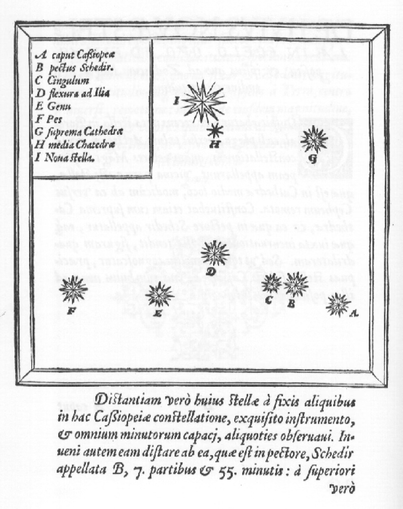
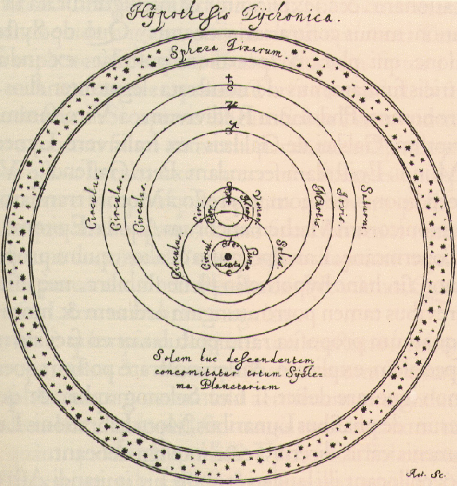
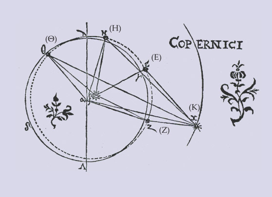
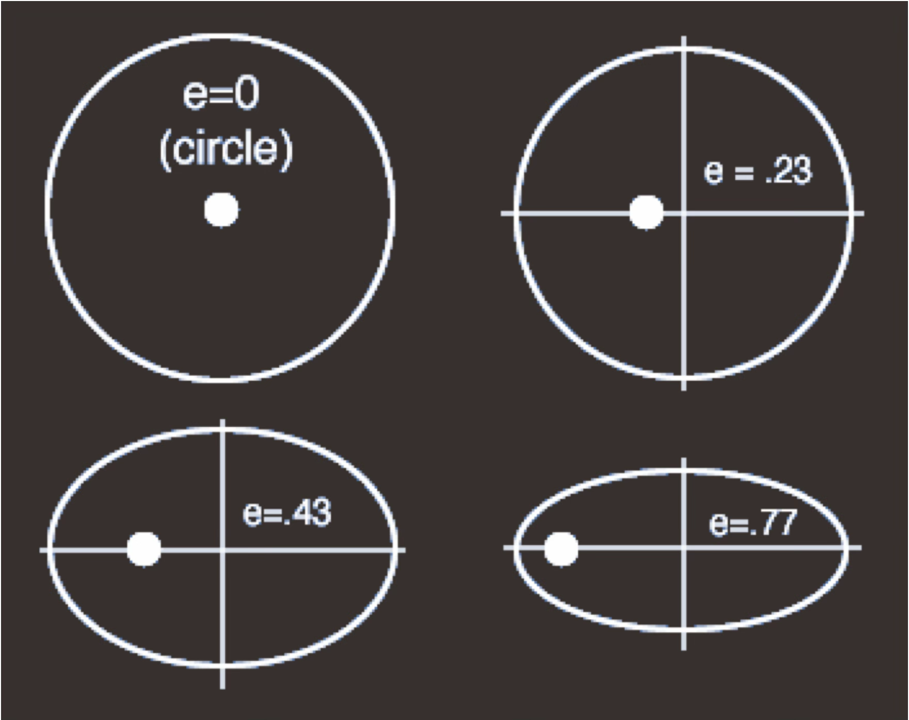
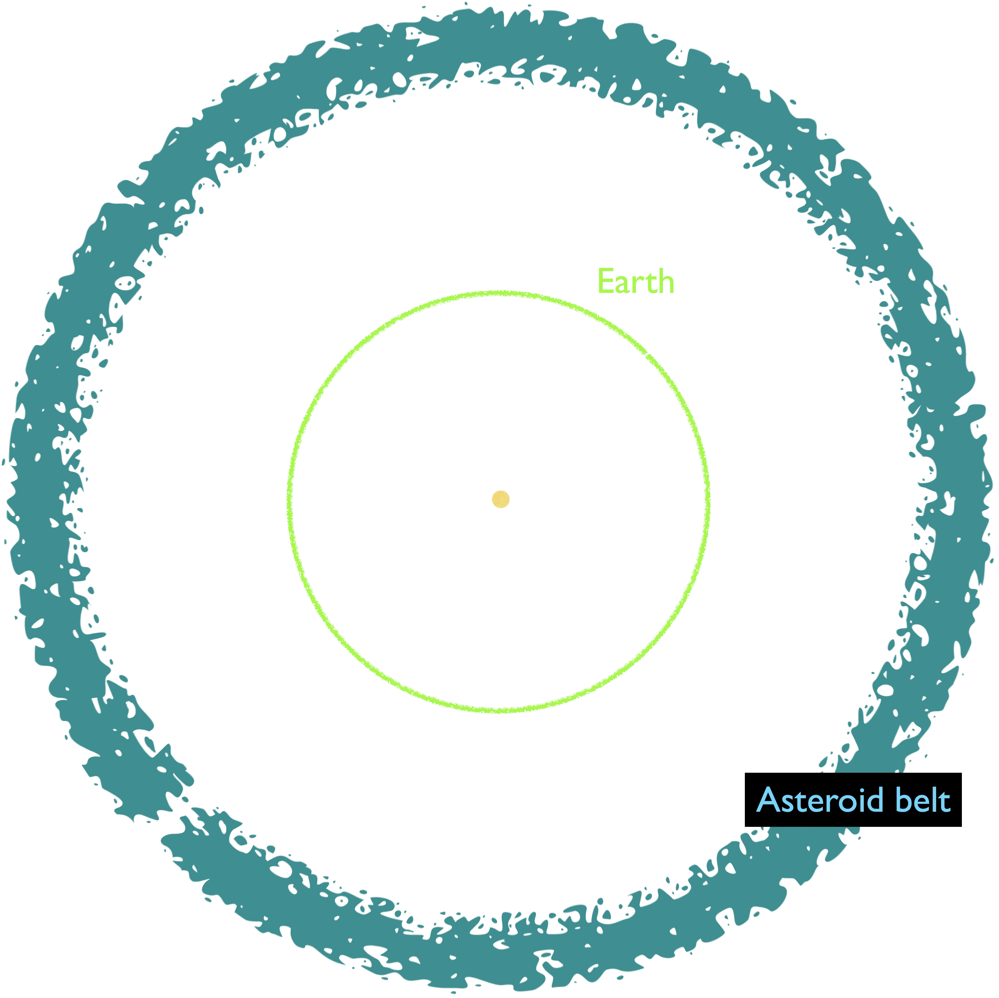
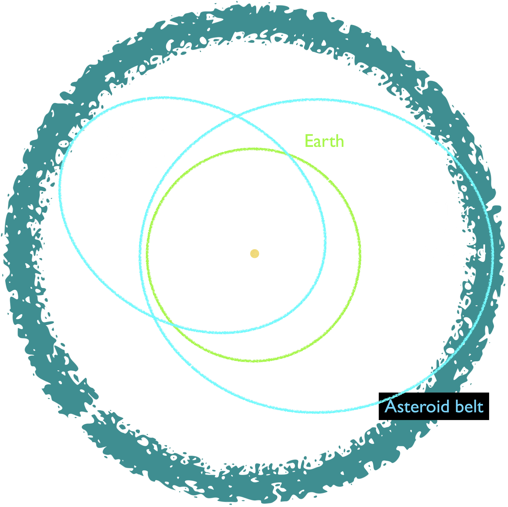
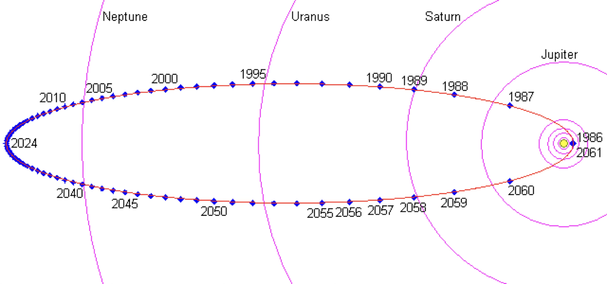

# Kepler's Orbits

- Tycho’s Observations
- Ellipticity
- Kepler’s First Law
- Asteroids and Comets

## Tycho’s Observations

Tycho Brahe 1546-1601, Denmark. Helped refute celestial sphere model by finding “new stars” or novae/supernovae. Made the most accurate (to arcminutes) astronomical observations of the time. Had a weird hypothesis fot the plantary system.

- 50 years after Copernicus, we have:
    - Galileo’s telescope observations of planets and moons
    - Tycho’s observations by eye of planets accurate to 1 arc minute
- BOTH the Ptolmeic and the Copernican models FAIL to match Tycho’s observational data perfectly

## Kepler's Proposal

“If I had believed that we could ignore these eight minutes, I would have patched up my hypothesis accordingly. But since it was not permissible to ignore them, those eight minutes pointed the road to a complete reformation of astronomy.”  - Johannes Kepler

Johannes Kepler, (1571-1630) German mathematician and astronomer. In 1609, developed the laws of planetary motion, “Kepler’s Laws”. 

He used them to predict the apparent motion of Mars.

## Kepler's First Law

The orbit of each planet is an ellipse with the Sun at one focus

- Major axis: longest distance across
- Minor axis: shortest distance across
- Perhelion: closest to Sun
- Aphelion: farthest from Sun

## Ellipses and Eccentricity

<figure>
  <video controls width="100%">
    <source src="../img/EllipseEccentricity.mp4" type="video/mp4">
    Your browser does not support the video tag.
  </video>
  <figcaption>Video showing the ellipse that comes from two foci as the foci move toward and away from each other.</figcaption>
</figure>

Earth's orbital eccentricity is 0.0167.

## Planets and Asteroids

The inner planets have fairly circular orbits.

While asteroids are mostly in the asteroid belt, they can have orbits that come close to (Near Earth) or cross (Potentially Hazardous) Earth's orbit. 

## Comets

<figure>
  <video controls width="100%">
    <source src="../img/comet-orbit.mp4" type="video/mp4">
    Your browser does not support the video tag.
  </video>
  <figcaption>A comet moves in from far away from the Sun on an eccentric orbit. The tail of the comet always points away from the Sun (not in the direction of motion)</figcaption>
</figure>

### Halley's Comet

*Source: [Halley Multicolor Camera Team, Giotto Project, ESA
via NASA page on Halley's Comet](https://science.nasa.gov/solar-system/comets/1p-halley/)*

Comets in very elliptic orbits spend most of their time far away from the sun and return to Earth rarely. (Because of [Kepler's Second Law](keplers_laws.md#keplers-second-law-and-speed))

### Comet ATLAS

This path does not return in an orbit

This is comet ATLAS, which passed near Earth in 2025. On November 10, 2025, Hubble captured the inset image of the fragmenting comet.

*Source: [NASA, ESA, R. Crawford (STScI)](https://esahubble.org/images/heic2606c/)*

## Check your understanding

<quiz>
Which of these shapes has the largest eccentricity?
(judged by the outline from this view)

- [] { width="100" }
- [] { width="100" }
- [] { width="70" }
- [x] { width="100" }
</quiz>

<quiz>
The eccentricity of the Earth’s orbit is e = 0.0167

Which of the three orbits shown below
most closely matches the shape of the 
Earth’s orbit around the Sun, 
seen from directly above the orbital plane?

- [x] (A)
- [] (B)
- [] (C)
</quiz>

<quiz>
Which of these animations, showing a planet orbiting around a star (from directly over the system) obeys Kepler’s First law?

 
- [] (A)
- [x] (B)
- [] (C)
- [] (D)
</quiz>