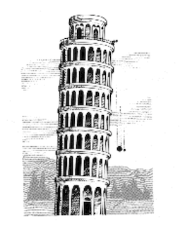
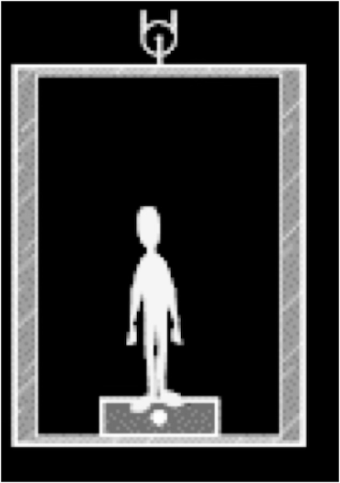
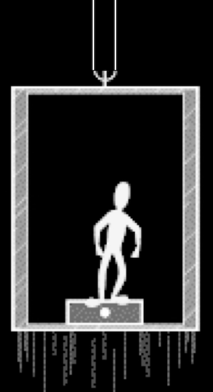
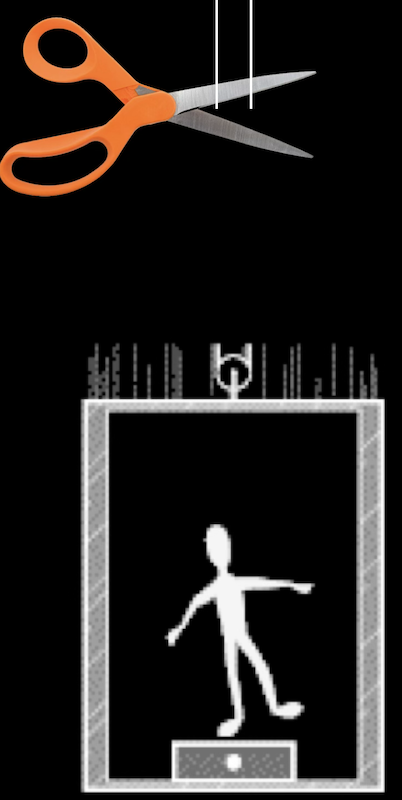
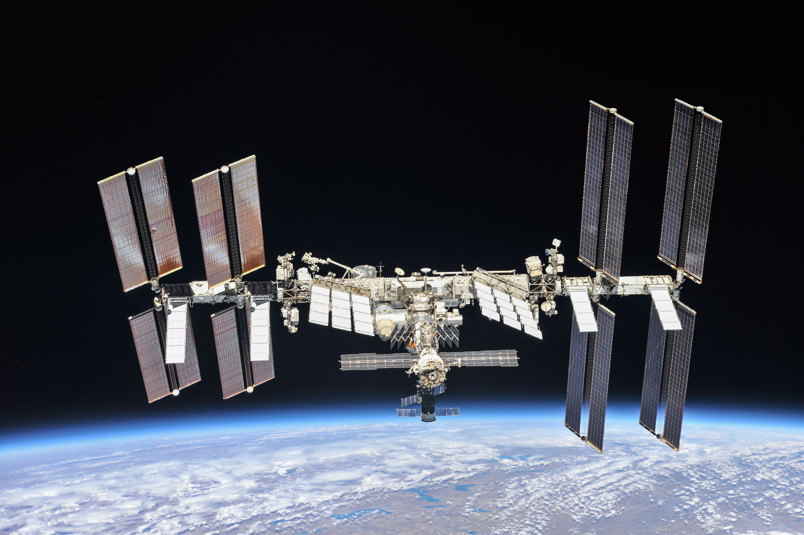
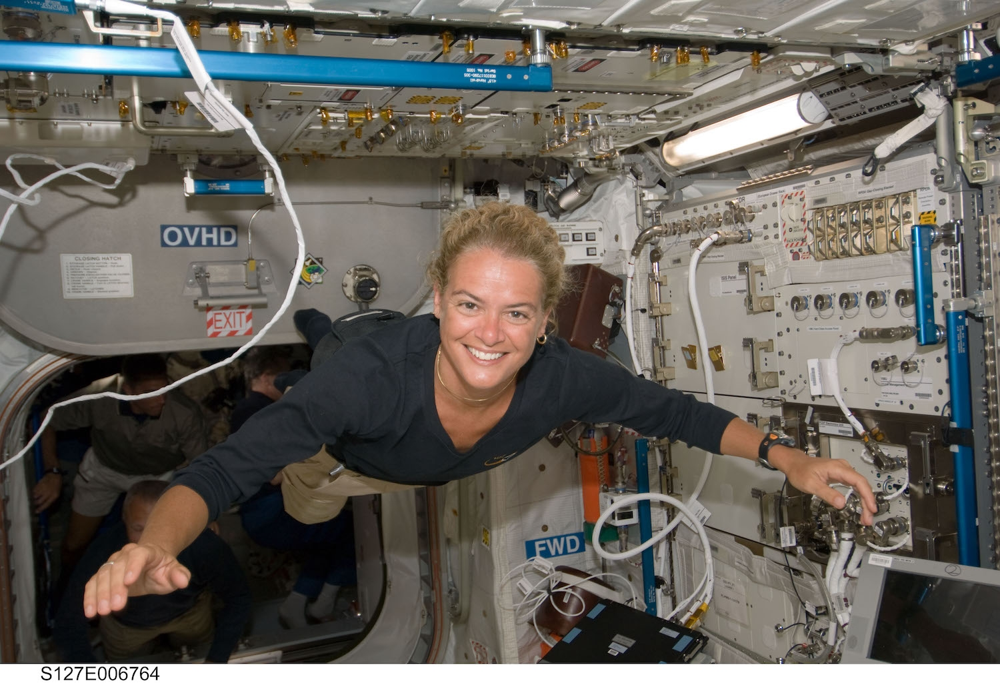

# Mass and Weight

- Gravitational Acceleration 
- Mass and Weight
- Elevators
- Weightlessness

## Gravitational Acceleration

From last module:

At a given distance ($r$) from a massive object ($M$), every other mass ($m$) feels the same gravitational acceleration ($a$).

$$ F = G \frac{Mm}{r^2}$$

 and 
 
$$ F=ma$$

means

$$ G \frac{Mm}{r^2} = ma$$

so

$$ G \frac{M}{r^2} = a$$

Planets at the same distance accelerate along the same paths around the Sun (the Sun is $M$).

This also means: You, a rock, and a feather experience the same acceleration due to Earth gravity (the Earth is $M$).

Galileo Galilei (1564-1642)  (again!)
Performed experiments where he dropped balls with different masses (from the Leaning Tower of Pisa) to demonstrate that the time it took them to fall was independent of their mass.

We don't always observe the same acceleration because air resistance can slow some objects.

If they feel the same air resistance, or if air is not present, the acceleration will be the same.

## Demonstration on Earth

On Earth, a bowling ball and feathers, with and without air:

  <iframe
    src="https://www.youtube.com/embed/E43-CfukEgs"
    title="Brian Cox visits the world's biggest vacuum | Human Universe - BBC"
    style="width: 100%; height: 100%; border: 0;"
    allow="accelerometer; autoplay; clipboard-write; encrypted-media; gyroscope; picture-in-picture; web-share"
    referrerpolicy="strict-origin-when-cross-origin"
    allowfullscreen>
  </iframe>

## Demonstration on the Moon

The Moon has no atmosphere, so each object
falls with the same acceleration.

Smaller than the acceleration on Earth

  <iframe
    src="https://www.youtube.com/embed/oYEgdZ3iEKA"
    title="Apollo 15 Hammer-Feather Drop"
    style="width: 100%; height: 100%; border: 0;"
    allow="accelerometer; autoplay; clipboard-write; encrypted-media; gyroscope; picture-in-picture; web-share"
    referrerpolicy="strict-origin-when-cross-origin"
    allowfullscreen>
  </iframe>

## The m in F=ma

- There is a technical difference between mass and weight

- Your mass (m) is the amount of matter in your body

- Your weight is the force F you feel from the ground. It is measured by a scale when you stand on it

## Changing Weight

- Your mass (m) is always the same
- The force F measured by a scale can change
  - Balances the gravitational force from the Earth
  - Different gravitational forces mean different weight:
  - Your weight will be smaller on the Moon or on Mars from smaller gravitational acceleration

## Acceleration and Weight

### Standing in a still elevator.

The force from the floor balances the force of gravity (net force=0)

A scale measures how much force is required to hold you up.

Your weight = the force of gravity from the Earth on you

###  Elevator accelerates upward. 

The force from the scale increases so that a net force accelerates you upward.

Weight increases.

You feel heavier.

### Elevator falls downward.

The force of gravity accelerates you downward at the same rate.

The falling floor doesn’t exert any force.  You are weightless.

## Weightlessness

The International Space Station orbits because of the gravitational force from the Earth

Earth’s gravitational force accelerates astronauts and the ISS downward at the same rate.

Astronauts on the International Space Station don’t notice the gravitational pull of the Earth. That’s because they are falling (orbiting) along with the Space Station.

We don’t notice the gravitational pull of the Sun. That’s because we are falling (orbiting) along with the Earth.

There is gravity in space, but astronauts in “free fall” feel weightless (like you would (temporarily) in a falling elevator)

## Check your understanding

<quiz>
Standing at the front of a classroom, your professor drops a feather and a rock at the same time.  Which falls faster?

- [x] the rock
- [] the feather
- [] they fall at the same rate

A different fall rate is what you'd expect to observe, and what you'd actually observe, because of air resistance.

</quiz>

<quiz>

Your professor puts a feather and a rock at the top of a vacuum tube and pump out all the air so there is no air resistance. She drops the feather and the rock at the same time. 

Which falls to the bottom of the tube faster?

- [] the rock
- [] the feather
- [x] they fall at the same rate

This is pretty weird but cool to actually see happen.

</quiz>

<quiz>
A person stands on a scale in an elevator.

When the elevator is stopped, they weigh 180 lbs.

When the elevator is accelerating up, their weight is 

- [x] more
- [] less 
- [] the same

</quiz>