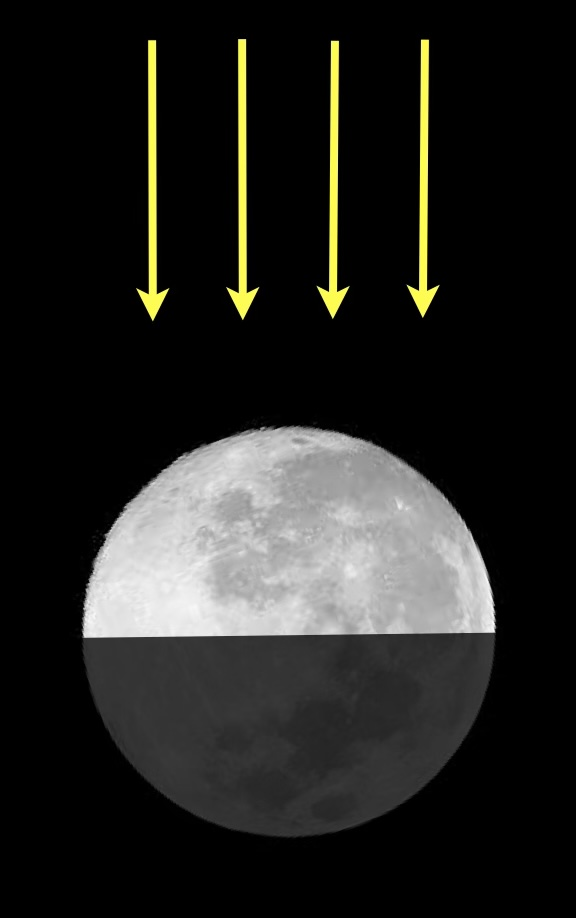
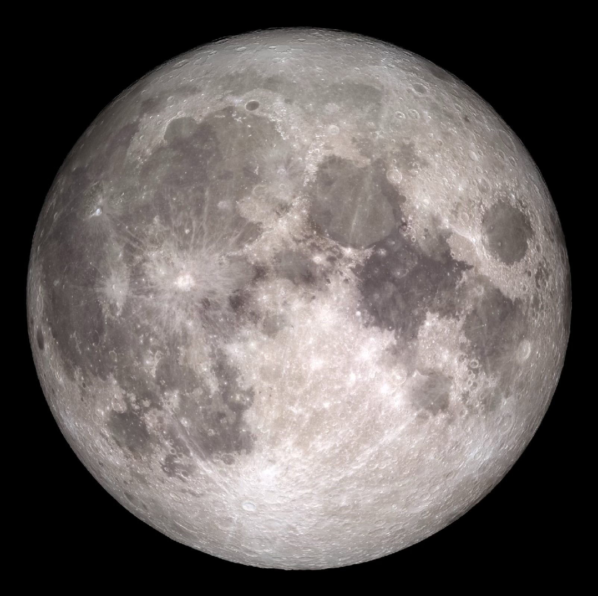
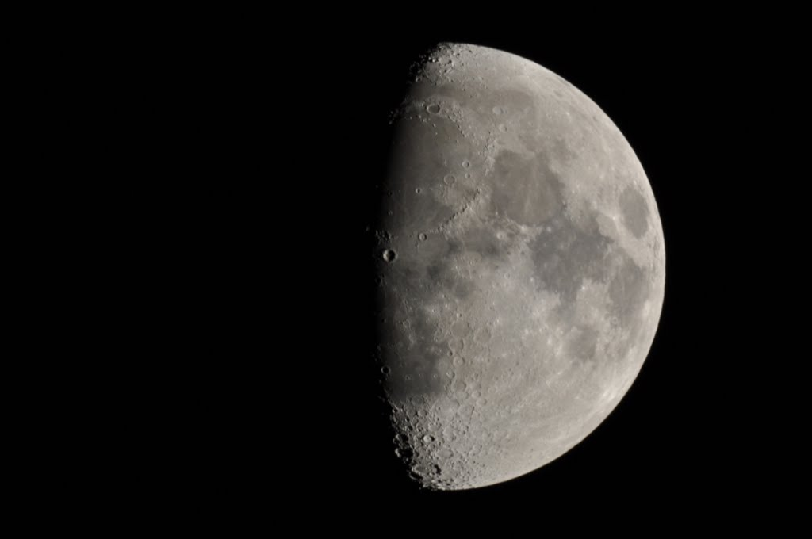
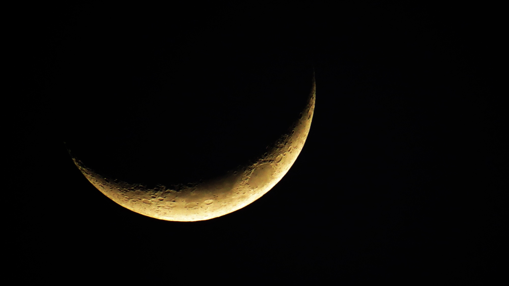
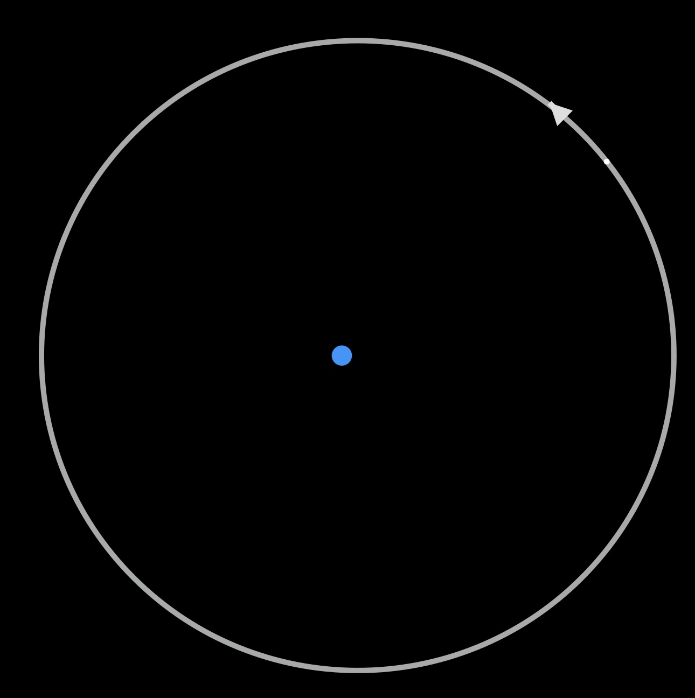
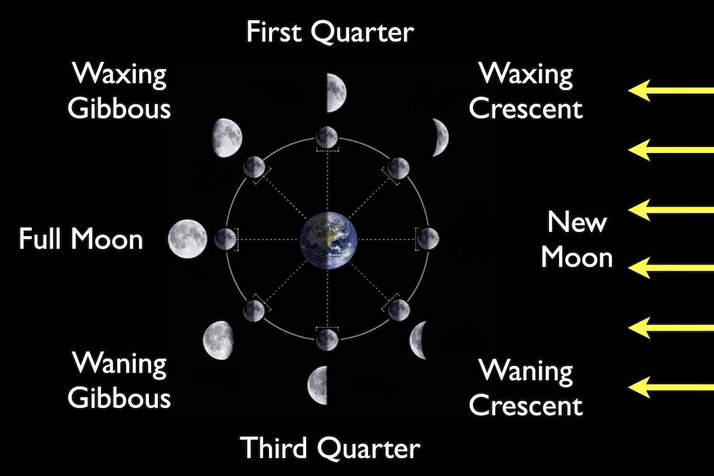
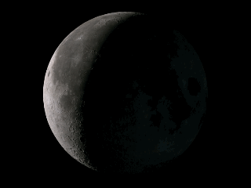
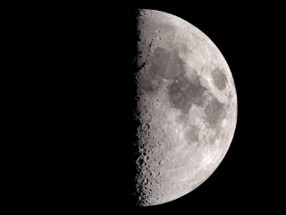

# Phases of the Moon

* The cause of moon phases

* Identifying moon phases

* The lunar cycle and the moon’s orbit

* Moon rise and set times

## Moon cycles

This is a visualization of how the moon appears in our sky over the course of a year:

  <video
    controls
    muted
    playsinline
    style="position:absolute;top:0;left:0;width:100%;height:100%;">
    <source src="https://svs.gsfc.nasa.gov/vis/a000000/a004800/a004874/phases_2021_plain_720p30.mp4" type="video/mp4">
  </video>

*[Source: NASA](https://svs.gsfc.nasa.gov/4874/)* 

*(This visualization is from 2021, showing the moon's appearance at hourly intervals)*

Why does it look this way?

## Light on the Moon

- The Moon does not produce its own light.

- Half the Moon is always illuminated by the Sun

### Build understanding: Moon illumination
![Three Moon images labeled (A), (B), and (C), each half illuminated. In (A), yellow arrows point diagonally upward toward the Moon from the lower left, and the left half is bright while the right half is in shadow, with a vertical dividing line. In (B), arrows point horizontally from right to left, and the upper right half is bright while the lower left half is in shadow, with a diagonal dividing line. In (C), arrows point straight downward from above, and the top half is bright while the bottom half is in shadow, with a horizontal dividing line.](img/three-moon-illuminations.jpg)

<quiz> 

Which of the three images above shows a physically realistic diagram of the Sun's rays hitting the moon?
- [ ] A only
- [ ] B only
- [x] C only
- [ ] All of them
- [ ] None of them

The side that is bright must be the one towards the Sun.
</quiz>

### Direction of the Sun

- The amount of illuminated Moon we see depends on the relative position of the Sun

#### Example:  

  
If you observe this moon, where is the Sun?

  
The sun must be behind us, to light up the moon fully.

#### Example:  

  
If you observe this moon, where is the Sun?

  
The sun must be off to the right.

#### Example:  

  
If you observe this moon, where is the Sun?

  
The sun must be a bit below the moon, but also far behind the moon so we don't see as much lit up.

## The Moon's orbit

* The Moon appears to lie on the celestial sphere. Over the course of one day, it moves with the rise-and-set stars. 

* As viewed from stars, above the North pole:

    * The Moon revolves **counterclockwise** about the Earth. 
    * It orbits the Earth once every 27.32 days.

Find the "start animation" button on this Lunar Phase Simulator to see a demonstration of how the moon orbits a spinning earth.  
<iframe
  src="https://ccnmtl.github.io/astro-simulations/lunar-phase-simulator/"
  width="1024"
  height="1024"
  title="Lunar Phase Simulator"
  frameborder="0"
  referrerpolicy="strict-origin-when-cross-origin">
</iframe>

* The Moon rises and sets, just like the sun and stars, based on the spin of Earth.
* When the observer looks up, they only see the illuminated part of the side of the Moon that faces them.
* All observers on earth who can see the Moon see the same phase at the same time
* Earth is small and the moon orbit is a bit tilted, so Earth doesn’t usually cast a shadow on the Moon.

## The face of the moon

The moon is "tidally locked." This means: the  moon spins once each orbit, so on Earth we always see the same face. 

  <video
    controls
    muted
    playsinline
    style="position:absolute;top:0;left:0;width:100%;height:100%;">
    <source src="https://science.nasa.gov/wp-content/uploads/2023/08/simple-tidal-comparison-of-earth-moon.mp4" type="video/mp4">
  </video>

*[Source: NASA](https://science.nasa.gov/moon/tidal-locking/)*

## Moon phases from the orbit

The relative angle of sunlight creates the moon's phases:

<iframe
  width="560"
  height="315"
  src="https://www.youtube.com/embed/wz01pTvuMa0?start=057&end=&mute=1&autoplay=0&loop=0&playlist=wz01pTvuMa0&rel=0&modestbranding=1"
  title="Moon Phases Demonstration"
  frameborder="0"
  allow="autoplay; fullscreen; picture-in-picture"
  referrerpolicy="strict-origin-when-cross-origin"
  allowfullscreen>
</iframe>

Phase Summary:

* The Earth is shown with 8 moon positions evenly spaced around it. From the illumination, the sunlight must come from the right side of this image. Each orbit position has the right half illuminated.

* Near each moon orbit location, the appearance of the moon in the sky for a Northern hemisphere observer is also shown. Moving counter-clockwise from the far right position:
    1. New moon: orbit position between the Earth and the Sun, moon not visible in the sky.
    1. Waxing crescent: a crescent on the right side based on the view from Earth
    2. First quarter: the sunlight comes in from the side to the orbit position, making a half-illuminated view
    1.  Waxing gibbous: more than half of the visible face is lit, a crescent of shadow on the left.
    1. Full moon: orbit position opposite the sun,fully lit in the sky
    1. Waning Gibbous: More than half of the visible face is lit. Now, we see the lit up part on the left.
    1. Third Quarter: half-illuminated view, the sun on the Earth observer's left as they look to this orbit position.
    1. Waning Crescent: a crescent on the left side.

## The Lunar Month

* There are 29.53 days between new moons, as observed from Earth.
* This is the **lunar month** - it is longer than moon’s orbital time of 27.32 days.
* Why? Earth is in orbit around the Sun, so the direction of a New Moon is changing
* This means: it takes a little bit more than a week to go from first quarter to full

*[Source: Orion 8](https://commons.wikimedia.org/wiki/File:Moon_phases_en.jpg)*

## Moonrise and Moonset

- Observers on earth experience times of day based on the sun.

- As the earth spins, different moon phases come into and out of view.

- As an example, the full moon comes into view on the horizon at 6pm, is highest in the sky at 12am (midnight), and sets at 6am.

You can work out the rise and set times for different phases. For example:

- First Quarter: Rises at noon, sets at midnight.
- Full Moon: Rises at 6pm, sets at 6am.
- Third Quarter: Rises at midnight, sets at noon.

## Check your understanding

<quiz>
Which phase of the Moon rises in the east as the Sun sets in the west?

- [ ] first quarter
- [ ]  new
- [x] full
- [ ]  third quarter
</quiz>

<quiz>

You observe a full moon rising in the East. What image best shows what it look like when it sets?

- [ ] (A)
- [x] (B)
- [ ] (C)
- [ ] (D)

</quiz>

<quiz>
Which of the following best describes why the moon goes through phases?

- [ ]  Earth’s shadow falls on different parts of the Moon at different times
- [ ]  The amount of the Moon illuminated by the Sun changes over the course of a month
- [ ]  The sunlight reflected from Earth lights up the Moon differently at different times of the month
- [x]   We only see part of the lit-up Moon depending on its position relative to the Earth and Sun

</quiz>

  
<quiz>
The time interval corresponding to the length of the lunar phase animation shown above is closest to...
- [ ] 4 days
- [ ] 10 days
- [x] 15 days
- [ ] 30 days
</quiz>

  
<quiz>
The time interval corresponding to the length of the lunar phase animation shown above is closest to...
- [ ] 4 days
- [ ] 7 days
- [x] 10 days
- [ ] 14 days
</quiz>