# Motion in Space

- Velocity, acceleration, and force
- Newton's First Law
- Newton's Second Law
- Newton's Third Law
- Rockets

## Rocket Launch

<iframe
  width="560"
  height="315"
  src="https://www.youtube.com/embed/U_yGbjnLMGM?modestbranding=1"
  title="Roman Rocket Launch"
  frameborder="0"
  allow="accelerometer; autoplay; clipboard-write; encrypted-media; gyroscope; picture-in-picture; web-share"
  referrerpolicy="strict-origin-when-cross-origin"
  allowfullscreen>
</iframe>

- What makes planets move the way they do?
- How do rockets and spaceships work?
- How do stars, black holes,  and entire galaxies interact?
- How do stars and planets form?

These questions are related.

## Understanding Motion

- The same relationships hold for motion in space and the motions of objects on earth
- To travel between orbiting planets, we need to predict and change how a spacecraft moves.
- Welcome to Rocket Science 101!

Isaac Newton (1642-1727)

English physicist, mathematician, astronomer. Developed three laws of motion, and the law of gravitation.

- Newton developed laws of motion to describe how objects move and interact on Earth.
- He realized that the force that made objects fall on Earth was the same as the force that keeps the moon (and planets) in orbit
- Newton showed that the laws of physics apply everywhere

## Describing Motion

- Speed: Distance covered / time taken
- Velocity: The speed AND direction of motion
- Acceleration:  A change in the velocity. 
  - This can be a change in speed OR a change in direction, or both.

## Newton’s first law

An object moves at constant velocity when there is no net (total) force acting on it.

- Objects at rest stay at rest...
  -   Unless the object interacts.
- Objects in steady motion stay in steady motion...
  -   Unless the object interacts.

- Acccelerations (changes in velocity) always indicate forces (interactions with other things).

## Force
Force: We define “force” in a specific way to characterize the interactions between objects. 

example: pushes and pulls
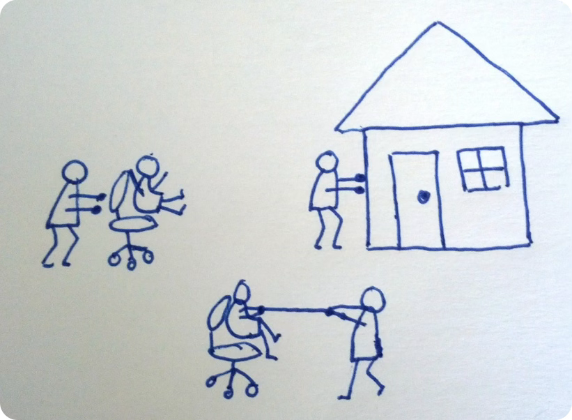

Net Force: The combination of forces on an object. 

If forces cancel each other－e.g. two with the same strength but opposite directions－the net force is zero.
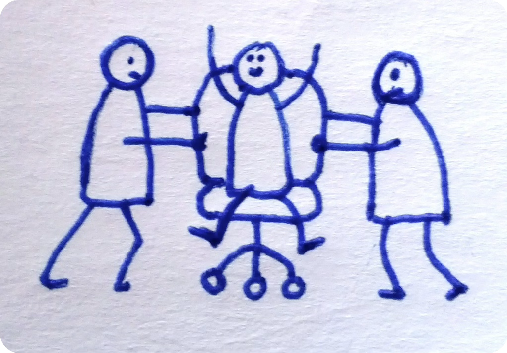

## Velocity in orbits
Imagine the planet shown is moving counter-clockwise.  What direction is the planet’s velocity at the point shown?
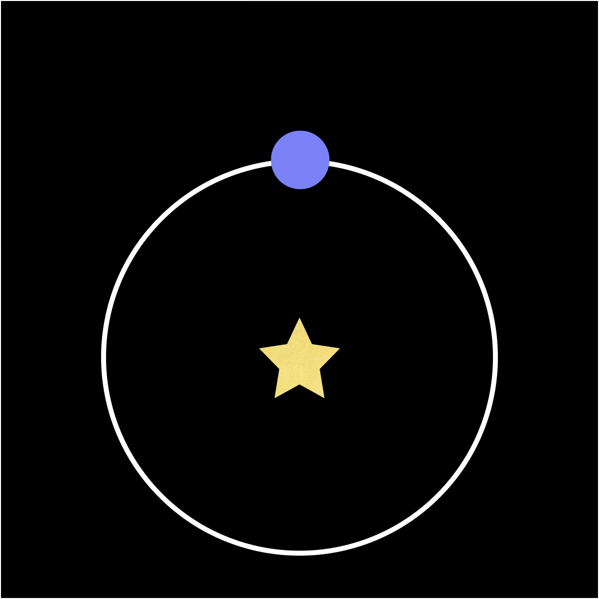

 The direction is...

 to the left.

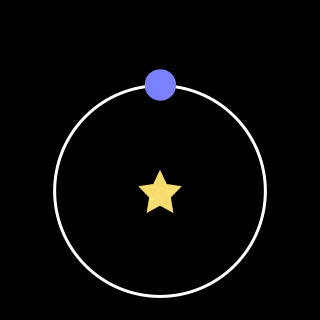

After some time, the planet orbits around to this new location.

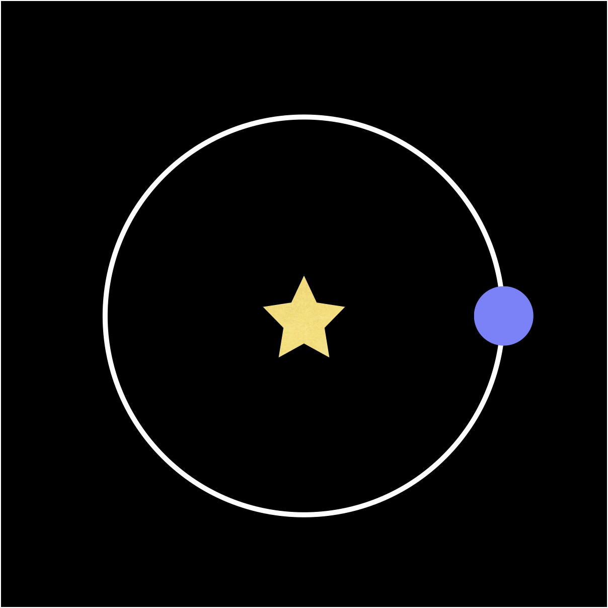
The planet is still moving counter-clockwise.  What direction is the planet’s velocity at the point shown?

 The direction is...

upward.

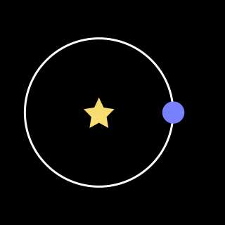

 
 What was the eccentricity in the previous two examples? 

Zero, circular orbit.

 
  Was the planet’s speed changing? 

No, constant speed.

 
   Was the velocity changing? 

Yes. A change in direction.

### Implication

As a planet orbits, its velocity changes.

Newton’s first law implies that a force is required for this to happen.

If that force disappeared the planets would continue moving with a constant velocity

## Newton’s second law: How does a force change motion?

The acceleration of an object is that object’s net force applied divided by the mass

Force = mass × acceleration

$F = m a$

If we exert the same force on two objects, the acceleration of each depends on its mass.

The acceleration is in the same direction as the force.

## Acceleration and direction

- If you speed up, the direction of acceleration is forward
  - 

- If you slow down, the direction of acceleration is backwards
  - 

- If you turn to the right, the direction of the acceleration is to the right
  - 

### Acceleration in an orbit

Imagine the planet shown is moving counter-clockwise.  What direction is the acceleration at the point shown?

 The direction is...

Downward, like our turning example.

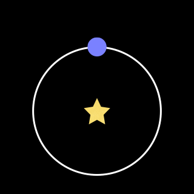

Orbits have acceleration toward the focus where the massive object is.

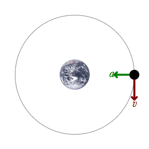

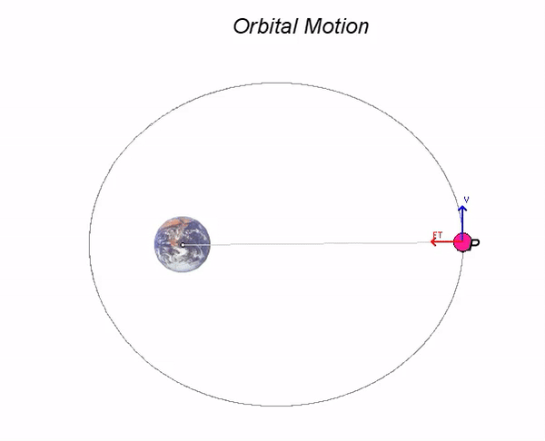

## The force keeping masses in orbit

From Kepler’s description of orbits and Newton’s Second Law, $F=ma$, we can determine properties of the force that keeps planets in orbit 

- It pulls masses toward each other
- It’s (a lot) larger when they are close together

Newton realized that the same force explains why things fall on Earth

## Falling and Orbits

Objects on earth fall because of the force of gravity.

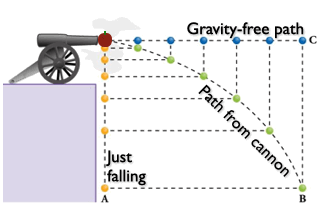

- The moon feels a gravitational force toward the earth (like an apple would)
- It always falls toward earth (like an apple would)
- It’s traveling exactly fast enough that it always misses (unlike apples)

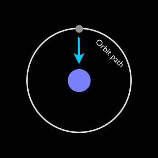

## Newton's Third Law

- When two objects interact,  they both exert forces on each other.
- The forces are of the same strength but in opposite directions.
- For every force there is an “equal and opposite” reaction force

## Rocket demo

  <iframe
    src="https://www.youtube.com/embed/74mP8R6QulU?start=52"
    title="YouTube video player"
    style="width: 100%; height: 100%; border: 0;"
    allow="accelerometer; autoplay; clipboard-write; encrypted-media; gyroscope; picture-in-picture; web-share"
    referrerpolicy="strict-origin-when-cross-origin"
    allowfullscreen>
  </iframe>

- Rockets can move without anything to “push against”. 
- The rocket thrust force comes from ejecting material backward (the force is the rate of mass ejection times the velocity of the exhaust). 
- That makes a force in the opposite direction that makes the rocket move forward.

## Wall-E

WALL-E  obeys Newton’s laws (EVE doesn’t)

  <iframe
    src="https://www.youtube.com/embed/pVRgfDSAGOA?start=165"
    title="YouTube video player"
    style="width: 100%; height: 100%; border: 0;"
    allow="accelerometer; autoplay; clipboard-write; encrypted-media; gyroscope; picture-in-picture; web-share"
    referrerpolicy="strict-origin-when-cross-origin"
    allowfullscreen>
  </iframe>

- Drift at constant speed when there is no force (interaction)
- Equal and opposite force between expelled fire-extinguishant and Wall-E
- Force changes acceleration (speed, slow, or turn)

## Check your understanding
<quiz>

<figure>
  <video controls width="100%">
    <source src="../img/breakrope.mp4" type="video/mp4">
    Your browser does not support the video tag.
  </video>
  <figcaption>This video shows boy spinning a rock on a string above his head. The string breaks.
</figcaption>
</figure>

Determine what path the rock will likely take after it is let go.

- [] A
- [] B
- [] C
- [x] D
- [] E

<figure>
  <video controls width="100%">
    <source src="../img/rock2.mp4" type="video/mp4">
    Your browser does not support the video tag.
  </video>
  <figcaption>A boy spinning a rock on a string above his head. 
</figcaption>
</figure>

*[Source: NAAP](https://astro.unl.edu/classaction/questions/renaissance/ca_renaissance_rock.html)*
</quiz>

<quiz>
A car traveling West slams on its brakes and comes to a stop. In which direction was its acceleration?

- []  West
- [x] East
- [] There was no acceleration, the car came to a stop

</quiz>

<quiz>
Your friend pushes on your hands while you’re both standing on very slippery ice.

The amount of force exerted by you on your friend is

- []  Greater than the force they exert on me
- []  Smaller than the force they exert on me
- [x] The same as the force they exert on me

</quiz>

<quiz>

The Sun exerts a gravitational force on Earth. Does Earth exert a force on the Sun? 
- []  No
- [] Yes, but the force is smaller than the force of the Sun on Earth.
- [x] Yes, and the force is the same strength as the force of the Sun on Earth.
- [] Yes, but the force is larger than the force of the Sun on Earth.
</quiz>

<quiz>
Your friend pushes on your hands while you’re both standing on very slippery ice.

You are less massive (you weigh less on Earth) than your friend. How do your accelerations compare?

- [x]  My acceleration is larger than theirs
- [] Their acceleration is greater than mine
- []  Our accelerations are the same

The forces $F$ in $F=ma$ are the same. But the masses $m$ are different. So the $a$ has to be larger when $m$ is smaller so the product $F$ stays the same.

</quiz>

<quiz>
Wall-E is flying in a straight line, but wants to turn toward the left, what should he do?

- []  Fire the extinguisher to the left
- [x] Fire the extinguisher to the right
- [] Fire the extinguisher forward

</quiz>