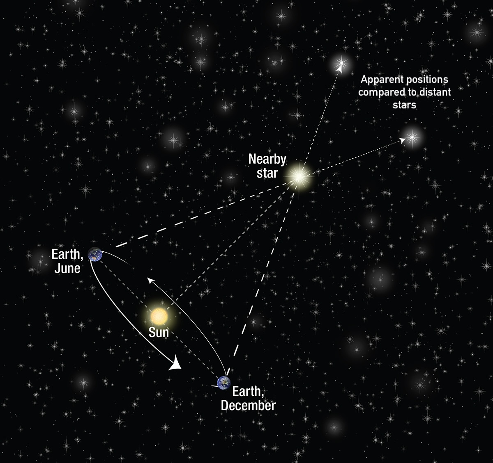
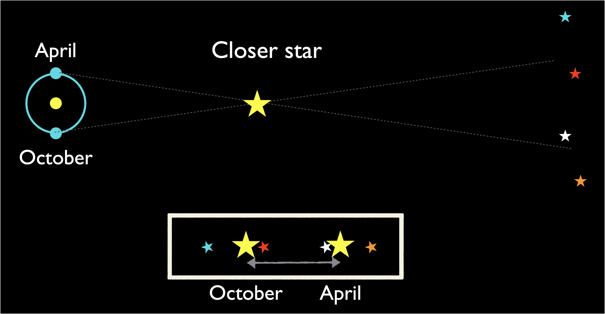
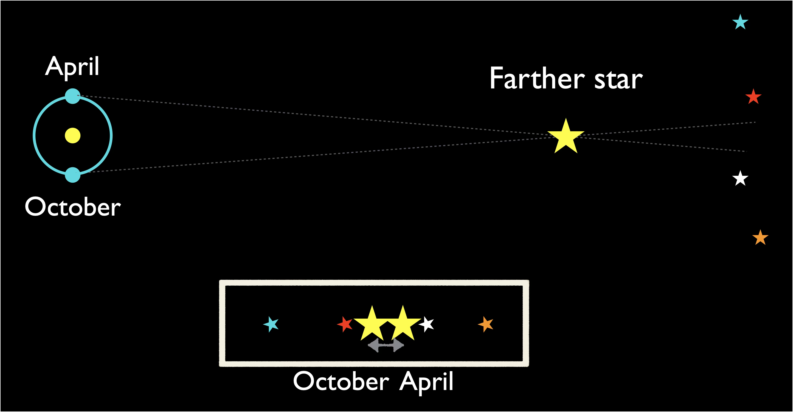
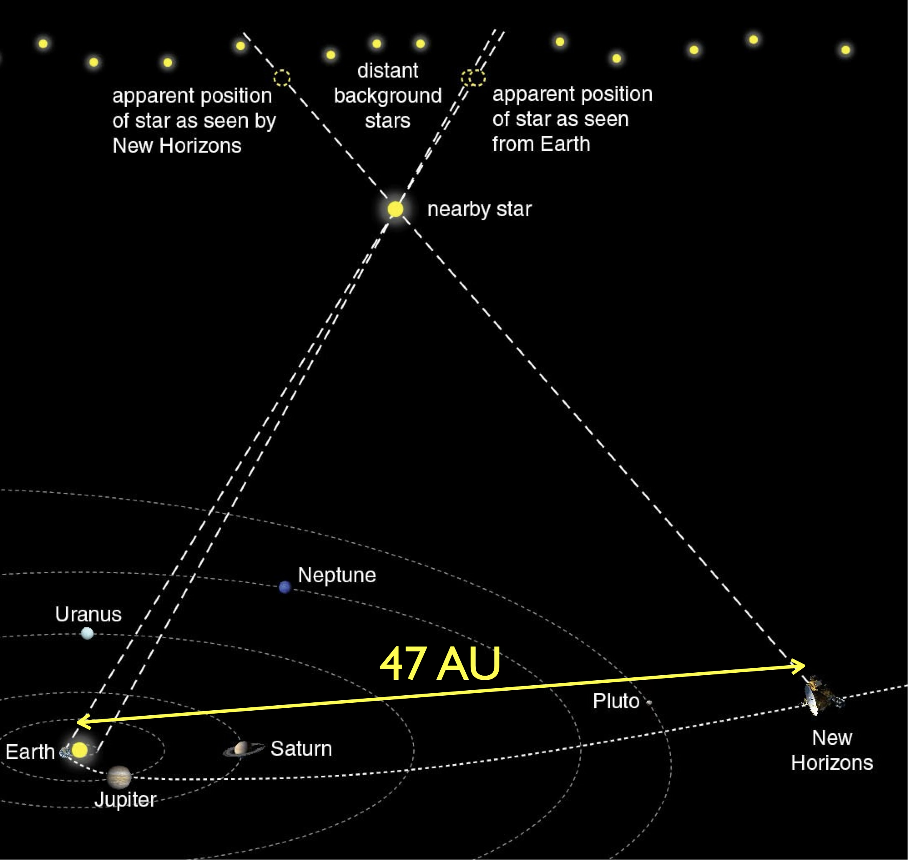
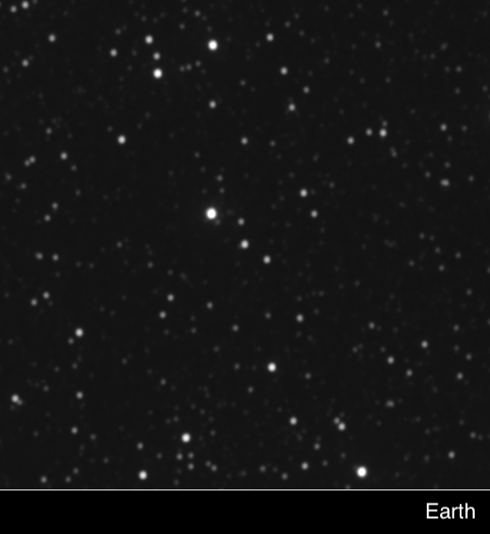
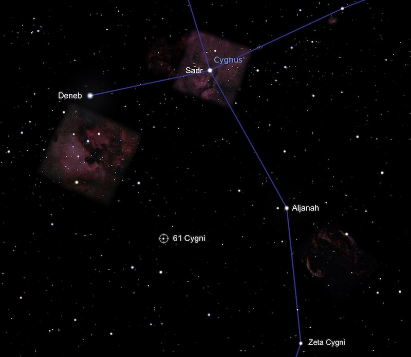
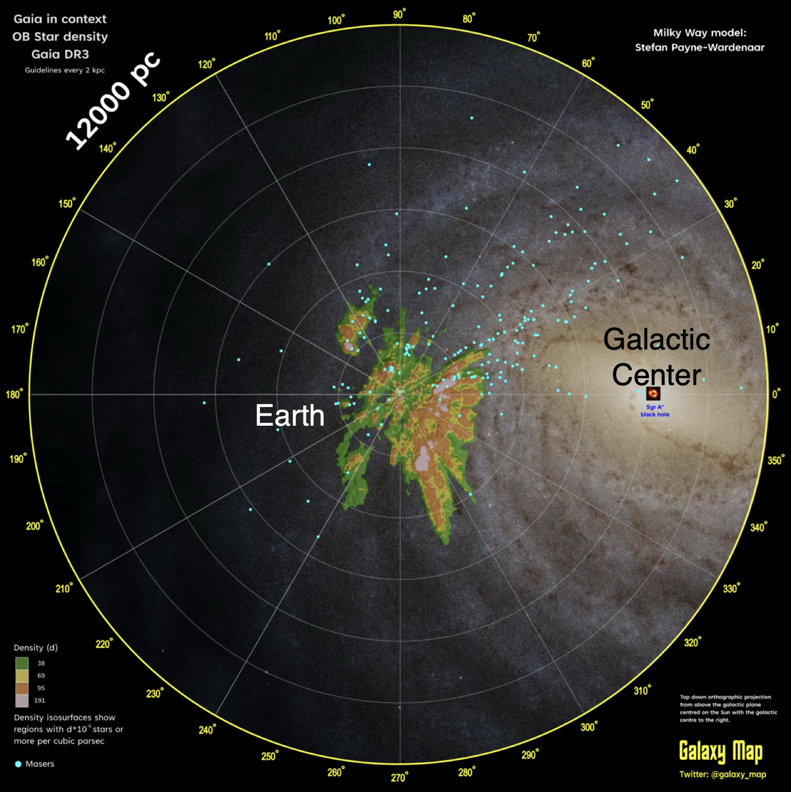

# Parallax 

- Perspective and distance
- Stellar Parallax
- Arcminutes and Arcseconds
- The Parsec
- Observing Parallax

## Perspective and distance
This video shows a view from a moving train.   
Notice:

* Apparent motion changes with distance
* Distant objects move less than nearby ones

  <iframe
    src="https://commons.wikimedia.org/wiki/File:Bewegungsparallaxe_Motion_parallax_from_Heidelberg.webm?embedplayer=yes"
    title="Motion parallax from Heidelberg"
    style="position: absolute; inset: 0; width: 100%; height: 100%; border: 0;"
    loading="lazy"
    allow="autoplay; picture-in-picture"
    allowfullscreen>
  </iframe>

*Source: [Georg Buzin, via Wikimedia Commons](https://commons.wikimedia.org/wiki/File:Bewegungsparallaxe_Motion_parallax_from_Heidelberg.webm)*

* In Astronomy, we often compare motion to the distant “Fixed stars”

## Stellar Parallax

*[Base image Source: NASA](https://science.nasa.gov/asset/hubble/stellar-parallax/)*

* As Earth orbits, it changes our view of the stars
* Analogy: Hold out your thumb, and look at it with alternate eyes

Close stars appear to move a larger angular distance

Farther stars appear to move a smaller angular distance

Perspective looking North from an orbiting planet

This video shows Earth's yearly perspective shift looking North, amplified x100,000.

<iframe
  src="https://www.esa.int/content/view/embedjw/500694#t=10,50"
  width="640"
  height="360"
  frameborder="0"
  allowfullscreen>
</iframe>

*[Source: ESA](https://www.esa.int/ESA_Multimedia/Videos/2018/04/Parallax_and_proper_motion_on_the_sky)*

## How much would the very nearest star appear to move?

- Proxima Centauri is 4.2 light years away.
- The parallax angle comes from a triangle formed by
Earth’s orbit distance (1 A.U. or 8 light minutes)
and the distance to the star (2 million light minutes). 
- The angle is very small!

(This image is not to scale.)

## Arcminutes and arcseconds

For small changes in the night sky, we use arcminutes and arcseconds

- The Moon appears about 31 arcminutes across

- Proxima Centauri has a parallax angle of about 0.8 arcseconds

## Parsecs

- A parsec is a unit of distance 
- It is the distance to an imagined star with a parallax angle of one arcsecond (with an Earth to Sun baseline of 1 A. U.)

## Parallax with New Horizons

[New Horizons](https://science.nasa.gov/mission/new-horizons/) was the first spacecraft to observe Pluto up close.

It also observed Proxima Centauri, from much farther than 1 A.U.

 

*[Source: NASA](https://web.archive.org/web/20231104161749/https://www.nasa.gov/solar-system/nasas-new-horizons-conducts-the-first-interstellar-parallax-experiment/)*

## Parallax and Ancient Astronomy

- Ancient astronomers could not observe parallax
- Either:
  - The stars are so far away that Earth’s motion does not make any observable change
  - The Earth is not moving
- Most ancient astronomers assumed the Earth was not moving
- We know now that stars are just really really really really far away.

## Observing Parallax

### In 1838
[Friedrich Bessel](https://en.wikipedia.org/wiki/Friedrich_Wilhelm_Bessel) published the first reliable parallax measurement in 1838 

He found 61 Cygni was about 3 parsecs (10.5 ly) away

*[Source: Stellarium, via EarthSky.org](https://earthsky.org/brightest-stars/61-cygni-suns-near-neighbor/)*

### Today

The 2013-2025 Gaia satellite mission measured parallax for 2 billion Milky Way stars, out to distances of thousands of parsecs.

*Source: [Kevin Jardine](https://gruze.org/posters_dr3/zenodo.html) using [Gaia DR3](https://www.cosmos.esa.int/web/gaia/dr3-where-are-the-stars)

## What's next?

Parallax was not observed until 1837, but the heliocentric model became widely accepted in the 1600s.

What changed?

[Galileo's Telescope](./copernican_revolution.md)
