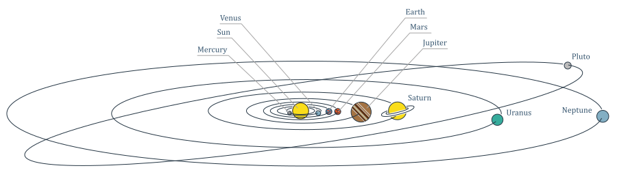
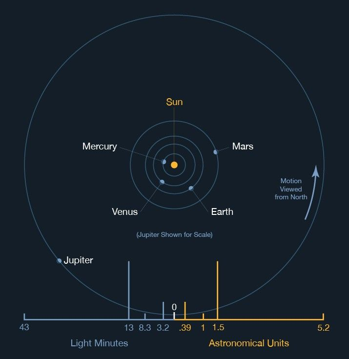
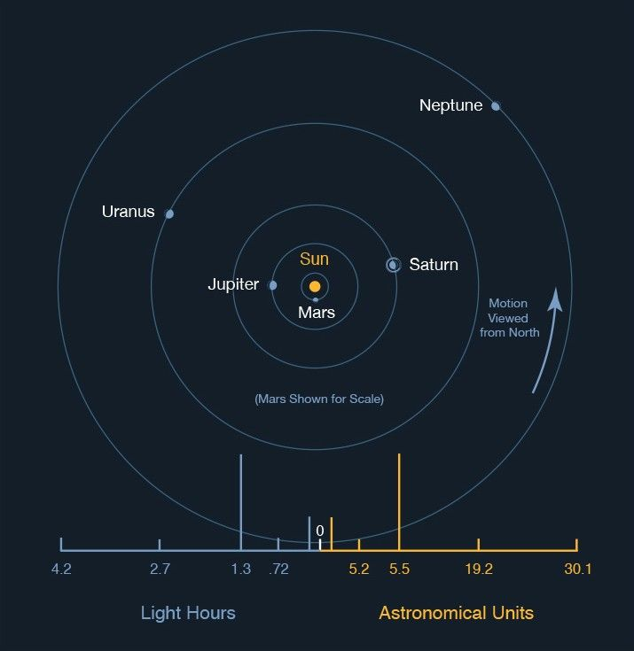
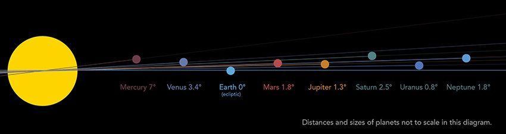
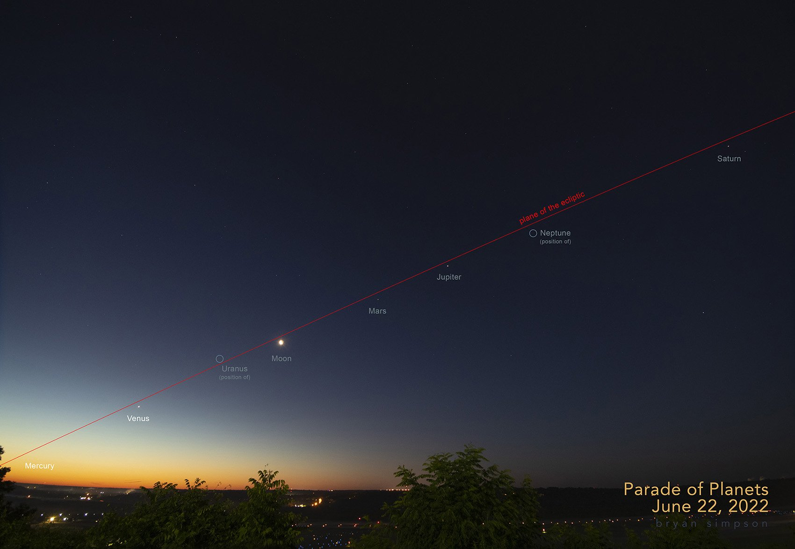
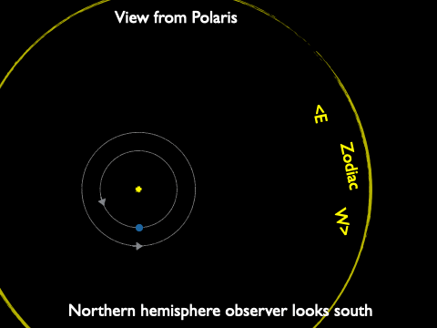
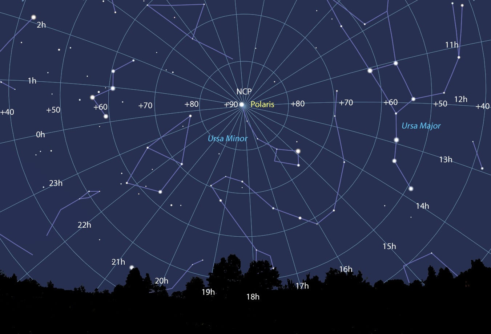

# Retrograde Motion

## Observing Planets

Mercury, Venus, Mars, Jupiter, and Saturn can be seen by eye.

Like Earth, the planets orbit the sun counter-clockwise, in nearly circular orbits

  
*[Source: NASA](https://science.nasa.gov/learn/basics-of-space-flight/chapter1-2/)*

It takes Mercury 88 Earth days to complete one orbit, 
but Saturn takes 29 Earth years

The major planets all orbit close to the Ecliptic plane.

*[Source: Bryan Simpson](https://www.cinastro.org/planetary-aligments)*

*[Source: Bryan Simpson](https://www.cinastro.org/planetary-aligments)*

* Planets orbit the Sun close to the ecliptic plane

* They appear to lie on the celestial sphere close to the ecliptic (path of the Sun) 

* Over one night planets rise in the East and set in the West (because of…)

* Like the Sun and Moon, they appear to slowly drift through the constellations of the Zodiac (taking weeks to years)

## Planets over many days

* Suppose you observe Mars each evening for a few months

* Because Mars orbits the Sun, its position relative to the background stars will change

* It usually appears to drift west to east through the constellations of the zodiac

* Sometimes, this drift is east to west

## Mapping the Sky

*[Source: Stellarium](https://www.fromspacewithlove.com/celestial-coordinates/)*

Sky observations use measurements in degrees.

Unit of both local sky observations and for celestial sphere maps

