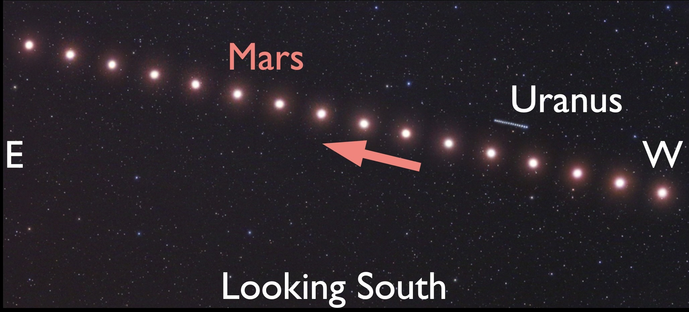
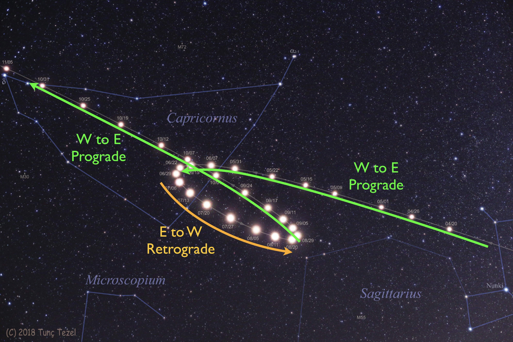
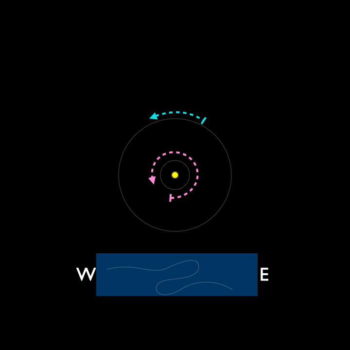
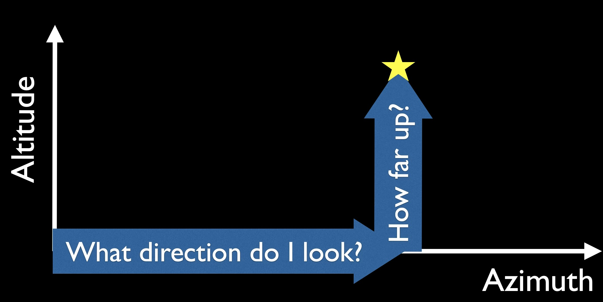
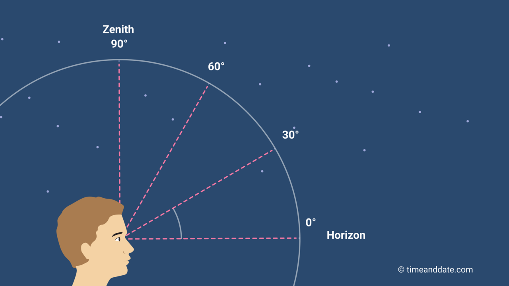
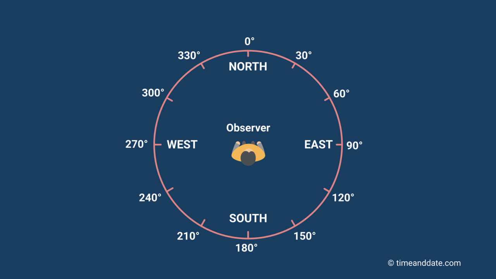
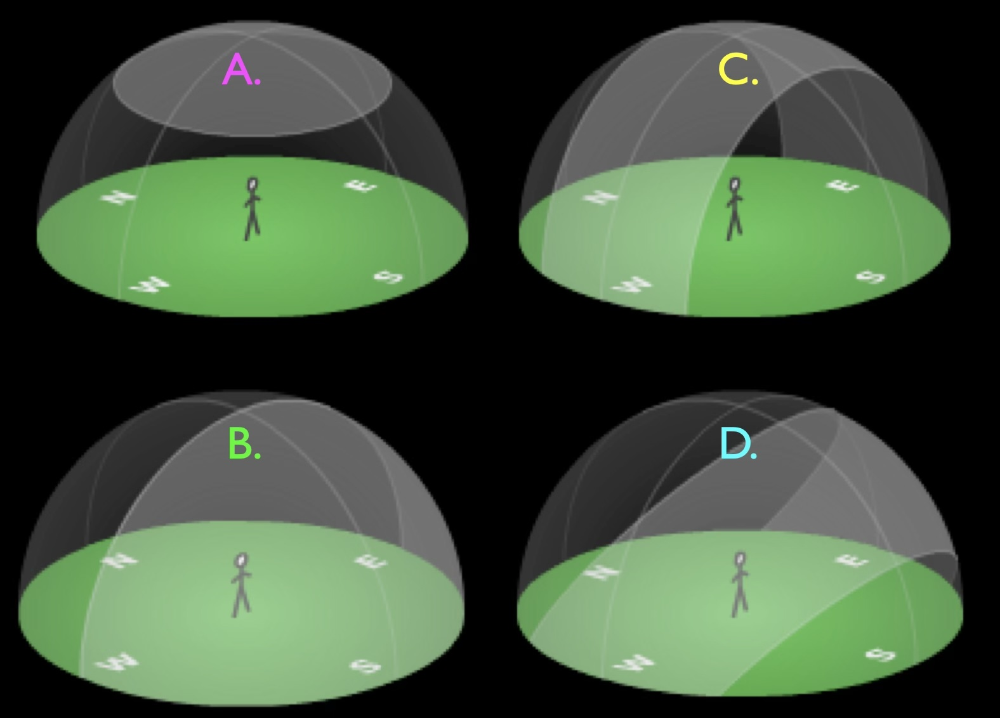

# Planets and Retrograde Motion

* Planet orbits
* Motion of planets in the sky
* Prograde and Retrograde
* How orbits produce retrograde motion
* Altitude and Azimuth

## Orbiting Planets

Mercury, Venus, Mars, Jupiter, and Saturn can be seen by eye.

Like Earth, the planets orbit the sun counter-clockwise, in nearly circular orbits

  
*[Source: NASA](https://science.nasa.gov/learn/basics-of-space-flight/chapter1-2/)*

It takes Mercury 88 Earth days to complete one orbit, 
but Saturn takes 29 Earth years.

The major planets all orbit close to the Ecliptic plane.

*[Source: Bryan Simpson](https://www.cinastro.org/planetary-aligments)*

## Observing Planets over one day

* Planets orbit the Sun close to the ecliptic plane

* They appear to lie on the celestial sphere close to the ecliptic (path of the Sun)

* Over one night planets rise in the East and set in the West, along with the Sun, Moon, and stars.

  

Because of ...

  Earth's rotation 

*[Source: Bryan Simpson](https://www.cinastro.org/planetary-aligments)*

## Planets over many days

* Like the Sun and Moon, planets appear to slowly drift through the constellations of the Zodiac (taking weeks to years)

* Suppose you observe Mars each evening for a few months

* Because Mars orbits the Sun, its position relative to the background stars will change

### Composite images
* From the Northern Hemisphere, we look South to observe the Sun, Zodiac stars, and planets when they are high in the sky.

* This composite photo shows Mars and Uranus imaged against the same background stars over many nights.

*Image source: [Tunc Tezel via APOD](https://apod.nasa.gov/apod/ap240802.html)*

* Counter-clockwise orbits (seen from North) *usually* carry planets West to East compared to background stars.

* Inner planets move faster than outer planets.

### Observations of Mars in retrograde

* This composite photo is made up of photos of  Mars, against the same background stars, taken over many nights.

*Base image source: [Tunc Tezel via APOD](https://apod.nasa.gov/apod/ap250530.html)*

* We look high in the southern sky to see Mars. So East is to the left, and West is to the right. The earliest images are on the right. 

* Mars starts by moving West to East. We call this prograde motion.

* Then, it moves East to West for a bit. We call this retrograde motion.

* Then, it returns to moving West to East. This is prograde motion again.

## Summary: How we see planets in the sky

* On any one night, planets rise in the East and set in the West.

* If you observe the sky over many nights planets usually appear to drift from West to East compared to background stars (Prograde)

* But sometimes over many nights planets move the other way, from East to West compared to background stars (Retrograde)

## What causes apparent retrograde motion?

<quiz>

Clue: where is Mars biggest and brightest in the composite image? What does that that observation imply?

- [ ] It's brightest when its in prograde. That's when it's closest to us!
- [x] It's brightest when its in retrograde. That's when it's closest to us!
- [ ] It's brightest when its in prograde. That's when it's farthest away!
- [ ] It's brightest when its in retrograde. That's when it's farthest away!

</quiz>

As the planets orbit the Sun, the outer planets move more slowly than the inner planets.

Every so often, the inner planet overtakes and passes the outer planet.

This changes the apparent motion compared to distant stars.

Example:
As the Earth passes Mars in it’s orbit, Mars appears to go "backwards" (East to West) for a while.

We also get retrograde motion viewing an inner planet.

This type of motion through the stars likely inspired the Ancient Greek name for planets - wandering stars.

## Prep for lecture tutorial: Mapping the Sky

Altitude and Azimuth are sky locations measured in degrees.

A lensatic compass can be used to measure azimuth.
.jpg)
*Source: [Tim Graf timgraf99, CC0, via Wikimedia Commons](https://commons.wikimedia.org/wiki/File:Setting_sun_in_the_West_%28Unsplash%29.jpg)*

A sextant can measure altitude.

They are angular distances.

Azimuth goes around the circle of the horizon from North, then altitude goes up from the horizon)

Altitude:
Increasing “height in the sky” precision with angle measurements
  
*[Source: timeanddate.com](https://www.timeanddate.com/astronomy/horizontal-coordinate-system.html)*

Azimuth:
Increasing compass direction precision with angle measurements
  
*[Source: timeanddate.com](https://www.timeanddate.com/astronomy/horizontal-coordinate-system.html)*

You can see what planets are viewable, and where they are in the sky with Altitude and Azimuth (Direction) at [Night Sky Tonight from timeanddate.com](https://www.timeanddate.com/astronomy/night/)

## Check your understanding

<quiz>
You see the planet Jupiter on the eastern horizon right after sunset. Six hours later Jupiter will be...

- [ ]  High in the northern sky
- [ ]  High in the southern sky
- [ ]  Directly overhead
- [ ]  Low in the west
- [ ]  Not visible

</quiz>

<quiz>

Which shaded region best indicates the part of the sky where you might see planets?

- [ ]  A.
- [ ]  B.
- [ ]  C.
- [x]  D.

</quiz>

<quiz>
When we see Jupiter in retrograde motion, it means that:
- [ ]   Jupiter is temporarily moving backward in its orbit of the Sun
- [x]  Earth is passing Jupiter in its orbit, with both planets on the same side of the Sun
- [ ] Jupiter and Earth must be on opposite sides of the Sun
</quiz>

<quiz>

Where would you look to see a
planet rise when it is undergoing
apparent retrograde motion?

- [x]  on the eastern horizon
- [ ]  on the western horizon

</quiz>

## Going Farther

Try out this [simulation of all the planets apparent positions against the Zodiac strip of stars](https://www.davidcolarusso.com/astro/).

