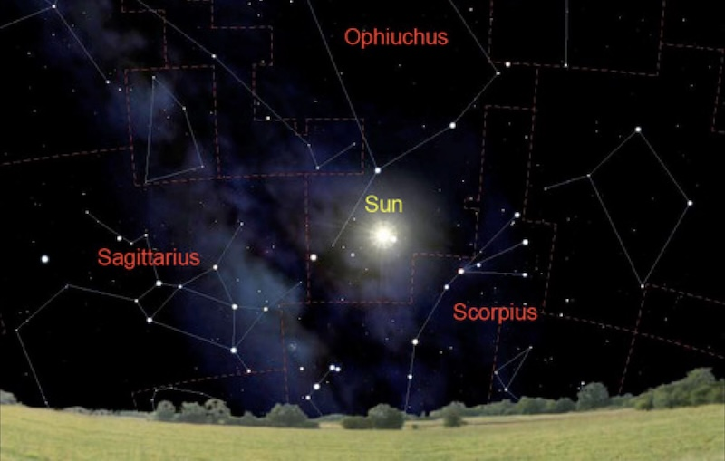
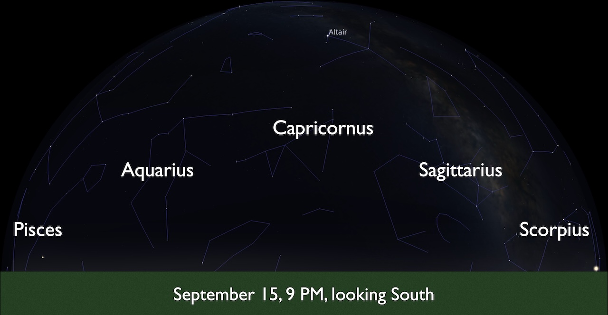

# Seasonal Stars

Yearly changes in the night sky. 
- How Earth's orbit changes our view.
- How the Sun appears to move through the Zodiac constellations.
- What that means for how we see the stars from month to month and day to day.

## Summer and Winter stars

* The stars are always present in the sky

* Light from the Sun and atmosphere obscures different stars at different times of the year

* The constellations visible at a particular time of night change as we orbit the Sun

    * Example: Orion is visible in the winter, but not the summer

*Image credit: NASA / JPL*

* We have to look away from the Sun to see stars.

## Earth's orbit

- The Earth orbits the Sun in the ecliptic plane.

- The average Earth-Sun distance is 1 Astronomical Unit

- The Earth's spin axis always points to the Polaris

- Earth takes 1 year to orbit the Sun

- The stars visible at night gradually change over the year

## The Sun in the Zodiac Constellations

- Remember: the stars are fixed on the celestial sphere

- Due to the Earth’s orbit, the Sun is not exactly fixed on the celestial sphere

- The Sun’s position within the constellations gradually changes over the year

- The constellations the Sun appears to move through are the 12 constellations of the zodiac

- The Sun moves through these regions of the Celestial Sphere every year

![Constellations on the Ecliptic. The Sun is drawn at the center. Surrounding the Sun is a blue circular arrow indicating the path of the Earth around the Sun. The Earth is shown in two positions along this arrow, representing where is it located in June and August. Surrounding the circle of the Earth the constellations of the ecliptic are drawn. Counter-clockwise from top center are: Gemini, Cancer, Leo, Virgo, Libra, Scorpius, Ophiuchus, Sagittarius, Capricorn, Aquarius, Pisces, Aries, Taurus. The Earth's vantage point is illustrated with an arrow drawn from the Earth through the center of the Sun to the constellation behind the Sun as seen from Earth. In June the arrow points to Taurus, in August to Cancer.](img/OSC_Astro_02_01_Ecliptic.jpg)

### Astrology aside

- Sun sign astrology refers to the position of the Sun at your birth, associated with one of the twelve zodiac signs, if you were born 2000 years ago. 

- There is no scientific mechanism for how the apparent position of the stars and planets could affect your daily life.

### Ophiuchus

- The modern Zodiac constellations vary in their size on the sky

- Sometimes the Sun actually appears in the constellation Ophiuchus.  Looking South in December with no atmosphere, you see the Sun in between Sagittarius and Scorpius.  *[Source:Stellarium]*

- We approximate 12 equal-sized zodiac constellations, with the Sun spending one month within each constellation, for questions in this class.

## Viewing the Zodiac

- The Sun and Zodiac constellations appear in the same region of your local sky.

- A Northern Hemisphere observer sees the Sun and Zodiac Constellations in the Southern Sky

- A Southern Hemisphere observer sees the Sun and Zodiac Constellations in the Northern Sky

- The sun and stars rise in the East and set in the West

### Example: Fullerton in the Fall and Spring Semesters

In your local sky, you will see half the Zodiac constellations. The constellations you see depend on the time of day. 

Every day, Earth's spin carries you around the Earth. It's noon when the sun is highest in your sky.

If you look at the sky in the evening in September, Capricorn will be highest in the sky. Pisces will be coming into view, and rising.

The Earth moves in its orbit. As it moves, the direction to the zodiac constellations change, compared to where you are at noon and in the early evening. 

If you look again in the evening in February, Taurus will be highest in the sky. Pisces will be going out of view, and setting.

## Yearly change in rise-and-set times 

- As Earth moves in its orbit, your midnight points in a different direction each month.

- The constellation that is highest in the sky at a given time will change.

- Each rise-and-set star rises earlier and sets earlier, compared to the Sun.

## Check your understanding
<quiz>

Which diagram best reflects our view of stars in summer compared to our view of stars in winter?

- [ ] Scenario A
- [ ] Scenario B
- [x] Scenario C
- [ ] Scenario D

Our view of the night sky is looking away from the Sun.
</quiz>

<quiz>

One night, you see the star Sirius rise at exactly 7.36 pm.

The following night it will rise...

- [x]   slightly earlier
- [ ]   at the same time
- [ ]  slightly later
- [ ] it will not be visible at all

</quiz>

<quiz>
What component of the Earth’s motion causes the stars to rise earlier and earlier on successive nights?

- [ ]  its rotation about its axis
- [x]   its orbit around the Sun
- [ ]  the tilt of its rotation axis
- [ ]   its motion with respect to nearby stars
</quiz>