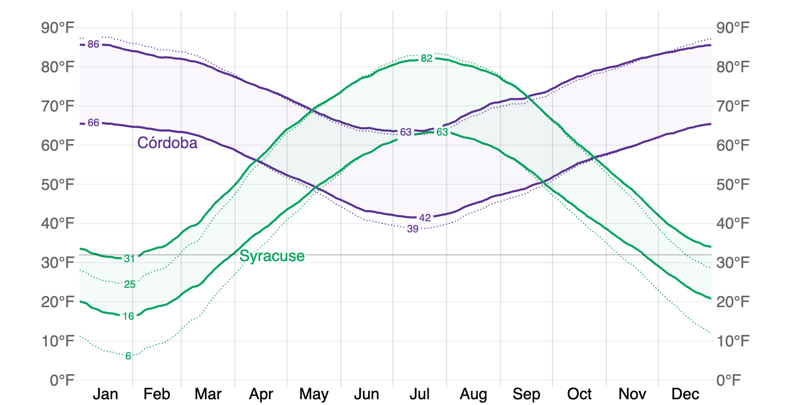
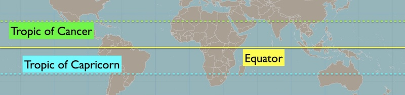

# Seasons on Earth

* Direct sunlight

* How the sun illuminates the Earth

* … at different latitudes and times of year

* The cause of seasons

## Intro

[Dr. Gabriela Gonzalez](https://en.wikipedia.org/wiki/Gabriela_Gonz%C3%A1lez), who played a leading role in the first detection of gravitational waves, did her undergraduate degree in Córdoba, Argentina. She then moved to Syracuse, NY, USA for her doctorate.

Córdoba is hottest in January and coldest in July, but Syracuse is hottest in July and coldest in January.

  
 [Source: © WeatherSpark.com](https://weatherspark.com/compare/y/28147~22184/Comparison-of-the-Average-Weather-in-C%C3%B3rdoba-and-Syracuse)

Why did Dr. Gonzalez experience different seasonal patterns in each location?

## Sunlight and the Earth's Orbit

* Earth’s axis is tilted by 23.5 degrees w/r/t the ecliptic plane

* The Northern Hemisphere is tilted toward the Sun in June

* The Southern Hemisphere is tilted toward the sun in December

*[Source: timeanddate.com](https://www.timeanddate.com/astronomy/equinox-solstice.html)*

## Sunlight carries energy

The angle of sunlight changes how much the Sun heats the Earth.

When a surface is tilted, it absorbs less energy from the Sun.

### Direct sunlight

* More direct sunlight when the sun is high: energy is concentrated  

* Less direct sunlight when the sun is low: energy is spread out  

## The changing angle of sunlight

From geosynchronous orbit, the Meteosat satellite recorded infrared images of the Earth every day at the same local time, from September 2010 to September 2011.

Geosynchronous: always above the same position on Earth's surface.

<iframe
  width="560"
  height="315"
  src="https://www.youtube.com/embed/LUW51lvIFjg?loop=1&playlist=LUW51lvIFjg&mute=1&rel=0&modestbranding=1"
  title="Descriptive title of the video content"
  frameborder="0"
  allow="autoplay; fullscreen; picture-in-picture"
  referrerpolicy="strict-origin-when-cross-origin"
  allowfullscreen>
</iframe>

Because it is the same local time, the Sun is always to the left of the camera when the photo was taken.

<quiz>
Which of these pictures shows a  physically realistic diagram of the Sun’s rays hitting the Earth?

- [ ] (A) only
- [ ] (B) only
- [x] (C) only
- [ ] All are realistic

</quiz>

## Sunlight on the Earth

The way the sun lights the earth determines the length of days and the amount of direct sunlight at each latitude.

In this animation, (A) and (B) are each the same distance from the equator, but (A) is in the northern hemisphere and (B) is in the southern hemisphere. (C) is close to Antarctica.

### Build your understanding

<quiz>
In the animation above, which latitude has more hours of daylight?

- [ ] (A) 
- [x] (B) 

More than half of B's day is spent in the lighted part of Earth. A is in shadow more than half of the time, so it has longer nights.
</quiz>

<quiz>
In the animation above, which latitude has more direct sunlight?

- [ ] (A) 
- [x] (B) 

Sun rays hitting Earth's surface at B are less tilted compared to the Earth's surface at A. The sun appears higher overhead at B.

</quiz>

<quiz>
 Which is more important for seasonal temperature: direct sunlight or hours of daylight?

 Hint: Compare location B to location C in the animation above.

- [x] Direct sunlight
- [ ] Hours of daylight
- [ ] Both equally important

The Arctic and Antarctic can experience many hours of daylight, but the sunlight is always quite indirect. Temperatures are lower in these regions compared to locations with fewer daylight hours but more direct sunlight. So, direct sunlight must be more important for local temperature.

</quiz>

## Changing sunlight on Earth

The Sun is at the zenith for different regions on Earth, depending on the [ecliptic](solstices_equinoxes.md#mapping-the-ecliptic):

* The sun is directly above the Equator at noon on the equinoxes
* The sun is directly above the Tropic of Cancer in the Northern Hemisphere at noon on the June solstice (our Summer Solstice)
* The sun is directly above the Tropic of Capricorn in the Southern Hemisphere at noon on the December solstice (our Winter Solstice)

### Sun over Equator
  
*[Base image](https://commons.wikimedia.org/wiki/File:Earth-lighting-equinox_EN.png)*  

This image shows the angle of the sunlight when the sun is directly overhead on the equator. 

- This is an Equinox.

- Northern and southern hemispheres experience the same sunlight.

### Sun over Tropic of Cancer 

This image shows the angle of the sunlight when the sun is directly overhead on the Tropic of Cancer. 

- This is the June solstice.

- Summer in Northern Hemisphere

- Winter in Southern Hemisphere

### Sun over Tropic of Capricorn 

This image shows the angle of the sunlight when the sun is directly overhead on the Tropic of Capricorn. 

- This is the December solstice.

- Winter in Northern Hemisphere

- Summer in Southern Hemisphere

## The Cause of the Seasons

The **tilt of Earth’s rotational axis** and Earth’s **movement in its orbit** change **how much direct sunlight** shines on the **northern and southern hemispheres.**

## Seasonal Lag

Average Temperatures at LAX Weather Station:

Sunlight is most direct here on the Summer Solstice. Why isn’t June the hottest month?

Partly, it takes time to warm up and cool down. The Pacific Ocean acts as a heat reservoir, and wind patterns from the ocean or from the inland desert also change our weather.

## Check your understanding

<quiz>
Which of the following experiences the smallest change in sunlight over the course of a year?
- [ ]   The North Pole
- [x]  The Equator
- [ ]  The South Pole
- [ ]    They are all the same
</quiz>

<quiz>
In the image above, which letter represents a location on Earth that is experiencing winter in the Northern Hemisphere?

- [x] A
- [ ] B
- [ ] C
- [ ] D
- [ ] E
- [ ] F

</quiz>

<quiz>
In the image above, which letter represents a location on Earth that is experiencing summer in the Southern Hemisphere?

- [ ] A
- [ ] B
- [x] C
- [ ] D
- [ ] E
- [ ] F

</quiz>