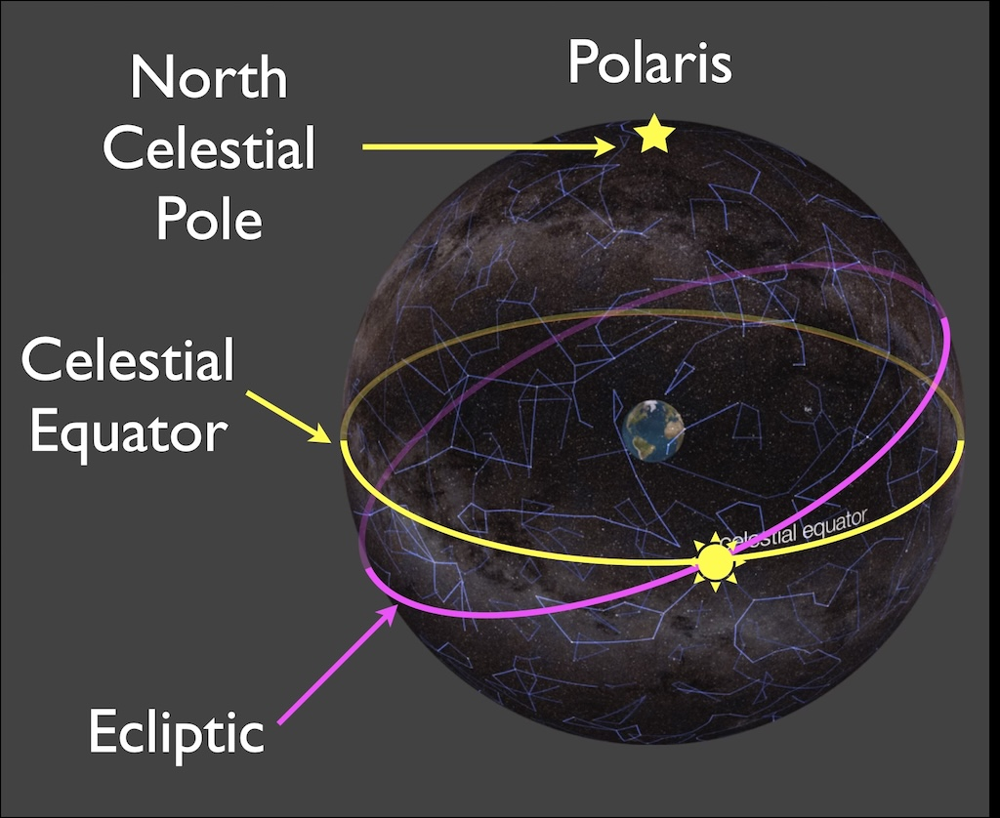

# Solstices and Equinoxes

How the Ecliptic works. How the Sun's position changes over the year compared to over one day, in the Celestial Sphere and in our Local sky.

## The Ecliptic

Remember [Earth's Orbit](seasonal_stars.md#earths-orbit). Why is the plane that Earth orbits in called the ecliptic plane?

### The Sun in the Celestial Sphere

- The stars appear in fixed positions on the Celestial Sphere

- The stars and the Sun are carried on a sphere that rotates about the Earth once each day 

- The ecliptic is the Sun’s path through the constellations over the course of one year.

  
*(Schematic, not actual constellation positions)*

### Earth's orbit makes the Ecliptic

This movie shows how Earth's orbit makes the ecliptic. It is tilted because Earth's spin is tilted.
<iframe
  width="560"
  height="315"
  src="https://www.youtube.com/embed/2-TtcfmbrkI?mute=1&rel=0&modestbranding=1"
  title="Descriptive title of the video content"
  frameborder="0"
  allow="autoplay; fullscreen; picture-in-picture"
  referrerpolicy="strict-origin-when-cross-origin"
  allowfullscreen>
</iframe>

### Mapping the Ecliptic

We can map the ecliptic in the Celestial Sphere the same way we map the surface of Earth.

![Mapping the surface of the earth: A map of the Earth showing the region around the Equator, with an arrow up to the N pole and down to the S pole. Mapping the surface of the celestial sphere: A map of stars around the Celestial Equator, with an arrow up to Polaris and down to the S.C.P. The Ecliptic is curved below and above the Celestial Equator. Sun symbols are marked in yellow when the Ecliptic crosses the equator. A green sun marks the northmost point and a blue sun marks the southmost point.](img/ecliptic-tropic-map.jpg)  
*(real map)*

Locations of the Sun in the Celestial Sphere:

* The Equinoxes are when the sun is on the Celestial Equator

* The June Solstice is when it is closest to the North Celestial Pole

* The December Solstice is when it is closest to the South Celestial Pole

## Check your Understanding: The Ecliptic

<quiz> How often is the Sun directly over Earth's Equator?

- [ ] Once a day
- [ ] Once a month
- [ ] Once every 4 months
- [x] Once every 6 months
- [ ] Once a year

The path shown is a full yearly loop through the sky, and it begins and ends in the same place. It starts at the  Celestial Equator and crosses again halfway through the year, so six months later.

</quiz>

<quiz> Approximately how many rotations will the celestial sphere make while the sun moved from the summer solstice to the winter solstice?

- [ ]  Half
- [ ]  One
- [x] 183
- [ ]  365

The celestial sphere rotates once each day. The Sun will take half a year to move from solstice to solstice, so 365/2 or about 183 days.

</quiz>

<quiz>
If the direction of the Sun’s motion along the ecliptic was reversed, how would its daily motion appear?

  
Hint

  
What real physical motion produces the Sun’s motion along the ecliptic? What real physical motion produces the Sun’s daily motion?Would changing one change the other?

- [x] It would continue to rise in the East and set in the West
- [ ] It would now rise in the West and set in the East 

The daily motion of the celestial sphere causes the rising and setting. The slow movement through the celestial sphere doesn't affect this. 

</quiz>

The Sun at the Zenith:

* The sun is directly above the Tropic of Cancer in the Northern Hemisphere at noon on the June solstice (our Summer Solstice)

* The sun is directly above the Equator at noon on the equinoxes

* The sun is directly above the Tropic of Capricorn in the Southern Hemisphere at noon on the December solstice (our Winter Solstice)

## The Sun in our Local Sky

We see the Sun in our Local Sky.

### Daily motion of the Sun:
Each day we see the sun move through the Southern sky:

### Yearly motion of the Sun

The path of the Sun through the sky changes over the year. This image shows the sun at its highest point on different days.

- The sun’s path is higher and longer in summer.

- The sun’s path is lower and shorter in winter.

- The sun's rise and set locations change over the course of the year.

### Daylight hours in Fullerton

## Check your Understanding: Solstices and Equinoxes 

<quiz>
The time for the sun to go from being highest in the sky at noon, to lowest in the sky at noon, and back to highest in the sky at noon again is…

- [x] One year
- [ ] Six months
- [ ] One day

</quiz>

<quiz>
When is the Sun above our horizon for the greatest number of hours?

- [x] Summer Solstice 
- [ ] Spring Equinox
- [ ] Fall Equinox
- [ ] Winter Solstice

</quiz>

<quiz>
What do we call the day(s) of the year when the Sun rises directly in the East and sets directly in the West?

- [ ] Solstices
- [ ] Circumpolar
- [ ] Equinoxes
- [ ] Celestial

</quiz>

<quiz>
On September 21, the Sun will set exactly on the West Point of the horizon. 

Where would the Sun appear to set 2 weeks later?

- [x]  Farther south
- [ ]  In the same place
- [ ] Farther north

</quiz>